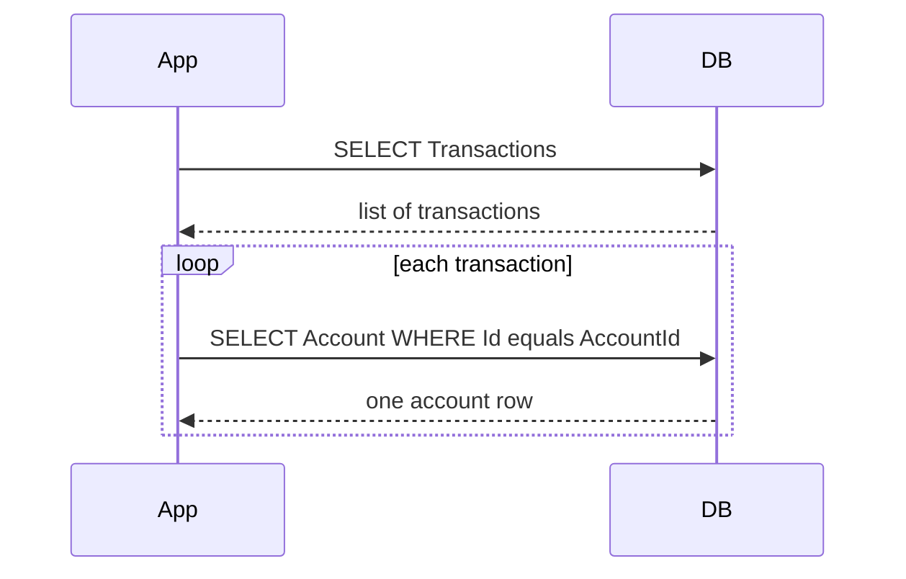
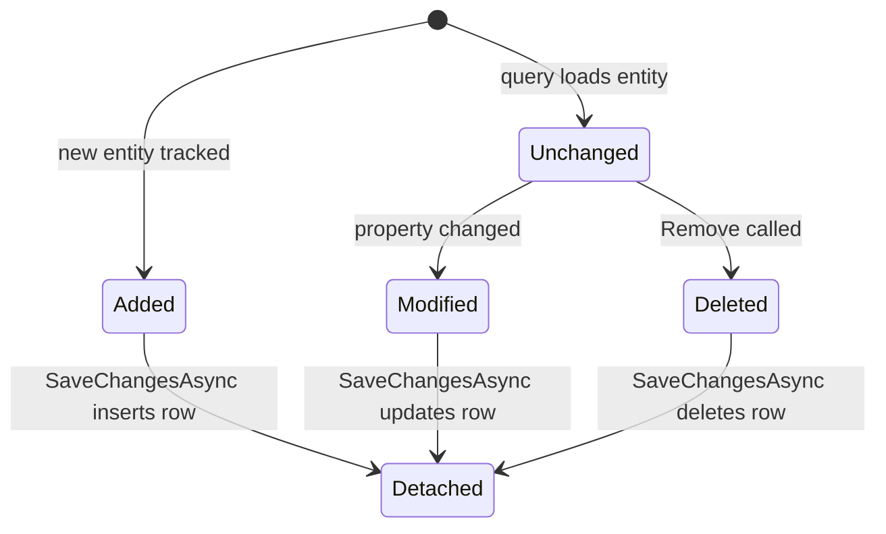

# Lecture 2 — Migrations and Queries

> **Duration:** ~2 hours of reading + hands-on.
> **Outcome:** You can evolve a schema across multiple migrations against SQLite, read every line of SQL the EF Core 9 provider emits, recognize and fix the three classic performance traps (N+1, accidental client evaluation, unbounded tracked loads), use `AsNoTracking` and projection deliberately, drop to `FromSqlInterpolated` when you must, and reason about optimistic concurrency conflicts with `[Timestamp]`.

If you only remember one thing from this lecture, remember this:

> **Change tracking is the magic, and it is also the cost.** EF Core watches every loaded entity, detects mutations, and emits the right `INSERT`/`UPDATE`/`DELETE` on `SaveChangesAsync`. That is great for writes. It is the single biggest footgun for reads — if you load 50,000 rows you never intend to mutate, you've paid for the change-tracker machinery for nothing. Learn the three reads — tracked, `AsNoTracking`, projected — and learn when each is correct.

---

## 1. Migrations as a Git artifact

A migration is just C# code. It lives in `Migrations/<timestamp>_<Name>.cs` and exposes two methods:

```csharp
public partial class AddAccountCurrencyIndex : Migration
{
    protected override void Up(MigrationBuilder migrationBuilder)
    {
        migrationBuilder.CreateIndex(
            name: "IX_Accounts_Currency",
            table: "Accounts",
            column: "Currency");
    }

    protected override void Down(MigrationBuilder migrationBuilder)
    {
        migrationBuilder.DropIndex(name: "IX_Accounts_Currency", table: "Accounts");
    }
}
```

`Up` is forward; `Down` is backward. Both are reviewed in pull requests. Both run in production. Treat the migration file as **source code**, not generated noise:

- **Read every migration before you commit it.** EF Core's generator is good but not perfect. A renamed property without a `[Column]` attribute or a fluent override produces a *drop column + add column*, not a rename — silently destroying data. The fix is a hand edit to the migration's `Up` body to call `migrationBuilder.RenameColumn(...)` instead.
- **Test the `Down` path at least once.** Most teams never run `Down` in production, but a missing `Down` is a yellow flag. Run `dotnet ef database update <PreviousMigration>` against a throwaway copy of your database and confirm the schema returns to the prior state.
- **Never edit an applied migration.** Once a migration has run on any environment (CI, staging, prod), it is immutable. To change its effect, write a *new* migration that fixes the issue. Editing an applied migration breaks every database that ran the original version.

### 1.1 The four `dotnet ef` commands you will use weekly

```bash
dotnet ef migrations add <Name>              # generate the next migration from the model diff
dotnet ef migrations remove                  # delete the last (unapplied) migration; regenerate the snapshot
dotnet ef migrations script [From] [To]      # emit pure SQL between two migrations (for CI/CD review)
dotnet ef database update [Target]           # apply migrations up to <Target> (or "latest" if omitted)
```

The script command is the one most teams underuse. Generate the SQL once, check it into a PR, let the DBA review it before it touches production:

```bash
dotnet ef migrations script 0 --idempotent --output schema.sql
```

The `--idempotent` flag wraps each migration block in a `WHERE NOT EXISTS (SELECT 1 FROM __EFMigrationsHistory ...)` so re-running the script against a partially-migrated database is safe. Always use it for production-bound scripts.

### 1.2 Apply migrations at startup vs in a CI step

Two patterns, both common, both defensible:

```csharp
// Pattern A — apply at startup. Convenient. Risky in multi-instance deployments.
var app = builder.Build();
using (var scope = app.Services.CreateScope())
{
    var db = scope.ServiceProvider.GetRequiredService<LedgerContext>();
    await db.Database.MigrateAsync();
}
app.Run();
```

```bash
# Pattern B — apply in a CI step. The app boot is read-only.
dotnet ef database update --connection "$PROD_CONNECTION_STRING"
```

Pattern A is fine for single-instance services and for local dev. Pattern B is correct for production with rolling deploys — you do not want three replicas racing each other to apply the same migration. C9 uses Pattern A in the mini-project and Pattern B in the capstone.

---

## 2. The three reads

Take the `LedgerContext` from Lecture 1. We will load some transactions and watch what EF Core does.

### 2.1 Tracked read — the default

```csharp
var transactions = await db.Transactions
    .Where(t => t.Date >= DateOnly.FromDateTime(DateTime.UtcNow.AddDays(-30)))
    .ToListAsync();
```

This issues one `SELECT` and registers every returned entity with the change tracker. If you then mutate one of them:

```csharp
transactions[0].Memo = "Updated memo";
await db.SaveChangesAsync();
```

…EF Core notices the change at `SaveChangesAsync` time and emits an `UPDATE Transactions SET Memo = @p0 WHERE Id = @p1`. No `Attach`. No explicit `Update`. The change tracker did the work.

This is the right read for write-path code. It is the *wrong* read for read-only paths because the change tracker is not free.

### 2.2 `AsNoTracking()` — for read-only paths

```csharp
var transactions = await db.Transactions
    .AsNoTracking()
    .Where(t => t.Date >= DateOnly.FromDateTime(DateTime.UtcNow.AddDays(-30)))
    .ToListAsync();
```

Same SQL. No change-tracker registration. Roughly 30% faster on large result sets, with constant memory savings proportional to the number of entities. Mutating a returned entity now has no effect on `SaveChangesAsync`.

Make `AsNoTracking` your default for *any* GET-endpoint query. The change tracker is for write paths.

### 2.3 Projection — when you don't need the whole entity

```csharp
var summaries = await db.Transactions
    .Where(t => t.Date >= DateOnly.FromDateTime(DateTime.UtcNow.AddDays(-30)))
    .Select(t => new TransactionSummary(t.Id, t.Date, t.Amount, t.Memo))
    .ToListAsync();
```

Three things changed: the SQL now selects only four columns instead of every column on `Transactions`; the result type is a DTO, not an entity; and there is no change-tracker entry because there is no entity. This is the fastest read of the three and the right choice when you are returning data to an HTTP client.

A rule of thumb: **if a query feeds an HTTP response, project it**. Entities are for internal mutation; DTOs are for external consumers.

---

## 3. `IQueryable<T>` translation — what works and what doesn't

`IQueryable<T>` is the surface of LINQ that *translates* to SQL. Each operator you chain (`Where`, `Select`, `OrderBy`, `GroupBy`) adds a node to an expression tree; nothing executes until you terminate the chain with a materializer (`ToListAsync`, `FirstAsync`, `CountAsync`, `AnyAsync`, an `await foreach`).

EF Core 9 translates a lot:

- `Where`, `OrderBy`, `OrderByDescending`, `ThenBy`, `Skip`, `Take`, `Distinct`.
- `Select` into anonymous types, DTOs, or scalars.
- `GroupBy` into `GROUP BY` *if* the grouping key and aggregates are translatable.
- `Join`, `Include`, `ThenInclude`.
- String operators (`Contains`, `StartsWith`, `EndsWith`) translated to `LIKE` (or provider equivalents).
- `EF.Functions.Like(...)` for explicit `LIKE` patterns.
- `Sum`, `Count`, `Min`, `Max`, `Average`, `Any`, `All`.

EF Core does *not* translate:

- Method calls on your own types (`t.Memo.Normalize()` is not SQL).
- Reflection (`prop.GetValue(t)` is not SQL).
- Most third-party library calls.
- Complex C# branching inside a `Select` (a `switch` expression on a non-scalar may or may not translate; test before assuming).

When EF Core encounters an operator it cannot translate, **it throws `InvalidOperationException`** at query-evaluation time with a message that names the unsupported expression. (Before EF Core 3, it silently client-evaluated. That changed because the silent path produced production incidents where a 10-row test database hid the fact that the query would pull a 10-million-row table over the wire in production.)

If you must run a method in C# on each row, call `.AsEnumerable()` *after* every operator the database can do:

```csharp
// SERVER:   filter by date, project to summary
// CLIENT:   run Memo.Normalize() in C# afterward
var rows = await db.Transactions
    .Where(t => t.Date >= cutoff)
    .Select(t => new { t.Id, t.Memo })
    .AsAsyncEnumerable()                  // boundary: nothing below this runs as SQL
    .Select(x => new { x.Id, NormalizedMemo = x.Memo.Normalize() })
    .ToListAsync();
```

The boundary is explicit. The SQL is bounded. The C# is only paying the cost of methods it actually needs.

---

## 4. The three classic performance traps

Every EF Core codebase hits these eventually. Recognize them on sight.

### 4.1 The N+1 query

```csharp
// BUG: one query for the list, then one query PER transaction for its Account.
var transactions = await db.Transactions.ToListAsync();
foreach (var t in transactions)
{
    Console.WriteLine($"{t.Id} {t.Account.Name}");   // ← lazy-loads Account each iteration
}
```

In EF Core lazy loading is *off* by default, so this exact code raises a `NullReferenceException` rather than silently issuing N queries — a deliberate improvement over EF6's behaviour. But the *pattern* shows up in code that does explicit loads:

```csharp
foreach (var t in transactions)
{
    var acct = await db.Accounts.FindAsync(t.AccountId);  // ← N queries
}
```


*N+1: one query for the list, then one extra round trip per row instead of a single joined query.*

Fix with `Include` or, better, a projection:

```csharp
// Fix A: eager load with Include — one query, one JOIN
var transactions = await db.Transactions
    .Include(t => t.Account)
    .ToListAsync();

// Fix B: projection — one query, only the columns you actually need
var rows = await db.Transactions
    .Select(t => new { t.Id, AccountName = t.Account.Name })
    .ToListAsync();
```

If a single `Include` is fine; if you `Include` three navigations, the resulting JOIN can produce a Cartesian product. Use `AsSplitQuery()` to split into multiple round trips:

```csharp
var transactions = await db.Transactions
    .Include(t => t.Account)
    .Include(t => t.Category)
    .Include(t => t.Tags)
    .AsSplitQuery()
    .ToListAsync();
```

EF Core will issue four queries — one for transactions, one for accounts, one for categories, one for tags — and stitch the graph together in C#. Four queries with reasonable result sizes is almost always better than one query with a 4-way cartesian product.

### 4.2 Accidental client evaluation

Pre-EF-Core-3 behaviour, mostly fixed but still possible at the `AsEnumerable` boundary:

```csharp
// BUG: AsEnumerable() pulls EVERY transaction, then filters in C#
var bigOnes = db.Transactions
    .AsEnumerable()
    .Where(t => t.Amount > 1000)
    .ToList();
```

The `AsEnumerable()` call materializes the entire `Transactions` table over the wire. Then the `Where` runs in C# memory. The SQL EF Core emits has *no* `WHERE` clause. The fix is to filter *before* leaving the queryable surface:

```csharp
var bigOnes = await db.Transactions
    .Where(t => t.Amount > 1000)
    .ToListAsync();
```

Read the SQL with `LogTo`:

```csharp
options.UseSqlite(connectionString)
       .LogTo(Console.WriteLine, LogLevel.Information);
```

You will see the emitted SQL in your console output. Spend an hour just running queries with logging on. It will recalibrate your intuition about which LINQ expressions translate and how.

### 4.3 The unbounded tracked load

```csharp
// BUG: loads every transaction since the beginning of time, tracked.
var all = await db.Transactions.ToListAsync();
return all.Count;
```

Two bugs in three lines:

- The query pulls every row. As the table grows, the response time grows linearly. By month 12 of production this endpoint times out.
- The result is change-tracked. The change tracker fills with millions of entries until the request ends, consuming memory and slowing every subsequent operation on the same context.

Fix:

```csharp
// Better: ask the database to count, return the scalar.
var count = await db.Transactions.CountAsync();
return count;
```

For aggregate workloads, *push the aggregate to the database*. `CountAsync`, `SumAsync`, `AverageAsync`, `MinAsync`, `MaxAsync`, `AnyAsync`, `AllAsync` are your friends. None of them materialize entities.

---

## 5. `Include` vs explicit loading vs lazy loading

Three loading strategies. Pick consciously.

**Eager loading with `Include`.** The default in C9. One query (or, with `AsSplitQuery`, a small number of queries) at read time. Predictable.

```csharp
var t = await db.Transactions
    .Include(t => t.Account)
    .Include(t => t.Tags)
    .FirstOrDefaultAsync(t => t.Id == id);
```

**Explicit loading.** When you have a tracked entity and want to load a navigation property *after the fact*:

```csharp
await db.Entry(transaction).Reference(t => t.Account).LoadAsync();
await db.Entry(transaction).Collection(t => t.Tags).LoadAsync();
```

Useful in branchy code where you do not always need the navigation. The extra query is opt-in.

**Lazy loading.** Off by default in EF Core. Turn it on by installing `Microsoft.EntityFrameworkCore.Proxies` and calling `UseLazyLoadingProxies()`. Then any access to a navigation property triggers a query *if* it has not been loaded.

```csharp
options.UseSqlite(connectionString)
       .UseLazyLoadingProxies();
```

C9's stance is: **do not enable lazy loading**. It produces the N+1 bug on the most innocent-looking code. The performance characteristics of `transaction.Account` should be visible at the call site. Eager and explicit loading both surface the round trip; lazy hides it.

---

## 6. Change tracking deep-dive

`db.ChangeTracker.Entries()` returns every entity the context currently knows about, along with its `EntityState`:

```csharp
public enum EntityState { Detached, Unchanged, Deleted, Modified, Added }
```

A typical write flow:

```csharp
var account = await db.Accounts.FindAsync(7);    // ← state: Unchanged
account.Name = "Renamed";                         // ← state: Modified (auto-detected)
db.Accounts.Remove(account);                      // ← state: Deleted
await db.SaveChangesAsync();                      // ← state: Detached (after the row is gone)
```


*EntityState transitions as the change tracker follows an entity from load to SaveChangesAsync.*

For an `Attach`/`Update` flow — common in stateless services that receive an entity from outside and want to apply it without a prior read:

```csharp
db.Attach(transaction);                            // state: Unchanged
db.Entry(transaction).State = EntityState.Modified;
await db.SaveChangesAsync();                       // emits UPDATE for every column
```

`Update` is shorthand for `Attach` + set to `Modified`. Use it when you have the entire entity from outside (a request DTO that has been mapped to the entity). The downside is the `UPDATE` includes every column, which can be wasteful for wide tables. For targeted updates, prefer the read-then-mutate flow.

EF Core 7 introduced `ExecuteUpdateAsync` and `ExecuteDeleteAsync` for bulk operations that bypass the change tracker entirely:

```csharp
// Set Done = true on every transaction older than 90 days, in ONE SQL UPDATE.
var cutoff = DateOnly.FromDateTime(DateTime.UtcNow.AddDays(-90));
var affected = await db.Transactions
    .Where(t => t.Date < cutoff)
    .ExecuteUpdateAsync(setters => setters.SetProperty(t => t.Memo, "[archived]"));
```

```csharp
// Delete every test transaction in ONE SQL DELETE.
var affected = await db.Transactions
    .Where(t => t.Memo.StartsWith("[TEST]"))
    .ExecuteDeleteAsync();
```

Both return the row count. Both bypass the change tracker. Both are the right answer for batch operations where you do not need to know about individual entities. Use them.

---

## 7. Raw SQL — the escape hatch

EF Core can run raw SQL with parameter binding via `FromSqlInterpolated`:

```csharp
var name = "%coffee%";
var rows = await db.Transactions
    .FromSqlInterpolated($"SELECT * FROM Transactions WHERE Memo LIKE {name}")
    .AsNoTracking()
    .ToListAsync();
```

The `$"..."` interpolation is *not* string concatenation. EF Core inspects the interpolation, replaces each `{value}` with a parameter placeholder, and passes the value as a real SQL parameter. The provider sees `WHERE Memo LIKE @p0` and binds `@p0 = "%coffee%"`. No SQL injection.

`FromSqlInterpolated` returns an `IQueryable<T>`, so you can still compose LINQ on top:

```csharp
var rows = await db.Transactions
    .FromSqlInterpolated($"SELECT * FROM Transactions WHERE Memo LIKE {name}")
    .Where(t => t.Amount > 0)             // appended as a SQL WHERE
    .OrderByDescending(t => t.Date)        // appended as a SQL ORDER BY
    .Take(50)
    .ToListAsync();
```

For non-entity result sets (a custom DTO from a hand-written query), use `SqlQuery<T>`:

```csharp
var stats = await db.Database
    .SqlQuery<DailyTotal>($"SELECT Date, SUM(Amount) AS Total FROM Transactions GROUP BY Date")
    .ToListAsync();
```

Two rules for raw SQL:

- **Always use the interpolated form** (`FromSqlInterpolated`, `SqlQuery`), never the raw-string form. The interpolated forms parametrize automatically. The raw-string forms (`FromSqlRaw`, `SqlQueryRaw`) require manual parameter objects and are easy to use incorrectly.
- **Use raw SQL when the LINQ translation is awkward, not when LINQ feels slow.** The right reason to drop is "I want a window function" or "I want a recursive CTE." The wrong reason is "I think SQL is faster" — the EF Core query and the hand-written SQL almost always produce the same plan when the LINQ is well-written.

---

## 8. Optimistic concurrency

Two HTTP requests load the same `Account` row, both modify it, both call `SaveChangesAsync`. Without concurrency control, the last write wins silently — and the first request's changes are lost.

The fix: a row-version column.

```csharp
public sealed class Account
{
    public int Id { get; set; }
    public string Name { get; set; } = "";

    [Timestamp]
    public byte[] RowVersion { get; set; } = [];
}
```

`[Timestamp]` tells EF Core: "this column is a row version; include it in the `WHERE` clause of every `UPDATE` and `DELETE`." On SQL Server it maps to the native `rowversion` type. On PostgreSQL it maps to `xmin`. On SQLite there is no native row-version type, so you use a `Property<int>("Version").IsConcurrencyToken()` pattern and increment it yourself in an interceptor (or accept that SQLite is dev-only and the production database has real `rowversion` support).

When the `UPDATE` runs and *no rows are affected* (because someone else updated the row first), EF Core throws `DbUpdateConcurrencyException`. Handle it:

```csharp
try
{
    await db.SaveChangesAsync();
}
catch (DbUpdateConcurrencyException ex)
{
    foreach (var entry in ex.Entries)
    {
        var dbValues = await entry.GetDatabaseValuesAsync();
        if (dbValues is null)
        {
            // The row was deleted by another transaction.
            return TypedResults.NotFound();
        }

        // Refresh the local entity with the database values, then re-apply user changes.
        entry.OriginalValues.SetValues(dbValues);
        // ...merge logic here...
    }

    await db.SaveChangesAsync();
}
```

The "right" merge depends on your domain. The two common strategies are **server wins** (discard the user's change, return the database value) and **client wins** (override the database value with the user's change, refresh the row version, retry). Document which you picked and stick to it.

---

## 9. The repository pattern: don't

A frequently-asked question: "should I wrap `DbContext` in a `Repository<T>`?"

C9's answer is: **almost never**. The reason is that `DbContext` *is* a Unit of Work and `DbSet<T>` *is* a Repository:

- A `DbContext` represents one logical operation, tracks changes, and commits atomically. That is the Unit of Work pattern.
- A `DbSet<T>` exposes `Add`, `Remove`, `Find`, `Where`, `Include`, materializers. That is the Repository pattern (and quite a bit more — `IQueryable<T>` composition).

A `Repository<T>` wrapper around `DbSet<T>` typically does three things, all wrong:

1. **It exposes `IEnumerable<T>` instead of `IQueryable<T>`.** The caller can no longer compose LINQ; every query happens entirely in the repository. The repository ends up with `GetByName`, `GetByDate`, `GetByNameAndDate`, `GetByDateRangeAndCategory` — a method explosion.
2. **It hides the change tracker.** The caller cannot ask `entry.State` or `entry.OriginalValues`. Debugging gets harder.
3. **It defeats testability.** Most teams add the repository "for unit tests," then mock the repository. But you cannot meaningfully unit-test a database query by mocking the database — you need integration tests against a real (test) database. EF Core 9 has `Microsoft.EntityFrameworkCore.InMemory` for this; the better answer is SQLite in-memory mode for tests.

The cases where a repository earns its keep are narrow: you genuinely have *multiple* persistence backends (an `IUserStore` whose implementation can be EF Core today or Cosmos tomorrow), or your domain language is alien enough that the EF Core API hurts readability. Neither applies to the C9 mini-projects.

If you find yourself reaching for a repository, ask: "what am I gaining over a `LedgerContext` injected directly into the endpoint?" If the answer is "less mocking in unit tests," you have the wrong test strategy.

---

## 10. Build succeeded

By the end of Lecture 2 you should be able to:

- Generate, inspect, and apply migrations.
- Read every line of SQL the EF Core 9 provider emits.
- Choose between tracked, `AsNoTracking`, and projected reads with reasons.
- Spot the three classic performance traps (N+1, accidental client evaluation, unbounded tracked load) and fix each with the right tool.
- Drop to `FromSqlInterpolated` or `ExecuteUpdateAsync` when LINQ is awkward — and not before.
- Configure a concurrency token and write a handler for `DbUpdateConcurrencyException`.

Run a full build of the Lecture 1 + Lecture 2 sample:

```bash
dotnet build
```

```
Build succeeded.
    0 Warning(s)
    0 Error(s)

Time Elapsed 00:00:00.71
```

That is the contract. The exercises take this material to muscle memory.

---

## Self-check

Before moving on, you should be able to answer the following without looking anything up:

1. What does `AsNoTracking()` change about the emitted SQL? About the materialization step? About what `SaveChangesAsync` does?
2. Why did EF Core 3 stop silently client-evaluating LINQ operators it could not translate?
3. When would `AsSplitQuery()` produce a noticeably better outcome than a single joined `Include`?
4. What does `ExecuteUpdateAsync` skip that `SaveChangesAsync` does not?
5. Why is a `Repository<T>` wrapper around `DbSet<T>` usually a step backward?

If any of these is fuzzy, re-read the relevant section before continuing to the exercises.

---

*Next: [Exercise 1 — Your first context](../exercises/exercise-01-first-context.md).*
