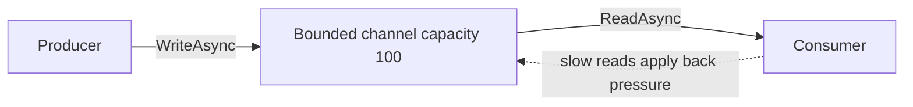
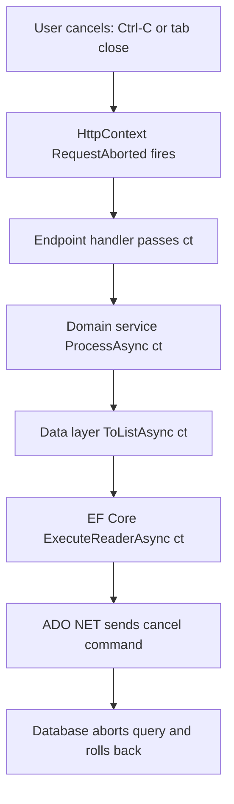

# Lecture 2 — Channels and Cancellation

> **Duration:** ~1.5 hours of reading + hands-on.
> **Outcome:** You can design a producer/consumer pipeline with `System.Threading.Channels` choosing between `Channel.CreateBounded<T>` and `Channel.CreateUnbounded<T>` based on a back-pressure requirement, wire `CancellationToken` from the outermost frame all the way down to every `Channel.Reader.ReadAsync(ct)` call, compose timeouts with linked sources, and handle `OperationCanceledException` at exactly one place — the outermost frame that owns the operation.

If you only remember one thing from this lecture, remember this:

> **Channels are typed queues with explicit policies.** They are a producer/consumer abstraction with a reader, a writer, a buffer capacity, and a "what to do when the buffer is full" mode. The whole point of reaching for `Channel<T>` over `BlockingCollection<T>` or a hand-rolled `Queue<T> + lock` is that channels are *async-native* — `WriteAsync` and `ReadAsync` are `ValueTask`-returning, cancellation-aware operations, not blocking ones. Master the four constructor options and the read/write/complete protocol, and the rest — multi-producer, multi-consumer, fan-out, fan-in — is composition on top.

---

## 1. `Channel<T>` — the constructors

`Channel<T>` lives in `System.Threading.Channels`, in the BCL. No package install needed. There are two factory methods:

```csharp
using System.Threading.Channels;

Channel<int> unbounded = Channel.CreateUnbounded<int>();
Channel<int> bounded   = Channel.CreateBounded<int>(capacity: 100);
```

The `Unbounded` channel buffers as many items as memory holds. Writers never wait. Readers can fall arbitrarily behind. **Use it only when you can prove the producer is naturally rate-limited**: a controller endpoint pushing one item per request, a `BackgroundService` emitting a heartbeat every 10 seconds. Never use it as the default. The first time the producer outpaces the consumer, you allocate megabytes of `T` per second.

The `Bounded` channel has a fixed capacity. When the buffer is full, the writer either *waits* or *drops*, depending on `BoundedChannelFullMode`:

```csharp
var options = new BoundedChannelOptions(capacity: 100)
{
    FullMode = BoundedChannelFullMode.Wait,         // default; back-pressure
    // or BoundedChannelFullMode.DropOldest,
    // or BoundedChannelFullMode.DropNewest,
    // or BoundedChannelFullMode.DropWrite,
    SingleReader = false,
    SingleWriter = false,
    AllowSynchronousContinuations = false,
};
var channel = Channel.CreateBounded<int>(options);
```

The `Wait` mode is the one you want most of the time. It is **back-pressure**: writers slow down when readers slow down. The slow consumer becomes the rate-limiter of the whole pipeline. This is exactly what you want for a crawler whose throughput is bounded by the parsing stage, an ETL pipeline whose sink is the rate-limiting step, or a logging pipeline whose `File.WriteAllTextAsync` is the bottleneck.

The `Drop*` modes are for "I would rather drop data than back up." Use them for telemetry, heartbeats, anything where missing one item is fine but blocking the producer is not.


*Wait mode back-pressure: once the bounded channel fills up, WriteAsync makes the producer wait until the consumer catches up.*

`SingleReader = true` / `SingleWriter = true` are perf hints. If you guarantee that only one task reads from the channel (and only one writes), the implementation skips the synchronization it would otherwise need. **Wrong values silently produce wrong results.** Set them only when you control both sides.

`AllowSynchronousContinuations = false` is the safe default. The opposite (`true`) lets the writer's `WriteAsync` continuation run inline on the reader's `ReadAsync`-completing thread. Faster in microbenchmarks, but a deadlock waiting to happen if the writer does anything slow. Leave it `false`.

---

## 2. The reader/writer split

A `Channel<T>` exposes two halves:

```csharp
var c = Channel.CreateBounded<int>(100);
ChannelWriter<int> writer = c.Writer;
ChannelReader<int> reader = c.Reader;
```

Pass `writer` to producers and `reader` to consumers. **Never pass the whole `Channel<T>`** — that lets a producer accidentally read its own data, which is a bug class that exists only because the API let it.

The reader/writer surface:

```csharp
// Writing
await writer.WriteAsync(item, ct);                // waits if full (in Wait mode)
bool wrote = writer.TryWrite(item);                // synchronous; false if full
await writer.WaitToWriteAsync(ct);                 // "tell me when there's room"
writer.Complete();                                 // "no more items"
writer.Complete(new InvalidOperationException()); // ...with an error

// Reading
var item = await reader.ReadAsync(ct);            // throws ChannelClosedException if closed and drained
bool got = reader.TryRead(out var item);           // synchronous; false if empty
await reader.WaitToReadAsync(ct);                  // "tell me when there's something"
await foreach (var item in reader.ReadAllAsync(ct)) // <-- the canonical consumer
{
    Process(item);
}
```

The canonical consumer pattern is `await foreach (var item in reader.ReadAllAsync(ct))`. It handles "wait for items, read all available, repeat until closed" in one line. It also propagates `ChannelClosedException` correctly when the writer completes with an error. Use it.

---

## 3. The complete producer/consumer pattern

```csharp
using System.Threading.Channels;

var channel = Channel.CreateBounded<int>(new BoundedChannelOptions(100)
{
    FullMode = BoundedChannelFullMode.Wait,
    SingleReader = true,
    SingleWriter = true,
});

using var cts = new CancellationTokenSource(TimeSpan.FromSeconds(10));
var ct = cts.Token;

var producer = Task.Run(async () =>
{
    try
    {
        for (var i = 0; i < 1_000; i++)
        {
            await channel.Writer.WriteAsync(i, ct);
        }
    }
    finally
    {
        channel.Writer.Complete();
    }
}, ct);

var consumer = Task.Run(async () =>
{
    await foreach (var i in channel.Reader.ReadAllAsync(ct))
    {
        Console.WriteLine(i);
    }
}, ct);

await Task.WhenAll(producer, consumer);
```

Read this carefully. Five things to notice:

1. **The producer always completes the writer in a `finally`.** If the producer throws, the consumer must still see `Complete()` so its `await foreach` exits. Without it, the consumer hangs forever.
2. **The cancellation token is passed to every async call** — `WriteAsync(i, ct)`, `ReadAllAsync(ct)`, and the `Task.Run` itself. If the token fires, every layer cooperates.
3. **`SingleReader = true, SingleWriter = true`** are correct here because we have exactly one of each. If you had three consumers in `Task.Run`s, you would set `SingleReader = false`.
4. **`await Task.WhenAll(producer, consumer)`** waits for both. If either throws, `WhenAll` aggregates the exception.
5. **The `BoundedChannelFullMode.Wait`** gives you back-pressure: if the consumer is slow, the producer's `WriteAsync` waits. The buffer never grows past 100.

This is the entire pattern. Every more-complicated channel pipeline is a composition of this.

---

## 4. Fan-out: multiple consumers from one channel

```csharp
var channel = Channel.CreateBounded<Uri>(new BoundedChannelOptions(100)
{
    FullMode = BoundedChannelFullMode.Wait,
    SingleReader = false,   // <-- multiple readers
    SingleWriter = true,    //     one writer
});

const int consumerCount = 4;
var consumers = Enumerable.Range(0, consumerCount).Select(workerId => Task.Run(async () =>
{
    await foreach (var uri in channel.Reader.ReadAllAsync(ct))
    {
        await ProcessAsync(uri, ct);
    }
}, ct)).ToArray();

// ... producer enqueues URLs ...
channel.Writer.Complete();

await Task.WhenAll(consumers);
```

Four workers race on the same `reader`. The channel's internal synchronization ensures each item is delivered to exactly one consumer. When the writer completes, every `await foreach` exits cleanly.

This is the basic building block of the mini-project's crawler.

---

## 5. Fan-in: multiple producers to one channel

```csharp
var channel = Channel.CreateBounded<LogEntry>(1_000);

var producers = Enumerable.Range(0, 8).Select(producerId => Task.Run(async () =>
{
    for (var i = 0; i < 100; i++)
    {
        await channel.Writer.WriteAsync(new LogEntry(producerId, i), ct);
    }
}, ct)).ToArray();

// IMPORTANT: when ALL producers are done, only THEN complete the writer.
_ = Task.WhenAll(producers).ContinueWith(_ => channel.Writer.Complete(), ct);

await foreach (var entry in channel.Reader.ReadAllAsync(ct))
{
    Console.WriteLine(entry);
}
```

The trick is the `ContinueWith` on `Task.WhenAll(producers)` — only when *every* producer has finished do we close the writer. If you `Complete()` inside one producer's `finally`, the others' `WriteAsync` calls will throw `ChannelClosedException`.

---

## 6. `CancellationToken` — the cooperative cancellation pattern

`CancellationToken` is a value type that wraps a reference to a `CancellationTokenSource`. The source has two states: not cancelled, cancelled. Once cancelled, it never un-cancels.

The pattern is **cooperative**: every async call accepts a `CancellationToken`, every awaiter checks it, and the calling code decides when to flip the source's switch. The runtime does not unilaterally kill in-flight threads (that was the deprecated `Thread.Abort` model from .NET Framework; it does not exist in .NET 9).

The shape of a cancellable method:

```csharp
public async Task<int> WorkAsync(int n, CancellationToken ct = default)
{
    for (var i = 0; i < n; i++)
    {
        ct.ThrowIfCancellationRequested();
        await Task.Delay(100, ct);
    }
    return n;
}
```

Three places to enforce the token:

1. **Inside loops**, call `ct.ThrowIfCancellationRequested()` once per iteration. Throws `OperationCanceledException` when the token is cancelled.
2. **Pass `ct` to every async call** that accepts one. `Task.Delay(100, ct)`, `db.Transactions.ToListAsync(ct)`, `httpClient.GetStringAsync(url, ct)`. If the token fires while these are in flight, they unwind immediately.
3. **At the top of methods**, optionally call `ct.ThrowIfCancellationRequested()` before any work — useful when the caller is racing and the method is expensive to start.

### `Register` for cleanup

`CancellationToken.Register(action)` lets you run code when the token is cancelled — typically to close a socket, dispose a resource, or notify a peer:

```csharp
ct.Register(() => socket.Close());
```

The registration returns a `CancellationTokenRegistration` you can `Dispose` if you want to un-register early.

### `IsCancellationRequested` vs `ThrowIfCancellationRequested`

`IsCancellationRequested` is a `bool` you can poll without throwing. Useful when you want to *gracefully* stop (e.g., write the last partial result, flush, then exit) rather than throwing.

`ThrowIfCancellationRequested()` is the strict version. It throws `OperationCanceledException` immediately. Most async methods you write should use the strict version unless you have a clear reason to handle cancellation gracefully.

---

## 7. Composing cancellation: linked sources and timeouts

The two composition patterns you will use constantly:

### Timeout-only cancellation

```csharp
using var cts = new CancellationTokenSource(TimeSpan.FromSeconds(5));
var result = await SomeAsyncOp(cts.Token);
```

`CancellationTokenSource(TimeSpan)` schedules a cancellation for the given delay. If the operation finishes first, the CTS is disposed and nothing happens. If the timeout elapses first, the token fires and the operation unwinds.

### Caller cancellation + timeout

```csharp
public async Task<int> DoWorkAsync(CancellationToken callerCt)
{
    using var cts = CancellationTokenSource.CreateLinkedTokenSource(callerCt);
    cts.CancelAfter(TimeSpan.FromSeconds(5));
    var ct = cts.Token;

    return await SomeAsyncOp(ct);
}
```

`CreateLinkedTokenSource` produces a new CTS whose token cancels when *either* the caller's token cancels *or* `cts.Cancel()` is called. The `CancelAfter` adds the timeout. Now the inner call cancels if:

- The caller cancels (e.g., user pressed Cancel).
- The 5-second timeout elapses.

This is the right pattern for "an HTTP endpoint that should respect the request's `RequestAborted` token but also impose its own server-side timeout."

### Distinguishing the two reasons for cancellation

```csharp
public async Task<int> DoWorkAsync(CancellationToken callerCt)
{
    using var cts = CancellationTokenSource.CreateLinkedTokenSource(callerCt);
    cts.CancelAfter(TimeSpan.FromSeconds(5));

    try
    {
        return await SomeAsyncOp(cts.Token);
    }
    catch (OperationCanceledException) when (callerCt.IsCancellationRequested)
    {
        throw; // caller cancelled — let it propagate
    }
    catch (OperationCanceledException)
    {
        // our timeout fired
        throw new TimeoutException("Server-side timeout expired.");
    }
}
```

The `when` clause inspects the *original* caller's token to decide which kind of cancellation we just observed. The exception filter runs without unwinding the stack, which is both cheaper than a `try/catch (...) { throw; }` and cleaner to read.

---

## 8. `Task.WhenEach` — processing in completion order

We mentioned `Task.WhenEach` in Lecture 1. Here is the cancellation-aware crawler-style pattern:

```csharp
public async IAsyncEnumerable<CrawlResult> CrawlAsync(
    IEnumerable<Uri> seeds,
    [EnumeratorCancellation] CancellationToken ct = default)
{
    var tasks = seeds.Select(uri => FetchAsync(uri, ct)).ToList();
    await foreach (var task in Task.WhenEach(tasks).WithCancellation(ct))
    {
        CrawlResult result;
        try
        {
            result = await task;
        }
        catch (Exception ex) when (ex is not OperationCanceledException)
        {
            result = CrawlResult.Failed(ex);
        }
        yield return result;
    }
}
```

Three things to notice:

1. **`Task.WhenEach` returns `IAsyncEnumerable<Task<T>>`** — each task yielded has *already* completed. The `await task` inside the loop is cheap (it just unwraps the result).
2. **The `OperationCanceledException` is excluded from the `catch`** — we let cancellation propagate. Only "real" exceptions are caught and converted to a `CrawlResult.Failed`.
3. **The producer is `async IAsyncEnumerable<CrawlResult>`** so the consumer can decide its own consumption rate.

This is *exactly* the shape of the mini-project's crawler API.

---

## 9. `Parallel.ForEachAsync` — the easy fan-out

If your use case is "run this async operation against every item in a collection, with N at a time" — and you do not need the streaming or back-pressure of channels — `Parallel.ForEachAsync` is the easier tool:

```csharp
var urls = await LoadUrlsAsync();
await Parallel.ForEachAsync(
    urls,
    new ParallelOptions { MaxDegreeOfParallelism = 8, CancellationToken = ct },
    async (url, ct) => await ProcessAsync(url, ct));
```

`Parallel.ForEachAsync` (since .NET 6) is the right tool for **batch processing with a fixed parallelism cap and no streaming back to the caller**. It blocks until everything is done. It uses a thread pool. It throws an `OperationCanceledException` if `ct` fires.

When to reach for it instead of channels:

| Need | Tool |
|------|------|
| Process N items, fixed parallelism, block until done | `Parallel.ForEachAsync` |
| Process unbounded stream, multiple consumers, back-pressure | `Channel<T>` |
| Produce a typed async stream for downstream consumption | `IAsyncEnumerable<T>` |
| Multiple producers, single consumer with completion ordering | `Channel<T>` |
| Single async operation that should time out | `CancellationTokenSource(TimeSpan)` |

If you can describe your workload as "iterate this collection in parallel," `Parallel.ForEachAsync` is the right tool. If you can describe it as "items flow from A to B to C," reach for channels.

---

## 10. Handling `OperationCanceledException`: catch at the boundary, nowhere else

A common anti-pattern:

```csharp
public async Task<int> WorkAsync(CancellationToken ct)
{
    try
    {
        await DoStepAsync(ct);
        return 1;
    }
    catch (OperationCanceledException)
    {
        return 0; // <-- swallow cancellation
    }
}
```

This is **almost always wrong**. The caller passed a `ct` because they want to be told when the operation was cancelled. By converting the exception into a "successful" return, you hide that fact.

The rule: **catch `OperationCanceledException` at exactly one place — the outermost frame that owns the operation.** Usually that is:

- A console app's `Main` (where `Console.CancelKeyPress` cancels a CTS, and `Main` catches `OperationCanceledException` to print "Cancelled" and exit).
- An ASP.NET Core middleware (which converts cancellation into a 499 or 408 response).
- A `BackgroundService.ExecuteAsync` (where the host's `StopAsync` triggered the token, and the service exits gracefully).

Everywhere in between, let `OperationCanceledException` propagate.

The .NET 9 exception hierarchy:

```
OperationCanceledException
└── TaskCanceledException  (Task-specific; thrown by Task.Delay, Task.WhenAll, etc.)
```

`catch (OperationCanceledException)` catches both. Never `catch (TaskCanceledException)` alone — you will silently miss the parent type from `CancellationToken.ThrowIfCancellationRequested`.

---

## 11. The complete cancellation chain

A complete picture of the cancellation chain for an HTTP endpoint in ASP.NET Core 9:

```
User cancels (Ctrl-C on curl, browser tab close)
            ↓
HttpContext.RequestAborted fires
            ↓
endpoint handler: CancellationToken ct = HttpContext.RequestAborted
            ↓
domain service:   await ProcessAsync(input, ct)
            ↓
data layer:       await db.Transactions.ToListAsync(ct)
            ↓
EF Core:          await dbConnection.ExecuteReaderAsync(ct)
            ↓
ADO.NET:          cancels the in-flight SQL by sending a cancel command
            ↓
SQL Server / SQLite: aborts the query and rolls back the transaction
```

Every layer accepts the token. Every layer passes it to the next layer. No layer catches the exception. The cancellation that started at the keyboard reaches the database in under 50 ms.


*The same CancellationToken travels unmodified from the browser down to the database - no layer catches it along the way.*

**Your job as the author of any layer in this chain is to be transparent**: accept a `CancellationToken`, pass it down, and never catch `OperationCanceledException` to "smooth things over." The chain only works if every link is honest.

---

## 12. Common pitfalls

- **Forgetting `[EnumeratorCancellation]`** on `IAsyncEnumerable<T>` generators. Without it, `WithCancellation(ct)` on the consumer silently does nothing. The token is never delivered.
- **Closing the writer too early** in a fan-in scenario. Use `Task.WhenAll(producers).ContinueWith(_ => channel.Writer.Complete())`.
- **Closing the writer too late**. If your producer throws and you never `Complete()`, the consumer's `await foreach` hangs. Always `Complete()` in a `finally`.
- **Not disposing `CancellationTokenSource`**. CTS holds an OS timer if you called `CancelAfter`. Disposing releases it. Always `using var cts = ...`.
- **`Channel.CreateUnbounded` as the default**. It is the wrong default. Choose `CreateBounded` and pick a capacity unless you can prove the producer is rate-limited.
- **`SingleReader = true` with two readers**. Silently produces wrong results. The compiler will not warn you. Set it only when you control both sides.

---

## What you should be able to do now

- Pick between `Channel.CreateBounded<T>` and `Channel.CreateUnbounded<T>` based on a back-pressure requirement, and pick `BoundedChannelFullMode` based on whether the producer should wait or drop.
- Compose a producer/consumer/multiple-consumer pipeline with the writer-completes-in-`finally` pattern, multi-producer fan-in with `ContinueWith`, and end-to-end cancellation.
- Wire a `CancellationToken` from a console app's `Main` (or an HTTP endpoint's `RequestAborted`) all the way down to a `Channel.Reader.ReadAsync(ct)` and an `await foreach` over `Task.WhenEach`.
- Compose timeouts with `CreateLinkedTokenSource` + `CancelAfter`, and distinguish caller-cancellation from timeout-cancellation in a `catch ... when` filter.
- Choose between `Parallel.ForEachAsync` (batch, fixed parallelism) and `Channel<T>` (stream, back-pressure).
- Catch `OperationCanceledException` at exactly one place — the outermost frame that owns the operation — and let it propagate everywhere else.

That is everything you need for the homework, the challenge, and the mini-project's crawler. Move on to **[exercises/](../exercises/)** when you are ready.
