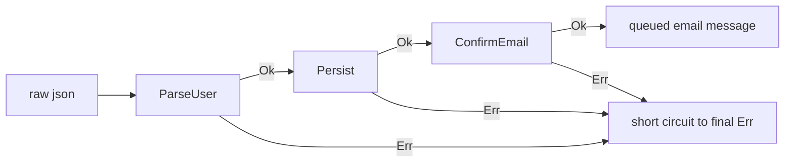
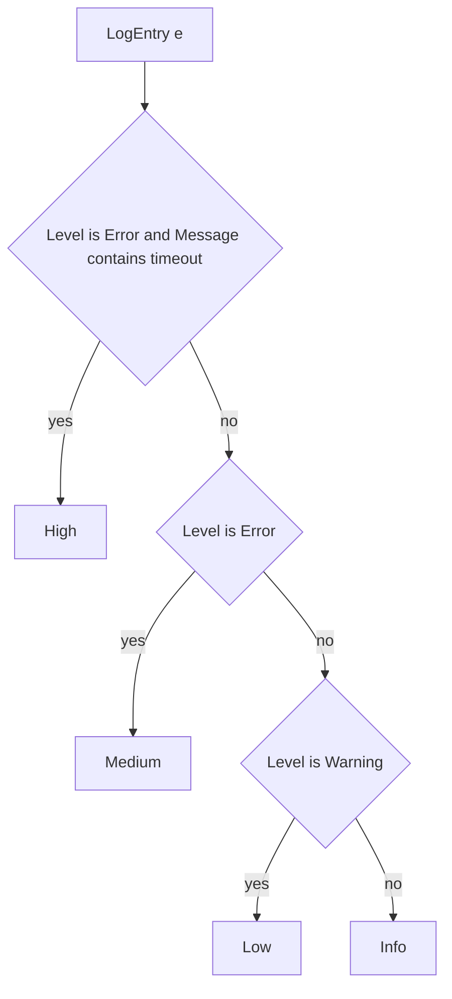

# Lecture 2 — Functional Patterns, Records, and Pattern Matching

> **Duration:** ~1.5 hours of reading + hands-on.
> **Outcome:** You can model a domain with `record` and `record struct`, write exhaustive `switch` expressions over closed type hierarchies, apply list and property patterns where chained `if`/`else` was the old default, build a small `Result<T>` discriminated union with `Map`/`Bind`/`Match`, and recognize when "immutable + pure + pipeline" is the right shape and when it is not.

If you only remember one thing from this lecture, remember this:

> **C# 13 is a functional-first language with imperative escape hatches, not the other way around.** Records give you immutable data with value equality. `with` expressions give you updates without mutation. `switch` expressions plus exhaustive pattern matching give you total functions over closed type hierarchies. The compiler checks that you handle every case (CS8509 → build error). Combine these and you can write business logic that reads like an algebra textbook — and reviews like one. The imperative tools (`for`, mutable lists, throw-and-catch) are still there. Reach for them when you measure that you need them, not by reflex.

---

## 1. `record` — the default modelling tool

A `record` is a reference type with compiler-generated value equality, `ToString`, `GetHashCode`, `Equals`, `Deconstruct`, and `with` support. Declare one in two lines:

```csharp
public sealed record User(string Name, string Email, DateTime CreatedAt);
```

That declaration generates:

- A primary constructor `User(string Name, string Email, DateTime CreatedAt)`.
- Three `init`-only properties: `Name`, `Email`, `CreatedAt`.
- A `Deconstruct(out string, out string, out DateTime)` method.
- `Equals(User?)` and `Equals(object?)` overrides that compare by *value* (all three properties).
- `GetHashCode()` that combines the three property hashes.
- `ToString()` that prints `User { Name = ..., Email = ..., CreatedAt = ... }`.
- A protected virtual `EqualityContract` property used by `Equals` to disallow comparing a `User` to a `User`-derived record as equal.
- A copy constructor `protected User(User original)` used by the `with` expression.
- An `operator ==` and `operator !=` pair.

You can verify all of this on SharpLab — paste the one-liner, look at the "C#" output panel. You will see ~120 lines of compiler-generated boilerplate. The whole point of `record` is that you did not write it.

### Value equality means what you think it means

```csharp
var u1 = new User("Ada", "ada@example.com", DateTime.UtcNow);
var u2 = new User("Ada", "ada@example.com", u1.CreatedAt);

Console.WriteLine(u1 == u2);             // True  — value equality
Console.WriteLine(ReferenceEquals(u1, u2)); // False — different instances
```

This is the headline. Two `User` instances with the same field values are `==` regardless of identity. The compiler emits the equality logic; you cannot accidentally forget to override `Equals` and `GetHashCode` together.

Use this everywhere you would have written a "DTO" — a plain data object whose identity is its content. HTTP request bodies, configuration sections, message payloads, value objects in your domain. All of these are records.

### Use a `class` for entities with database identity

`User` in the example above is a domain value. But an *entity* — a row in `Users` with primary key `Id` — has a different equality contract: two `User` rows with the same `Id` are equal even if their other fields differ (one has been edited). For entities, define a class with `Id`-only equality:

```csharp
public sealed class UserEntity
{
    public required Guid Id { get; init; }
    public required string Name { get; set; }
    public required string Email { get; set; }
    public DateTime CreatedAt { get; init; }

    public override bool Equals(object? obj) =>
        obj is UserEntity other && Id == other.Id;
    public override int GetHashCode() => Id.GetHashCode();
}
```

The rule of thumb: **records for values, classes for entities**. EF Core's `DbContext` works better with classes anyway (change tracking needs mutable properties). Domain logic that flows through pipelines wants records.

### `with` expressions

```csharp
var u1 = new User("Ada", "ada@example.com", DateTime.UtcNow);
var u2 = u1 with { Email = "ada@newdomain.org" };
```

`u2` is a fresh `User` with the same `Name` and `CreatedAt`, the new `Email`. `u1` is unchanged. The compiler lowers `u1 with { Email = "..." }` to roughly:

```csharp
var u2 = new User(u1) { Email = "..." };
```

— invoking the compiler-generated copy constructor and overriding the `init`-only `Email` setter via the object initializer. The copy constructor copies every property; the object initializer overrides the named one.

`with` is the "update without mutating" idiom. Use it instead of:

```csharp
// DON'T — needs the property to be set, not init
u1.Email = "ada@newdomain.org";
```

Records are immutable by default (their properties are `init`-only). `with` is the escape hatch for "I need to change one field"; it always produces a fresh instance.

### `record struct` — when the type is small

```csharp
public readonly record struct Point(double X, double Y);
public readonly record struct Money(decimal Amount, string Currency);
```

A `record struct` is a value type with all the same compiler-generated members. The differences:

- **Stack-allocated** (when used as a local). No GC pressure for short-lived values.
- **Value semantics** for assignment — `a = b` copies the bytes.
- **`readonly record struct`** makes the whole thing immutable; this should be your default for record structs.

When to reach for `record struct`:

1. The type is **≤ 16 bytes** (two 8-byte fields, or four 4-byte fields). Beyond that the copy cost on assignment exceeds the allocation savings.
2. The type is **frequently allocated and short-lived** — coordinates, timestamps, monetary amounts.
3. The type has **no inheritance** needs.

When to stay with `record`:

- The type has more than ~16 bytes of state.
- You need inheritance (an abstract record with sealed cases — the discriminated-union pattern below).
- You only allocate it a few times per request — the allocation is noise.

The Week 5 default: `record` everywhere; promote to `record struct` only after `BenchmarkDotNet` with `[MemoryDiagnoser]` shows the allocations actually hurt.

---

## 2. `required` and `init`

`required` properties (since C# 11) force every caller to set the property during construction. Combine with `init` for immutable, complete construction:

```csharp
public sealed record Page
{
    public required string Title { get; init; }
    public required string Body  { get; init; }
    public DateTime? PublishedAt { get; init; }
}

var p = new Page { Title = "Hello", Body = "..." }; // ok — PublishedAt may be null
var q = new Page { Title = "Hello" };               // CS9035: Body is required
```

`required` is the modern alternative to a long positional constructor. It works particularly well with object initializers and `with` expressions, because the compiler tracks "have all required members been set?" at the type-checker level.

The Week 5 default: prefer the **primary-constructor form** of records for ≤ 5 properties (`record Page(string Title, string Body, DateTime? PublishedAt)`), and the **required-member form** for ≥ 6 properties, where the object-initializer syntax becomes more readable than a positional constructor.

---

## 3. Pattern matching, exhaustively

C# 13's pattern surface is the largest of any mainstream curly-brace language:

- **Type patterns:** `obj is User u`
- **Constant patterns:** `n is 0`
- **Var patterns:** `obj is var x` (always matches, binds)
- **Discard patterns:** `_`
- **Relational patterns:** `n is > 0 and < 100`
- **Logical patterns:** `obj is (User and { IsActive: true })`
- **Property patterns:** `obj is User { Email: "ada@example.com" }`
- **Positional patterns:** `obj is User("Ada", _, _)` (uses `Deconstruct`)
- **List patterns:** `arr is [1, 2, ..]` or `arr is [.., var last]`

The vocabulary is large but the compositional rules are simple: every pattern matches a value or doesn't, and patterns combine with `and`, `or`, `not`. Property and positional patterns nest other patterns inside.

### `switch` expressions

The most useful place to apply patterns is the `switch` *expression* — note "expression," not "statement":

```csharp
public static string Describe(object obj) => obj switch
{
    User { IsActive: true, Email: var e } => $"active user with email {e}",
    User { IsActive: false }              => "inactive user",
    int n when n > 0                       => $"positive integer {n}",
    int n                                  => $"non-positive integer {n}",
    string s                               => $"string of length {s.Length}",
    null                                   => "null reference",
    _                                      => $"unknown {obj.GetType().Name}",
};
```

The `switch` expression evaluates to a value. Every arm is a pattern + optional `when` clause + `=>` + expression. The arms are tried top-to-bottom; the first match wins; the value of the matched arm becomes the value of the whole expression.

The `_` discard pattern at the end is the catch-all. **Without it**, if the compiler can prove that the input type has values not covered by the listed patterns, it emits **CS8509 — "the switch expression does not handle all possible values"**. Treat this warning as a build error.

### Property patterns make `if`/`else` clauses disappear

The old-style:

```csharp
public static string Severity(LogEntry e)
{
    if (e.Level == LogLevel.Error && e.Message.Contains("timeout"))
        return "high";
    if (e.Level == LogLevel.Error)
        return "medium";
    if (e.Level == LogLevel.Warning)
        return "low";
    return "info";
}
```

The pattern-matching form:

```csharp
public static string Severity(LogEntry e) => e switch
{
    { Level: LogLevel.Error, Message: var m } when m.Contains("timeout") => "high",
    { Level: LogLevel.Error }   => "medium",
    { Level: LogLevel.Warning } => "low",
    _                           => "info",
};
```

The second form is shorter, reads top-down as a decision table, and the compiler complains if you forget a `LogLevel` case (if `Severity` is over a closed enum or sealed type). The `when` clause is the escape hatch for predicates that cannot be expressed as patterns alone — the rule of thumb is "use patterns where you can, `when` where you must."

### List patterns

New in C# 11, list patterns match arrays and lists by *shape*:

```csharp
public static string Classify(int[] arr) => arr switch
{
    []                        => "empty",
    [var x]                   => $"one element: {x}",
    [var first, var second]   => $"two elements: {first}, {second}",
    [var first, .., var last] => $"first {first}, last {last}, middle has {arr.Length - 2}",
    [_, _, _, ..]             => "at least three",
};
```

The `..` is the "slice" — zero or more elements. It can appear once per pattern and binds, optionally, to a variable: `[var first, .. var rest]` gives you `int[] rest`.

List patterns work on any type that has both a `Length` (or `Count`) property and an indexer. That includes arrays, `List<T>`, `string` (each element is a `char`), `Span<T>`, `ReadOnlySpan<T>`, and any custom type you make pattern-aware.

A practical use: parsing command-line args:

```csharp
return args switch
{
    []                                   => Help(),
    ["--help"]                           => Help(),
    ["--seed", var url, ..var rest]      => RunWithSeed(url, rest),
    [var subcommand, ..var rest]         => Dispatch(subcommand, rest),
};
```

That replaces a 30-line manual arg parser. The same pattern works for any input that has "first, rest" structure: a string of tokens, an `IList<T>` of events, a `Span<byte>` of bytes.

---

## 4. Closed type hierarchies — the C# 13 way to do discriminated unions

C# 13 does not have a `union` keyword. But you can encode a closed sum type (a discriminated union) with `abstract record` + a `sealed record` per case:

```csharp
public abstract record Result<T>;
public sealed record Ok<T>(T Value) : Result<T>;
public sealed record Err<T>(string Error) : Result<T>;
```

Three types. One base, two cases. The base is `abstract` so it cannot be instantiated. The cases are `sealed` so nobody can add a third one from outside.

Now you can write exhaustive consumers:

```csharp
public static string Format<T>(Result<T> r) => r switch
{
    Ok<T> ok   => $"value: {ok.Value}",
    Err<T> err => $"error: {err.Error}",
};
```

The compiler **knows** that `Result<T>` has exactly two derived types (because they are all `sealed` and live in the same file as the abstract base, ideally), so the `switch` is exhaustive. No `_` needed. If you add a third case `Pending<T>`, every `switch` over `Result<T>` fails to compile until you handle it. The compiler is your refactoring tool.

This is the C# 13 idiom for what F#, OCaml, Rust, Swift, and Kotlin (via sealed classes) call discriminated unions / sum types / algebraic data types. The syntax is more verbose than F#'s `type Result<'T> = Ok of 'T | Err of string`, but the semantics are the same.

### `Map`, `Bind`, `Match` on `Result<T>`

The three core operations:

```csharp
public static class ResultExtensions
{
    // Map: transform the value inside Ok; Err passes through.
    public static Result<U> Map<T, U>(this Result<T> r, Func<T, U> f) => r switch
    {
        Ok<T> ok   => new Ok<U>(f(ok.Value)),
        Err<T> err => new Err<U>(err.Error),
    };

    // Bind: like Map, but f itself returns a Result (lets you chain operations that may fail).
    public static Result<U> Bind<T, U>(this Result<T> r, Func<T, Result<U>> f) => r switch
    {
        Ok<T> ok   => f(ok.Value),
        Err<T> err => new Err<U>(err.Error),
    };

    // Match: the exhaustive consumer.
    public static U Match<T, U>(this Result<T> r, Func<T, U> onOk, Func<string, U> onErr) => r switch
    {
        Ok<T> ok   => onOk(ok.Value),
        Err<T> err => onErr(err.Error),
    };
}
```

In use:

```csharp
Result<User>     ParseUser(string json)      => /* may return Ok<User> or Err<User> */;
Result<UserId>   Persist(User u)             => /* may return Ok<UserId> or Err<UserId> */;
Result<EmailMsg> ConfirmEmail(UserId id)     => /* ... */;

// Chain three operations that each may fail:
Result<EmailMsg> pipeline =
    ParseUser(rawJson)
        .Bind(Persist)
        .Bind(ConfirmEmail);

// Consume it:
string output = pipeline.Match(
    onOk:  msg => $"queued {msg.Subject}",
    onErr: err => $"failed: {err}");
```


*Bind chains ParseUser, Persist, and ConfirmEmail; the first Err skips every remaining step.*

Three things to notice:

1. **No `try`/`catch` and no `if`/`else`.** The error propagates through `Bind` automatically. The first `Err` short-circuits the chain.
2. **Type-checked.** If `Persist` accidentally returned `Result<Document>` instead of `Result<UserId>`, the second `Bind` would not compile.
3. **The pipeline reads as English.** "Parse the user, then persist it, then confirm the email."

This is the same shape LINQ uses with `Where`/`Select`/`SelectMany`. `Bind` is *exactly* `SelectMany` for `Result<T>`. Once you see this, you see it everywhere: `Task<T>` has `ContinueWith`, `Nullable<T>` has `?.`, `IEnumerable<T>` has `SelectMany`, `Result<T>` has `Bind`. All of these are the same operation — flatten a nested wrapper. The pattern is called *monadic bind*; you do not need to know the word to use it.

### When to reach for `Result<T>` vs throwing

C# has exceptions. Records, `Result<T>`, `Map`, `Bind` do not replace them — they coexist:

- **Throw exceptions** for *exceptional* errors: a bug, a precondition violation, a `null` argument, an external system that should never have failed. These should crash the request (and be caught at the outermost frame).
- **Return `Result<T>`** for *expected* errors that callers must handle: a parse failure on user input, a network call that can fail, a domain operation that violates a business rule.

A useful rule: if the caller can sensibly do something *other than* "log and re-throw," you owe them a `Result<T>` or `Option<T>`. If the answer is always "log and re-throw," an exception is fine.

The mini-project this week applies this rule: the parser returns `Result<Row>` (a row may fail to parse); the aggregator returns the totals or `Result<Totals>` if no rows survived. Crashes (truly exceptional, e.g. the input file does not exist) stay exceptions.

---

## 5. `Option<T>` — the simpler sibling

`Result<T>` carries an error message. Sometimes you only need "value or no value." That's `Option<T>` (a.k.a. `Maybe<T>`):

```csharp
public abstract record Option<T>;
public sealed record Some<T>(T Value) : Option<T>;
public sealed record None<T>()        : Option<T>;
```

`Option<T>` is the type-safe alternative to `null`. The signal is in the *type*: a function that may return nothing returns `Option<T>`, not `T?`.

You probably won't ship your own `Option<T>` — C# has nullable reference types and they are good enough for most cases. But the pattern is useful when:

- You have a chain of operations each of which may produce "no value," and you want compile-time guarantees that the consumer handles both cases.
- You want `Option<T>` to compose with `Bind`/`Map` the same way `Result<T>` does — `null`s do not chain through `?.` as smoothly as you might want.
- You are interop-ing with F# code that uses `Option<T>` natively.

Most codebases stick with `T?` (nullable annotations) and the null-conditional operator (`u?.Email?.Trim()`). `Option<T>` is the heavier-hand answer for "I want the type system to *force* me to handle the absent case."

---

## 6. Functional patterns in idiomatic C#

The functional-style C# checklist:

### Default to immutability

- Properties are `init`-only unless they need to mutate.
- Collections passed around are `IReadOnlyList<T>`, `IReadOnlyDictionary<K, V>`, `ImmutableArray<T>`. Local mutation inside a method is fine; do not let mutable collections escape.
- Update with `with` expressions, not assignment.

### Default to pure functions

- A pure function depends only on its arguments and returns only its result. No `static` mutable state, no `Console.WriteLine`, no `DateTime.UtcNow` reads. Pure functions are trivial to test.
- Side effects belong at the edges: I/O, logging, the database. The middle of your pipeline should be pure.

### Default to expressions over statements

- `switch` expressions, not `switch` statements.
- Ternary `?:` for two-branch decisions, not `if`/`else`.
- `record` expression returns: `public sealed record Result(int Status, string Body);` — no field-by-field constructors.
- LINQ pipelines, not loops with mutable accumulators.

### Default to total functions

- A function that "may throw" has an implicit return value of `T | Exception`. Reflect that in the type: return `Result<T>`.
- A function that "may return null" has an implicit return value of `T | null`. Reflect that with `T?` and let the compiler track nullability.

### The escape hatches are still there

- A tight inner loop on a `Span<int>` should still be a `for` loop. LINQ is not the right tool.
- A method that runs once per request and is straightforward to read as a sequence of statements does not benefit from being rewritten as an expression. Readability wins.
- Exception-throwing is correct for invariant violations, programmer errors, and "this should never happen" cases.

The Week 5 reflex: **start with the functional shape**. Refactor to imperative if the functional shape is unclear, slow, or hard to read. The default is not the rule.

---

## 7. A worked example: parsing CSV rows

The procedural shape:

```csharp
public static List<Transaction> ParseTransactions(IEnumerable<string> lines)
{
    var result = new List<Transaction>();
    foreach (var line in lines)
    {
        var parts = line.Split(',');
        if (parts.Length != 4) continue;
        if (!DateTime.TryParse(parts[0], out var date)) continue;
        if (!decimal.TryParse(parts[1], out var amount)) continue;
        var description = parts[2].Trim();
        var category = parts[3].Trim();
        result.Add(new Transaction(date, amount, description, category));
    }
    return result;
}
```

The functional shape — records, pattern matching, LINQ:

```csharp
public sealed record Transaction(DateTime Date, decimal Amount, string Description, string Category);

public abstract record ParseOutcome;
public sealed record Parsed(Transaction Value) : ParseOutcome;
public sealed record Skipped(string Reason)    : ParseOutcome;

public static IEnumerable<Transaction> ParseTransactions(IEnumerable<string> lines) =>
    lines
        .Select(ParseLine)
        .OfType<Parsed>()
        .Select(p => p.Value);

static ParseOutcome ParseLine(string line) => line.Split(',') switch
{
    [var d, var a, var desc, var cat]
        when DateTime.TryParse(d, out var date) && decimal.TryParse(a, out var amount)
        => new Parsed(new Transaction(date, amount, desc.Trim(), cat.Trim())),
    [_, _, _, _]                      => new Skipped("bad date or amount"),
    var parts                          => new Skipped($"expected 4 fields, got {parts.Length}"),
};
```

Read the second form out loud: "for each line, parse it; keep the parsed ones; project to the transaction." Each step is its own concern. The `switch` expression is a complete decision table — list pattern with `when` clause for the happy path, list pattern of length 4 for the "fields present but parse failed" case, default for "wrong number of fields." The compiler checks exhaustiveness.

A bonus: the `Skipped` variant carries the reason. If you ever want to log skipped lines, you uncomment one line:

```csharp
return lines
    .Select(ParseLine)
    .Tap(o => { if (o is Skipped s) logger.LogWarning("Skipped: {Reason}", s.Reason); })
    .OfType<Parsed>()
    .Select(p => p.Value);
```

The `Tap` operator from Lecture 1 §9 is the bridge between a pure pipeline and a logging side effect. The pipeline stays declarative; the side effect happens in exactly one place.

---

## 8. Performance, again

Records allocate. `with` allocates. `switch` expressions over reference types do a runtime type check (cheap, but not free). The functional shape is not always free.

Concrete numbers (.NET 9 on x64, your numbers may vary):

- **Allocating a `record` with 4 properties:** ~40 ns + 48 bytes.
- **`with` expression on the same record:** ~40 ns + 48 bytes (copy + initializer).
- **`switch` expression over 4 sealed records:** ~5 ns + 0 bytes (the type test is a vtable read).
- **Property pattern with one nested property check:** ~6 ns + 0 bytes.
- **List pattern `[_, _, var last]`:** ~3 ns + 0 bytes (length check + indexer).

For comparison:

- **Allocating a small `class`:** ~25 ns + 32 bytes.
- **Assigning a property on a mutable class:** ~1 ns + 0 bytes.

So a record-and-`with` pipeline allocates ~2× more than a mutable-class-and-assign pipeline. For low-volume code (one request, one DTO chain) this is invisible. For a tight inner loop that processes 1M elements, the 48 bytes × 1M = 48 MB of garbage is real.

The recipe:

- **Default to records.** Almost all code is low-volume on this axis.
- **Convert to mutable class** only after `BenchmarkDotNet` + `[MemoryDiagnoser]` says you need to. Document the reason in a comment.
- **Convert to `readonly record struct`** for ≤ 16-byte values that you allocate millions of times.

Mini-project this week measures one such pipeline both ways. You will see the cost. Most of the time it does not matter.

---

## 9. The grand pattern: LINQ pipeline over records of sum types

Putting it all together, the Week 5 canonical shape:

```csharp
public sealed record LogEntry(DateTime At, LogLevel Level, string Host, string Message);

public abstract record Severity;
public sealed record High(LogEntry Entry, string Reason)   : Severity;
public sealed record Medium(LogEntry Entry, string Reason) : Severity;
public sealed record Low(LogEntry Entry)                   : Severity;
public sealed record Info(LogEntry Entry)                  : Severity;

static Severity Classify(LogEntry e) => e switch
{
    { Level: LogLevel.Error, Message: var m } when m.Contains("timeout")
        => new High(e, "timeout"),
    { Level: LogLevel.Error,   Message: var m } => new Medium(e, m),
    { Level: LogLevel.Warning }                  => new Low(e),
    _                                            => new Info(e),
};

static IReadOnlyList<High> HighSeverityByHost(IEnumerable<LogEntry> entries, string host) =>
    entries
        .Where(e => e.Host == host)
        .Select(Classify)
        .OfType<High>()
        .OrderByDescending(h => h.Entry.At)
        .ToList();

static IEnumerable<KeyValuePair<string, int>> ErrorCountsByHost(IEnumerable<LogEntry> entries) =>
    entries
        .Select(Classify)
        .Where(s => s is High or Medium)
        .CountBy(s => s switch
        {
            High h   => h.Entry.Host,
            Medium m => m.Entry.Host,
            _        => throw new UnreachableException(),  // we filtered to High|Medium
        });
```


*The Classify switch is a decision tree in disguise, and the compiler proves every branch is covered.*

Five lines per query. Each query reads exactly like its question. Adding a `Critical` severity case forces every `switch` to be revisited — and the compiler is your reminder.

This is the shape we drill in Exercises 1–3 and lock in with the mini-project. By Sunday it should feel as obvious as `for (i = 0; i < n; i++)` did in week one.

---

## 10. Build succeeded

```
Build succeeded · 0 warnings · 0 errors · 281 ms
```

You have read Lecture 1 (LINQ, deferred execution, iterators, `CountBy`/`AggregateBy`/`Index`) and Lecture 2 (records, pattern matching, discriminated unions, `Map`/`Bind`/`Match`). The mental model is now:

> Data flows through a pipeline of transformations. The data is immutable. The transformations are pure. The pipeline is declarative. The branching is exhaustive. When a step may fail, the failure is a value (`Result<T>`), not an exception. The compiler proves that every case is handled. The whole thing reads like English.

Open Exercise 1 next. The puzzles are designed to drill exactly the LINQ operators introduced in Lecture 1. Exercise 2 forces you to *see* deferred execution. Exercise 3 is the canonical refactor from procedural-with-mutation to pipeline-of-records.

---

## Self-check questions

Answer these before moving on.

1. What is the difference between a `record` and a `record struct`? When would you choose each? (Answer: `record` is a reference type; `record struct` is a value type. Default to `record`; choose `record struct` only when the type is ≤ 16 bytes, frequently allocated, short-lived, and benchmarked.)
2. Why does the compiler emit CS8509 for the `switch` expression `e.Level switch { LogLevel.Error => "err", LogLevel.Warning => "warn" }` when `LogLevel` has more values? (Answer: the compiler proves the input has unhandled values — `LogLevel.Info`, `LogLevel.Debug`, etc. CS8509 says "not exhaustive." Add cases or a `_` arm.)
3. What does `u1 with { Email = "..." }` compile to? (Answer: a call to the compiler-generated copy constructor `new User(u1)` followed by an object-initializer that overrides the `init`-only `Email` property.)
4. What is the relationship between `Bind` and LINQ's `SelectMany`? (Answer: they are the same operation — both flatten a nested wrapper. `result.Bind(f)` and `enumerable.SelectMany(f)` are structurally identical: take the inner value out, apply `f` (which itself returns the same wrapper type), let the result flow through.)
5. Why is `sealed` important on the cases of a discriminated union? (Answer: it prevents anyone from adding a third case later. The compiler proves exhaustiveness only when it knows the full list of cases — `sealed` + the base being `abstract` is the closure.)
6. What's the difference between `e is { Level: LogLevel.Error }` and `e is LogEntry { Level: LogLevel.Error }`? (Answer: the first is a property pattern without a type test (assumes the static type already includes `Level`); the second adds a type test. In practice both work where `e` is statically typed as `LogEntry`; the second is necessary when `e` is `object`.)
7. When is throwing an exception still the right answer in C# 13? (Answer: invariant violations, programmer errors, "this should never happen." Use `Result<T>` for expected, recoverable errors — parse failures, network errors, business-rule violations — and exceptions for the genuinely exceptional.)

---

*Lecture 2 ends here. Move on to the [exercises](../exercises/README.md).*
