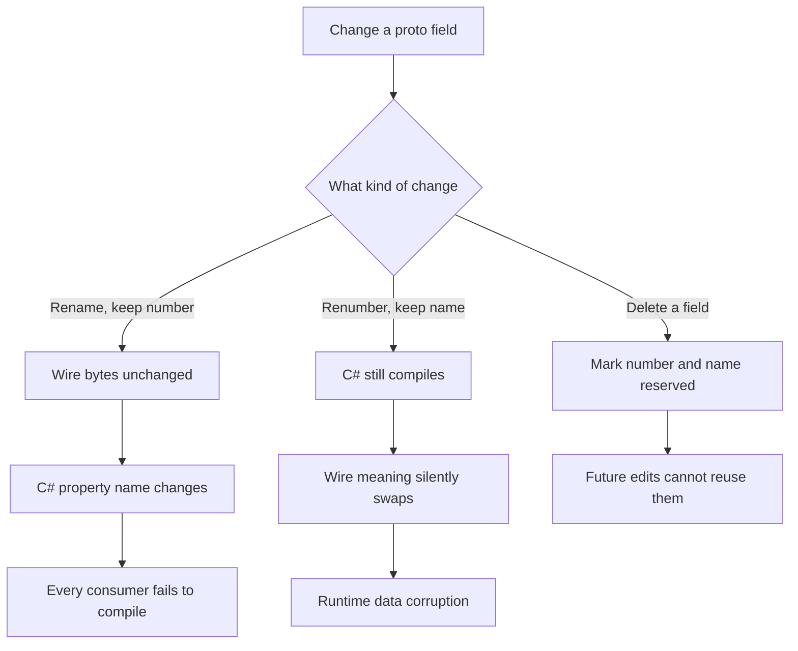
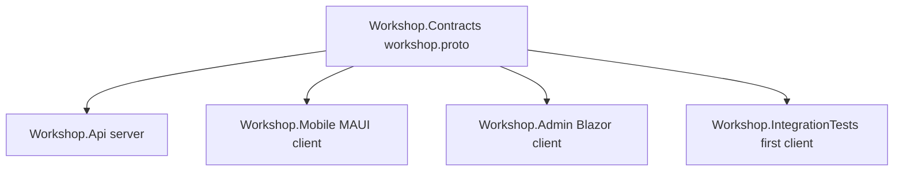

# Lecture 1 — The Contract Is the Source of Truth: `workshop.proto`, Code Generation, and One Shape for Three Clients

## What we are building

For the next three weeks we build one system, the **Polyglot Workshop**, on one repository. It is a classroom platform: instructors create **lessons**, learners **enroll** in them, both sides **submit** and **review** exercises, and an analytics surface aggregates progress. The system has three clients — a .NET MAUI mobile app, a Blazor admin dashboard, and (this week) a thin first client plus the integration-test suite — and one backend, an ASP.NET Core 9 service called `Workshop.Api`. The thing that holds it all together, the thing this lecture is about, is a single file: `workshop.proto`. It is the **source of truth** for the shape of the domain. Everything else — the service, the database, the clients — is downstream of it.

This is a deliberate inversion of how most systems are built. The usual order is: design a database, write a backend that exposes it, write a UI against the backend, then write a second UI by copying the first UI's networking code. Three weeks in you have three codebases that each carry their own private notion of what a `Lesson` is, and the day someone renames a column the breakage is silent, at runtime, in production, in whichever client nobody tested. The Polyglot Workshop writes the contract first and generates the clients from it, so that a rename is a **compile error** in every consumer at once. That is the whole idea. The reference is the Protocol Buffers proto3 language guide at <https://protobuf.dev/programming-guides/proto3/> and the gRPC for .NET overview at <https://learn.microsoft.com/en-us/aspnet/core/grpc/>.

We are on **.NET 9 / C# 13** now — the capstone steps the course up from the .NET 8 of the earlier weeks. Confirm `dotnet --version` prints `9.0.x` before you write a line. Nothing in the proto changes between framework versions, but the generated code, the EF Core provider, and the test packages all target 9.

## Why a `.proto` and not an OpenAPI doc or a shared C# library

You could imagine three other ways to share a contract. A hand-written shared C# library of DTO classes is one — but it only helps C# clients, and the capstone's whole point is *polyglot*: a `.proto` could just as well drive a Swift or Kotlin or Go client, and the Blazor client consumes it over **gRPC-Web** in the browser. An OpenAPI document is another — but it describes a REST surface in JSON and does not give you generated, strongly-typed clients for free across languages; it describes shapes, it does not enforce them at compile time. A `.proto` does three things none of the alternatives do together: it is language-neutral, it generates strongly-typed client *and* server code, and — because the generated code is *referenced*, not copied — a change to the contract forces a recompile of every consumer. That last property is the one we are buying. Citation: the gRPC vs HTTP-API comparison at <https://learn.microsoft.com/en-us/aspnet/core/grpc/comparison>.

## The shape of `workshop.proto`

Here is the contract. It lives in a shared project, `Workshop.Contracts`, under `protos/workshop/v1/workshop.proto`. The package is `workshop.v1` — versioned from day one, because a real contract outlives its first version and `workshop.v2` should be able to coexist.

```proto
syntax = "proto3";

package workshop.v1;

import "google/protobuf/timestamp.proto";

option csharp_namespace = "Workshop.Contracts.V1";

// The Workshop service: the single RPC surface every client consumes.
service Workshop {
  // Instructor surface.
  rpc CreateLesson (CreateLessonRequest) returns (Lesson);
  rpc ListLessons  (ListLessonsRequest)  returns (ListLessonsResponse);
  rpc GetLesson    (GetLessonRequest)     returns (Lesson);

  // Learner surface — the Week-13 vertical slice lives here.
  rpc Enroll       (EnrollRequest)        returns (Enrollment);
  rpc ListEnrollments (ListEnrollmentsRequest) returns (ListEnrollmentsResponse);

  // Exercise + review surface (scaffolded this week, fleshed out in Week 14).
  rpc SubmitExercise (SubmitExerciseRequest) returns (Submission);
  rpc ReviewSubmission (ReviewSubmissionRequest) returns (Review);

  // Identity probe — used by every client to confirm auth wiring.
  rpc WhoAmI (WhoAmIRequest) returns (WhoAmIResponse);
}

// ---- Core domain messages ----

message Lesson {
  string id = 1;                       // server-assigned GUID, string-encoded
  string title = 2;
  string summary = 3;
  string instructor_id = 4;
  LessonStatus status = 5;
  google.protobuf.Timestamp created_at = 6;
}

enum LessonStatus {
  LESSON_STATUS_UNSPECIFIED = 0;       // proto3 requires a zero default
  LESSON_STATUS_DRAFT = 1;
  LESSON_STATUS_PUBLISHED = 2;
  LESSON_STATUS_ARCHIVED = 3;
}

message Enrollment {
  string id = 1;
  string lesson_id = 2;
  string learner_id = 3;
  google.protobuf.Timestamp enrolled_at = 4;
}

message Exercise {
  string id = 1;
  string lesson_id = 2;
  string prompt = 3;
  int32 max_score = 4;
}

message Submission {
  string id = 1;
  string exercise_id = 2;
  string learner_id = 3;
  string content = 4;
  google.protobuf.Timestamp submitted_at = 5;
}

message Review {
  string id = 1;
  string submission_id = 2;
  string reviewer_id = 3;
  int32 score = 4;
  string feedback = 5;
  google.protobuf.Timestamp reviewed_at = 6;
}

// ---- Request / response envelopes ----

message CreateLessonRequest { string title = 1; string summary = 2; }
message GetLessonRequest    { string id = 1; }

message ListLessonsRequest  { int32 page_size = 1; string page_token = 2; }
message ListLessonsResponse { repeated Lesson lessons = 1; string next_page_token = 2; }

message EnrollRequest       { string lesson_id = 1; }
message ListEnrollmentsRequest  { string learner_id = 1; }
message ListEnrollmentsResponse { repeated Enrollment enrollments = 1; }

message SubmitExerciseRequest   { string exercise_id = 1; string content = 2; }
message ReviewSubmissionRequest { string submission_id = 1; int32 score = 2; string feedback = 3; }

message WhoAmIRequest  {}
message WhoAmIResponse { string subject = 1; string display_name = 2; }
```

The contract above is the minimum that makes the milestone honest. Before we generate from it, it is worth widening it once with the messages the next two weeks will need, so the shape is settled and Week 14 adds *behavior*, not *structure*. The analytics surface and the richer list/filter envelopes look like this — paste them alongside the messages above:

```proto
// ---- Analytics surface (scaffolded now, served in Week 14) ----

message LessonProgress {
  string lesson_id = 1;
  int32 enrolled_count = 2;
  int32 submission_count = 3;
  int32 reviewed_count = 4;
  double average_score = 5;            // 0..max_score, NaN-free; absent reads 0
}

message GetLessonProgressRequest { string lesson_id = 1; }

message ListSubmissionsRequest {
  string exercise_id = 1;
  int32 page_size = 2;
  string page_token = 3;
}
message ListSubmissionsResponse {
  repeated Submission submissions = 1;
  string next_page_token = 2;
}

// ---- A richer list envelope, with an explicit filter ----

message ListLessonsRequest {
  int32 page_size = 1;
  string page_token = 2;
  LessonStatus status_filter = 3;      // UNSPECIFIED => all statuses
  string instructor_id = 4;            // empty => any instructor
}
```

And the service grows two analytics RPCs that round out the surface without changing anything already declared:

```proto
service Workshop {
  // ... the eight RPCs above, unchanged ...

  // Analytics surface (scaffolded this week, served Week 14).
  rpc GetLessonProgress (GetLessonProgressRequest) returns (LessonProgress);
  rpc ListSubmissions   (ListSubmissionsRequest)   returns (ListSubmissionsResponse);
}
```

Note what just happened: adding `status_filter = 3` and `instructor_id = 4` to `ListLessonsRequest` *extended* the message without disturbing fields `1` and `2`, and adding two RPCs *extended* the service without touching the existing methods. Both are additive, both are backward-compatible, and both are the right way to grow a contract — the discipline Challenge 1 makes you prove by contrast with the wrong way.

A few decisions are worth dwelling on because they are the kind of thing that bites teams later.

**Field numbers are forever.** The `= 1`, `= 2` on each field are wire identifiers, not display order. Once a message has shipped, you never renumber and never reuse a deleted number — you `reserved` it. We do not need `reserved` yet because nothing has shipped, but the habit starts now. Citation: <https://protobuf.dev/programming-guides/proto3/#assigning>.

**Every enum starts at zero with an `UNSPECIFIED` member.** proto3 has no concept of "field absent" for scalars; an unset enum reads as `0`. If `0` meant `DRAFT`, you could not tell "explicitly draft" from "the client forgot to set it." `LESSON_STATUS_UNSPECIFIED = 0` makes the absence visible. Citation: <https://protobuf.dev/programming-guides/proto3/#enum>.

**IDs are strings, not a custom GUID type.** Protobuf has no GUID. We string-encode server-assigned GUIDs. The conversion to and from `System.Guid` happens at the service boundary (Lecture 2), never leaks into the contract.

**Timestamps use the well-known type.** `google.protobuf.Timestamp` is the standard UTC-instant type; it round-trips cleanly to `DateTimeOffset` in C# via the generated `.ToDateTimeOffset()` / `Timestamp.FromDateTimeOffset(...)` helpers. We `import "google/protobuf/timestamp.proto";` to get it. Citation: <https://protobuf.dev/reference/protobuf/google.protobuf/#timestamp>.

**The service is one service, not five.** Everything hangs off a single `Workshop` service. We *could* split instructor and learner surfaces into separate services; we do not, because one service is one generated `WorkshopClient` that every client constructs identically, and the build milestone values that uniformity over premature partitioning.

## Field numbers, the wire, and what "compatible" means

The single most important fact about protobuf — the one that justifies the entire "contract first" bet — is that **the field number, not the field name, is what travels on the wire.** A protobuf message on the wire is a sequence of `(field_number, wire_type, value)` tuples. The field *name* (`learner_id`) is never serialized; it exists only in the `.proto` and in the generated code. This has three consequences you must internalize before you ship anything:

```
  Source .proto          On the wire (conceptual)        What a peer reads
  string learner_id = 3   field#3, type=LEN, "abc..."     whatever its .proto calls #3
```

1. **Renaming a field is wire-safe but source-breaking.** Change `learner_id` to `learner_id` while keeping `= 3`, and the bytes on the wire are byte-for-byte identical — an old peer and a new peer interoperate perfectly. But the *generated C# property* changes from `LearnerId` to `LearnerId`, so every line of C# that read `.LearnerId` stops compiling. That is the safe-but-breaking change, and it is exactly what you want: the compiler catches it everywhere at once. Challenge 1 makes you do this and watch it break.

2. **Renumbering a field is source-safe but wire-breaking.** Swap `lesson_id = 2` and `learner_id = 3` to `lesson_id = 3` and `learner_id = 2`, keeping the names, and the C# compiles cleanly — `.LessonId` and `.LearnerId` still resolve. But a peer built against the old numbering reads field 2 as the lesson id while the new peer wrote the learner id there. The two values silently transpose, with no error, at runtime, possibly in production. This is the catastrophic change, and the field-number-is-forever rule exists to prevent it.

3. **Deleting a field requires `reserved`.** When a field is genuinely retired, you delete it and `reserved` its number *and* its name, so no future edit can re-use number 3 (and silently read old wire data into a new meaning) or re-add the name 3 (and confuse a code reviewer):

```proto
message Enrollment {
  string id = 1;
  string lesson_id = 2;
  reserved 3;                 // learner_id used to live here; never reuse #3
  reserved "learner_id";      // and never reuse the name either
  google.protobuf.Timestamp enrolled_at = 4;
  string learner_ref = 5;     // its replacement gets a fresh number
}
```

The rule of thumb, which you will repeat for three weeks: **additive is free, rename is a coordinated source change, renumber is a bug.** Adding a field at a new number is forward- and backward-compatible — old peers ignore the unknown field, new peers read it; this is why `ListLessonsRequest` could grow `status_filter = 3` above without breaking anyone. Citations: the field-assignment rules at <https://protobuf.dev/programming-guides/proto3/#assigning>, the `reserved` reference at <https://protobuf.dev/programming-guides/proto3/#fieldreserved>, and the gRPC versioning guidance at <https://learn.microsoft.com/en-us/aspnet/core/grpc/versioning>.


*Renaming breaks the build loudly; renumbering breaks data silently — reserved fields prevent both.*

## Generating C# from the contract: `Grpc.Tools`

The `.proto` is not code you compile directly. The `Grpc.Tools` NuGet package hooks into MSBuild and runs the `protoc` compiler plus the gRPC C# plugin at build time, emitting `Workshop.cs` (the messages) and `WorkshopGrpc.cs` (the service base class and the client) into `obj/`. You never check the generated files in; they regenerate on every build from the `.proto`. The `Workshop.Contracts.csproj` is small and is the keystone of the whole repo:

```xml
<Project Sdk="Microsoft.NET.Sdk">

  <PropertyGroup>
    <TargetFramework>net9.0</TargetFramework>
    <Nullable>enable</Nullable>
    <ImplicitUsings>enable</ImplicitUsings>
  </PropertyGroup>

  <ItemGroup>
    <PackageReference Include="Google.Protobuf" Version="3.27.3" />
    <PackageReference Include="Grpc.Net.Client" Version="2.66.0" />
    <PackageReference Include="Grpc.Tools" Version="2.66.0">
      <PrivateAssets>All</PrivateAssets>          <!-- build-time only; not a runtime dep -->
    </PackageReference>
  </ItemGroup>

  <ItemGroup>
    <!-- Generate BOTH the server base class and the client.
         The service references this project for Server; clients use Client. -->
    <Protobuf Include="protos/workshop/v1/workshop.proto"
              GrpcServices="Both"
              ProtoRoot="protos" />
  </ItemGroup>

</Project>
```

Three points. First, `Grpc.Tools` carries `<PrivateAssets>All</PrivateAssets>` because it is a *build-time* tool — it must not flow transitively to anything that references `Workshop.Contracts` as a runtime dependency. Second, `GrpcServices="Both"` emits both the abstract `Workshop.WorkshopBase` server class (which the service overrides) and the concrete `Workshop.WorkshopClient` (which every client constructs). Third, `ProtoRoot="protos"` tells `protoc` where the import root is so `google/protobuf/timestamp.proto` resolves. The canonical reference is <https://learn.microsoft.com/en-us/aspnet/core/grpc/basics>.

The `<Protobuf>` MSBuild item has more knobs than the three we use, and knowing them saves an afternoon when a contract grows. The ones worth memorizing:

| Attribute | Values | What it controls |
|-----------|--------|------------------|
| `GrpcServices` | `Both` / `Server` / `Client` / `None` | Whether to emit the service base, the client, both, or only the message types. A pure client project can set `Client` to skip the unused server base. |
| `ProtoRoot` | a directory | The import root `protoc` resolves `import` paths against. Required once `import` lines appear. |
| `Access` | `Public` / `Internal` | Visibility of the generated types. `Public` (the default) is what lets other assemblies reference them. |
| `OutputDir` | a directory | Where the generated `.cs` lands; defaults under `obj/`. Leave it. |
| `AdditionalImportDirs` | dirs | Extra `-I` paths for imports living outside `ProtoRoot`. |

Two `<Protobuf>` items can coexist with different `GrpcServices` values — for instance, you can emit `Both` for `workshop.proto` and `Client` for a third-party vendor `.proto` you only consume. The wildcard form `<Protobuf Include="protos/**/*.proto" GrpcServices="Both" ProtoRoot="protos" />` picks up every `.proto` under the root, which is what the capstone uses once `workshop/v1/` holds more than one file. Reference: <https://learn.microsoft.com/en-us/aspnet/core/grpc/basics#generated-c-assets>.

After a `dotnet build`, the generated client looks (abridged) like this — you do not write it, but you read it constantly:

```csharp
// Generated into obj/.../WorkshopGrpc.cs — DO NOT EDIT.
namespace Workshop.Contracts.V1
{
    public static partial class Workshop
    {
        // The base class the service overrides.
        public abstract partial class WorkshopBase
        {
            public virtual Task<Enrollment> Enroll(EnrollRequest request, ServerCallContext context)
                => throw new RpcException(new Status(StatusCode.Unimplemented, ""));
            // ... one virtual per RPC ...
        }

        // The client every consumer constructs.
        public partial class WorkshopClient : ClientBase<WorkshopClient>
        {
            public WorkshopClient(ChannelBase channel) : base(channel) { }
            public virtual Enrollment Enroll(EnrollRequest request, CallOptions options = default) { /* ... */ }
            public virtual AsyncUnaryCall<Enrollment> EnrollAsync(EnrollRequest request, CallOptions options = default) { /* ... */ }
            // ... one method (sync + async) per RPC ...
        }
    }
}
```

## One contract, three clients, zero copies

Here is the repository shape that makes the single-source rule real. The `Workshop.Contracts` project is referenced — never copied — by the service and by every client:

```
                       +----------------------------+
                       |  Workshop.Contracts        |
                       |  protos/workshop/v1/*.proto |  <-- the ONE source of truth
                       |  (generates Workshop.cs,    |
                       |   WorkshopGrpc.cs at build) |
                       +-------------+--------------+
                                     |  <ProjectReference>
        +----------------+-----------+-----------+----------------------+
        v                v                       v                      v
 +--------------+  +--------------+      +----------------+    +---------------------+
 | Workshop.Api |  | Workshop.    |      | Workshop.      |    | Workshop.           |
 | (server:     |  | Mobile       |      | Admin          |    | IntegrationTests    |
 |  WorkshopBase|  | (MAUI, gRPC, |      | (Blazor, gRPC- |    | (first honest       |
 |  override)   |  |  Week 14-15) |      |  Web, Week 15) |    |  client THIS week)  |
 +--------------+  +--------------+      +----------------+    +---------------------+
```

Notice what is *not* here: there is no `LessonDto.cs` hand-written in `Workshop.Mobile`, no `class Lesson` typed by hand in `Workshop.Admin`. There is one `Lesson`, generated from one `.proto`, and four projects reference it. The day you rename `Lesson.summary` to `Lesson.description` in the `.proto`, all four projects that use that field stop compiling until someone fixes them — which is the whole point, and which you will prove to yourself in Challenge 1.


*One generated contract referenced by the server and every client — never copied.*

This week you only need the *first* client to compile and exercise the contract. The integration-test project (`Workshop.IntegrationTests`, Lecture 3) is that client: it constructs a real `WorkshopClient` over an in-memory channel and calls `EnrollAsync`. The MAUI and Blazor projects are scaffolded as empty `<ProjectReference>` consumers now and built out in Weeks 14–15. The cost of "setting up the shared project on day one" is one `.csproj`; the reward is that adding the second and third clients is a project reference, not a porting exercise.

## The client side of the generated code

A client constructs a `GrpcChannel` to the service's address and wraps it in the generated `WorkshopClient`:

```csharp
using Grpc.Net.Client;
using Workshop.Contracts.V1;

// In a real MAUI/Blazor client the address comes from config; here it is literal.
using var channel = GrpcChannel.ForAddress("https://localhost:7080");
var client = new Workshop.WorkshopClient(channel);

var enrollment = await client.EnrollAsync(new EnrollRequest { LessonId = lessonId });
Console.WriteLine($"Enrolled {enrollment.LearnerId} in {enrollment.LessonId} at {enrollment.EnrolledAt.ToDateTimeOffset():u}");
```

Two things make this honest. The `EnrollRequest` and `Enrollment` types are the *same generated types the server implements against* — there is no translation layer, no risk of the client's idea of `Enrollment` diverging from the server's. And `EnrollAsync` returns an `AsyncUnaryCall<Enrollment>` that is awaitable directly; the synchronous `Enroll` exists but you use the async form everywhere, as Week 4 drilled. Citation: the gRPC .NET client docs at <https://learn.microsoft.com/en-us/aspnet/core/grpc/client>.

The Blazor admin client is the one wrinkle: browsers cannot speak raw HTTP/2 gRPC, so it uses **gRPC-Web**, which tunnels the same generated client over an HTTP/1.1-friendly framing. The generated `WorkshopClient` is *identical*; only the channel's transport handler differs (`GrpcWebHandler`). That is a Week-15 concern, but it is why the contract being transport-neutral matters — one `.proto`, one generated client, three transports. Citation: <https://learn.microsoft.com/en-us/aspnet/core/grpc/grpcweb>.

It is worth being precise about *why* the browser cannot do raw gRPC, because the distinction surfaces again in Week 15. Native gRPC requires the client to control HTTP/2 framing directly — to read and write length-prefixed protobuf frames, send trailers, and manage flow control. A browser's `fetch`/`XMLHttpRequest` API exposes none of that: it gives you a request body and a response body, not the frames underneath. gRPC-Web is the adaptation layer that fits gRPC's semantics into what a browser *can* do — it encodes the same length-prefixed messages but in a way an HTTP/1.1-or-2 body can carry, and it folds the trailers (which carry the gRPC status) into the body's tail. Concretely:

```
  Native gRPC (MAUI, server-to-server)     gRPC-Web (Blazor in the browser)
  ---------------------------------------  ----------------------------------------
  Transport: HTTP/2, raw frames            Transport: HTTP/1.1 or /2, body framing
  Channel:   GrpcChannel.ForAddress(addr)  Channel:   GrpcChannel.ForAddress(addr,
  Handler:   default SocketsHttpHandler                 new GrpcWebHandler(
  Server:    AddGrpc()                                    new HttpClientHandler()))
  Same generated WorkshopClient on both    ----- only the handler differs -----
```

On the server, the same `Workshop.Api` host serves both: `app.UseGrpcWeb()` plus `.EnableGrpcWeb()` on the mapped service lets the one host answer native-gRPC calls from MAUI *and* gRPC-Web calls from Blazor, against the same service implementation. The contract does not know or care which transport a given call arrived on — the generated `Enroll` override runs identically. That is the payoff stated once more in transport terms: the *shape* is in the `.proto`, the *transport* is a client and host concern, and they never tangle. Citation: <https://learn.microsoft.com/en-us/aspnet/core/grpc/grpcweb>.

## Versioning the `workshop.v1` package

The `package workshop.v1;` line and the `protos/workshop/v1/` directory are not decoration — they are the contract's escape hatch for the day the shape must change incompatibly. The convention, which the gRPC and protobuf communities share, is that the major version lives in *both* the package name and the directory path:

```
protos/
  workshop/
    v1/
      workshop.proto      package workshop.v1;   csharp_namespace = "Workshop.Contracts.V1"
    v2/                   (the day a breaking change is unavoidable)
      workshop.proto      package workshop.v2;   csharp_namespace = "Workshop.Contracts.V2"
```

Because the package and the C# namespace differ between versions, `workshop.v1.Workshop` and `workshop.v2.Workshop` are *distinct services* that can be registered on the same host at the same time (`MapGrpcService<WorkshopServiceV1>()` and `MapGrpcService<WorkshopServiceV2>()`). Old clients keep calling `/workshop.v1.Workshop/Enroll`; new clients call `/workshop.v2.Workshop/Enroll`; the routes do not collide because the package name is part of the gRPC method path. This is how you ship an incompatible change — a renumber, a field type change, a removed RPC — without a flag day: you stand up `v2` beside `v1`, migrate clients on their own schedule, and retire `v1` when its last caller is gone.

The rule of thumb: **everything additive stays in `v1` forever** (new fields at new numbers, new RPCs, new messages — all the growth we did above). You only ever cut a `v2` when a change is genuinely wire-incompatible and you cannot make it additive. In a well-run contract, `v2` is rare; most teams live in `v1` for years. The reason we version *from day one* — `workshop.v1`, not bare `workshop` — is that retrofitting a version segment into a package name later is itself a breaking change to every method path, so you pay the one-character cost now and never think about it again. Citation: the gRPC versioning guidance at <https://learn.microsoft.com/en-us/aspnet/core/grpc/versioning>.

## Four call types, and why the milestone is all unary

gRPC supports four RPC shapes, and the contract chooses one per method by how the request and response are typed. Every RPC in `workshop.proto` this week is **unary** — one request message in, one response message out — because the build milestone values the simplest shape that proves the architecture, and because unary maps cleanly onto REST-style request/response thinking the team already has. The other three are real and we will reach for them later:

```
                request        response       used in the Workshop for...
  Unary         single  ----->  single        Enroll, GetLesson, CreateLesson (THIS week)
  Server stream single  ----->  stream         "tail the activity feed of a lesson" (Week 14 idea)
  Client stream stream  ----->  single         "bulk-import submissions" (not planned)
  Bidi stream   stream  <---->  stream         live presence / collaborative review (Week 14, with SignalR)
```

In the `.proto`, a streaming method is declared with the `stream` keyword on the request or response side, e.g. `rpc TailLessonActivity (TailRequest) returns (stream ActivityEvent);`. We do *not* declare any this week — not because streaming is hard, but because a unary `Enroll` is the thinnest thing that exercises the full proto → service → client → database path, and the milestone is about proving that path, not about exercising every gRPC feature. When Week 14 adds live presence in a lesson, that is where a server-stream or a SignalR hub earns its place. The four call types are documented at <https://learn.microsoft.com/en-us/aspnet/core/grpc/services> and the conceptual comparison at <https://grpc.io/docs/what-is-grpc/core-concepts/>.

## Where the address comes from (dev vs the three clients)

One last practical point that bites teams: the `GrpcChannel.ForAddress("https://localhost:7080")` literal above is fine for a lecture but wrong for a real client. Each of the three clients sources the address differently, and the contract is indifferent to all of them. The MAUI client reads it from a config service (`appsettings` packaged in the app, overridable per environment) because a phone talks to a deployed backend, not `localhost`. The Blazor admin reads it from the host page's base URI because the gRPC-Web calls go back to the same origin that served the app. The integration-test client (Lecture 3) does not use an address at all — it builds the channel over the in-memory `TestServer`'s message handler, so no socket is opened. Three address strategies, one generated client, zero contract changes. That indifference is the payoff of writing the shape down once: the *transport* and the *address* are deployment concerns, and the *shape* is the contract, and they never tangle. Citation: <https://learn.microsoft.com/en-us/aspnet/core/grpc/configuration>.

## What we built

- A single `workshop.proto` (proto3, `package workshop.v1`) declaring `Lesson`, `Enrollment`, `Exercise`, `Submission`, `Review`, an enum with a zero `UNSPECIFIED`, well-known `Timestamp`s, and one `Workshop` service — the only declaration of the domain shape in the entire repo.
- A `Workshop.Contracts` project that turns the `.proto` into strongly-typed C# at build time via `Grpc.Tools` (`GrpcServices="Both"`, `Grpc.Tools` as a `PrivateAssets="All"` build dependency).
- The repository topology in which the service and all clients *reference* the generated contract rather than copying it, so a contract change is a compile error in every consumer at once.
- The client-side construction pattern (`GrpcChannel` + generated `WorkshopClient`) that the integration-test project — this week's first honest client — will use to exercise the contract.

The slogan: **write the contract first, generate everything else, and let the compiler keep three clients honest.**
