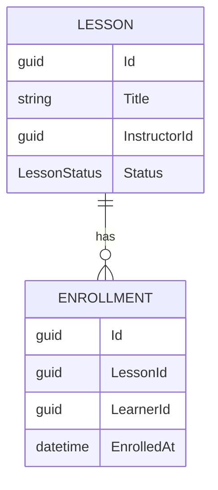
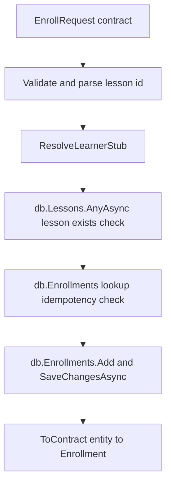

# Lecture 2 — Scaffolding `Workshop.Api`, the EF Core 9 Data Layer, and the Enroll Vertical Slice

## Why this lecture exists

Lecture 1 gave us a contract and four projects that reference it. None of them does anything yet. This lecture turns the contract into a running service: an ASP.NET Core 9 host that serves the generated gRPC service, persists to PostgreSQL through EF Core 9, and — crucially — delivers **one complete vertical slice** rather than five half-built layers. The slice is *"a learner enrolls in a lesson."* By the end of the lecture, an `EnrollRequest` lands at the gRPC frame, becomes an `Enrollment` row in Postgres, and returns an `Enrollment` message to the caller, with a structured log line and a trace ID following it the whole way. That single thread through every layer is the deliverable; everything else is repetition of its proven shape.

The temptation — the one this lecture is built to defeat — is to scaffold all five entities, write all the repositories, wire all eight RPCs, and only then try a client call, three days from now, hoping it all lines up. It will not. The vertical-slice discipline says: finish the thinnest path that touches the contract, the entity, the migration, the service method, and a client, get *that* green, and only then add breadth. The reference is Jimmy Bogard's vertical-slice writing at <https://www.jimmybogard.com/vertical-slice-architecture/>; the .NET-flavored version is the incremental minimal-API tutorial at <https://learn.microsoft.com/en-us/aspnet/core/tutorials/min-web-api>.

We are on **.NET 9 / EF Core 9 / C# 13**. The migration commands assume `dotnet-ef` 9.0.x.

## Scaffolding the host

`Workshop.Api` is a gRPC service host. The `Program.cs` is short and composes one `Add*` call per concern, exactly the discipline Week 12 drilled — observability is wired from the first commit, not bolted on later.

```csharp
using Serilog;
using Workshop.Api.Data;
using Workshop.Api.Services;

var builder = WebApplication.CreateBuilder(args);

// 1. Serilog as the global logger, compact JSON, trace-ID enrichment.
builder.Host.UseSerilog((ctx, cfg) => cfg
    .ReadFrom.Configuration(ctx.Configuration)
    .Enrich.FromLogContext()
    .WriteTo.Console(new Serilog.Formatting.Compact.RenderedCompactJsonFormatter()));

// 2. EF Core 9 against PostgreSQL, pooled.
builder.Services.AddDbContextPool<WorkshopDbContext>(opt =>
    opt.UseNpgsql(builder.Configuration.GetConnectionString("Workshop")));

// 3. OpenTelemetry tracing — console exporter in dev. AspNetCore covers the
//    gRPC server frame; Npgsql adds the SQL span; the WorkshopService source
//    adds the application span.
builder.Services.AddOpenTelemetry()
    .WithTracing(t => t
        .AddSource("Workshop.Api")
        .AddAspNetCoreInstrumentation()
        .AddNpgsql()
        .AddConsoleExporter());

// 4. The gRPC service.
builder.Services.AddGrpc();

var app = builder.Build();

// 5. Apply migrations on startup in Development; manual in prod (Week 15).
if (app.Environment.IsDevelopment())
{
    using var scope = app.Services.CreateScope();
    var db = scope.ServiceProvider.GetRequiredService<WorkshopDbContext>();
    await db.Database.MigrateAsync();
}

// 6. Map the generated service into the pipeline.
app.MapGrpcService<WorkshopService>();
app.MapGet("/", () => "Workshop.Api — gRPC only. Use a gRPC client or grpcurl.");

app.Run();

// Required so WebApplicationFactory<Program> can reference the entry point (Lecture 3).
public partial class Program { }
```

`AddGrpc()` registers the gRPC middleware; `MapGrpcService<WorkshopService>()` routes the HTTP/2 gRPC frames to our implementation. The `public partial class Program { }` line at the bottom promotes the implicit top-level-statement `Program` class to `public` so the test project can name it — the exact gotcha quiz question 10 of Week 12 covered, brought forward. Citation: <https://learn.microsoft.com/en-us/aspnet/core/grpc/aspnetcore>.

The `Workshop.Api.csproj` references the contract for the *server* side:

```xml
<ItemGroup>
  <PackageReference Include="Grpc.AspNetCore" Version="2.66.0" />
  <PackageReference Include="Microsoft.EntityFrameworkCore.Design" Version="9.0.0" PrivateAssets="All" />
  <PackageReference Include="Npgsql.EntityFrameworkCore.PostgreSQL" Version="9.0.0" />
  <PackageReference Include="Serilog.AspNetCore" Version="8.0.3" />
  <PackageReference Include="OpenTelemetry.Extensions.Hosting" Version="1.9.0" />
  <PackageReference Include="OpenTelemetry.Instrumentation.AspNetCore" Version="1.9.0" />
  <PackageReference Include="Npgsql.OpenTelemetry" Version="9.0.0" />
  <PackageReference Include="OpenTelemetry.Exporter.Console" Version="1.9.0" />
  <ProjectReference Include="..\Workshop.Contracts\Workshop.Contracts.csproj" />
</ItemGroup>
```

## The EF Core 9 data layer

The entities are *not* the contract messages. The contract is the wire shape; the entities are the persistence shape, and the two are deliberately separate so that a database concern (a foreign key, an index, a `timestamptz`) never leaks into the contract and a wire concern (a string-encoded GUID) never dictates a column type. The slice maps between them at the service boundary.

```csharp
namespace Workshop.Api.Data;

public sealed class Lesson
{
    public Guid Id { get; set; }
    public string Title { get; set; } = "";
    public string Summary { get; set; } = "";
    public Guid InstructorId { get; set; }
    public LessonStatus Status { get; set; } = LessonStatus.Draft;
    public DateTimeOffset CreatedAt { get; set; }
    public List<Enrollment> Enrollments { get; } = [];   // C# 13 collection expression
}

public enum LessonStatus { Unspecified = 0, Draft = 1, Published = 2, Archived = 3 }

public sealed class Enrollment
{
    public Guid Id { get; set; }
    public Guid LessonId { get; set; }
    public Lesson Lesson { get; set; } = null!;
    public Guid LearnerId { get; set; }
    public DateTimeOffset EnrolledAt { get; set; }
}

// Exercise, Submission, Review entities follow the same shape — scaffolded
// this week, exercised in Week 14. The vertical slice needs only Lesson + Enrollment.
```

The `DbContext` configures snake_case tables, the org-agnostic indexes the slice needs, and the cascade from lesson to enrollment:

```csharp
namespace Workshop.Api.Data;

using Microsoft.EntityFrameworkCore;

public sealed class WorkshopDbContext(DbContextOptions<WorkshopDbContext> options) : DbContext(options)
{
    public DbSet<Lesson> Lessons => Set<Lesson>();
    public DbSet<Enrollment> Enrollments => Set<Enrollment>();

    protected override void OnModelCreating(ModelBuilder b)
    {
        b.Entity<Lesson>(e =>
        {
            e.ToTable("lessons");
            e.HasKey(x => x.Id);
            e.Property(x => x.Title).HasMaxLength(200);
            e.Property(x => x.CreatedAt).HasColumnType("timestamptz");
            e.HasIndex(x => x.InstructorId);
        });

        b.Entity<Enrollment>(e =>
        {
            e.ToTable("enrollments");
            e.HasKey(x => x.Id);
            e.Property(x => x.EnrolledAt).HasColumnType("timestamptz");
            e.HasIndex(x => new { x.LessonId, x.LearnerId }).IsUnique();   // a learner enrolls once
            e.HasOne(x => x.Lesson)
             .WithMany(l => l.Enrollments)
             .HasForeignKey(x => x.LessonId)
             .OnDelete(DeleteBehavior.Cascade);
        });
    }
}
```

The unique index on `(lesson_id, learner_id)` encodes a real business rule — a learner enrolls in a given lesson exactly once — at the database level, where it cannot be bypassed by a race between two requests. We will rely on it in the slice. Citation: the Npgsql provider docs at <https://learn.microsoft.com/en-us/ef/core/providers/npgsql> and the EF Core indexes reference at <https://learn.microsoft.com/en-us/ef/core/modeling/indexes>.


*A lesson has many enrollments, enforced by a foreign key and a unique index on lesson and learner.*

### The migration

With the entities and context in place, generate and inspect the `InitialCreate` migration. You **check the migration in** — it is the schema's version-controlled history, not a build artifact.

```bash
cd src/Workshop.Api
dotnet ef migrations add InitialCreate
dotnet ef migrations script        # print the SQL; read it before applying
```

The generated `Up` produces, in PostgreSQL terms:

```sql
CREATE TABLE lessons (
    id            uuid        NOT NULL,
    title         varchar(200) NOT NULL,
    summary       text         NOT NULL,
    instructor_id uuid        NOT NULL,
    status        integer     NOT NULL,
    created_at    timestamptz NOT NULL,
    CONSTRAINT pk_lessons PRIMARY KEY (id)
);

CREATE TABLE enrollments (
    id          uuid        NOT NULL,
    lesson_id   uuid        NOT NULL,
    learner_id  uuid        NOT NULL,
    enrolled_at timestamptz NOT NULL,
    CONSTRAINT pk_enrollments PRIMARY KEY (id),
    CONSTRAINT fk_enrollments_lessons_lesson_id FOREIGN KEY (lesson_id)
        REFERENCES lessons (id) ON DELETE CASCADE
);

CREATE INDEX ix_lessons_instructor_id ON lessons (instructor_id);
CREATE UNIQUE INDEX ix_enrollments_lesson_id_learner_id ON enrollments (lesson_id, learner_id);
```

Read that SQL before you apply it. The `timestamptz` columns, the `ON DELETE CASCADE`, and the unique index are the model decisions made concrete; if any of them surprises you, the model is wrong, not the migration. Citation: the migrations docs at <https://learn.microsoft.com/en-us/ef/core/managing-schemas/migrations/>.

## The vertical slice: `Enroll`, end to end

Now the slice. `WorkshopService` extends the generated `Workshop.WorkshopBase` and overrides exactly the method the slice needs. The auth identity is a **stub** this week — a hard-coded learner id sourced from a header — because real OIDC/Keycloak is the Week-14 harden milestone. The stub is a deliberate, documented scope cut, not an oversight.

```csharp
namespace Workshop.Api.Services;

using System.Diagnostics;
using Google.Protobuf.WellKnownTypes;
using Grpc.Core;
using Microsoft.EntityFrameworkCore;
using Workshop.Api.Data;
using Workshop.Contracts.V1;
using DataEnrollment = Workshop.Api.Data.Enrollment;

public sealed class WorkshopService(WorkshopDbContext db, ILogger<WorkshopService> logger)
    : Workshop.WorkshopBase
{
    private static readonly ActivitySource Source = new("Workshop.Api");

    public override async Task<Enrollment> Enroll(EnrollRequest request, ServerCallContext context)
    {
        using var activity = Source.StartActivity("Enroll");

        // 1. Validate the contract input.
        if (!Guid.TryParse(request.LessonId, out var lessonId))
            throw new RpcException(new Status(StatusCode.InvalidArgument, "lesson_id is not a valid id"));

        // 2. Auth stub — Week 14 replaces this with the OIDC subject claim.
        var learnerId = ResolveLearnerStub(context);
        activity?.SetTag("workshop.lesson_id", lessonId);
        activity?.SetTag("workshop.learner_id", learnerId);

        // 3. Enforce the invariant: the lesson must exist.
        var lessonExists = await db.Lessons.AnyAsync(l => l.Id == lessonId, context.CancellationToken);
        if (!lessonExists)
            throw new RpcException(new Status(StatusCode.NotFound, "lesson not found"));

        // 4. Idempotency: the unique index makes a double-enroll a NotFound-free no-op.
        var existing = await db.Enrollments
            .FirstOrDefaultAsync(e => e.LessonId == lessonId && e.LearnerId == learnerId, context.CancellationToken);
        if (existing is not null)
            return ToContract(existing);

        // 5. Persist — produces the Npgsql INSERT span under the Enroll span.
        var entity = new DataEnrollment
        {
            Id = Guid.NewGuid(),
            LessonId = lessonId,
            LearnerId = learnerId,
            EnrolledAt = DateTimeOffset.UtcNow,
        };
        db.Enrollments.Add(entity);
        await db.SaveChangesAsync(context.CancellationToken);

        logger.LogInformation("Learner {LearnerId} enrolled in lesson {LessonId}", learnerId, lessonId);
        return ToContract(entity);
    }

    // ---- the contract <-> entity boundary, in one place ----
    private static Enrollment ToContract(DataEnrollment e) => new()
    {
        Id = e.Id.ToString(),
        LessonId = e.LessonId.ToString(),
        LearnerId = e.LearnerId.ToString(),
        EnrolledAt = Timestamp.FromDateTimeOffset(e.EnrolledAt),
    };

    private static Guid ResolveLearnerStub(ServerCallContext ctx)
    {
        // Week-13 stub: read x-learner-id metadata, default to a fixed dev learner.
        var raw = ctx.RequestHeaders.GetValue("x-learner-id");
        return Guid.TryParse(raw, out var id) ? id : Guid.Parse("00000000-0000-0000-0000-000000000001");
    }
}
```

Walk the thread once more, because the shape of this method is the shape of every method you write for the rest of the capstone:

```
EnrollRequest (contract, wire)
      |  validate + parse
      v
ResolveLearnerStub  ----> (Week 14: OIDC subject claim)
      |
      v
db.Lessons.AnyAsync  ----> SELECT ... (Npgsql span, child of Enroll span)
      |
      v
db.Enrollments.Add + SaveChangesAsync  ----> INSERT ... (Npgsql span)
      |
      v
ToContract(entity)  ----> Enrollment (contract, wire)
```


*Every RPC method follows this same validate, authorize, check invariant, persist, map shape.*

Five things are true of this slice and must stay true of every slice after it. It validates the contract input before touching the database. It enforces a real invariant (the lesson exists; the enrollment is unique). It maps contract↔entity in exactly one place (`ToContract`), never inline. It produces a structured log line and a trace span without any caller doing anything. And it returns the *generated contract type*, so the client and the server agree on the shape by construction.

## Poking the slice by hand

Before the integration test (Lecture 3), prove the slice with `grpcurl`. Seed a lesson, then enroll:

```bash
# List the service's methods straight off reflection (AddGrpcReflection in dev).
grpcurl -plaintext localhost:5080 list workshop.v1.Workshop

# Enroll in a seeded lesson, passing the stub learner header.
grpcurl -plaintext \
  -H 'x-learner-id: 00000000-0000-0000-0000-000000000002' \
  -d '{"lesson_id":"<seeded-guid>"}' \
  localhost:5080 workshop.v1.Workshop/Enroll
```

A correct response is the JSON projection of the `Enrollment` message:

```json
{
  "id": "5f3a...",
  "lessonId": "<seeded-guid>",
  "learnerId": "00000000-0000-0000-0000-000000000002",
  "enrolledAt": "2026-06-18T14:09:51Z"
}
```

If you get `NotFound`, the lesson was not seeded. If you get `InvalidArgument`, the `lesson_id` is not a GUID. If a *second* identical call returns the *same* enrollment id rather than a unique-violation error, the idempotency branch (step 4) is working. Citation for gRPC reflection used by `grpcurl`: <https://github.com/fullstorydev/grpcurl>.

## What we built

- A short `Workshop.Api` `Program.cs` that serves the generated gRPC service with Serilog and OpenTelemetry wired from the first commit, and `public partial class Program { }` so the tests can boot it.
- An EF Core 9 data layer — entities deliberately separate from the contract messages, a `WorkshopDbContext` with snake_case tables, a unique `(lesson_id, learner_id)` index encoding a business rule, and a checked-in `InitialCreate` migration whose SQL we read before applying.
- The enroll vertical slice: one `EnrollRequest` validated, authorized (stub), checked against an invariant, persisted, and mapped back to a contract `Enrollment` — with the contract↔entity conversion isolated in one method.
- A `grpcurl` recipe to prove the slice by hand before the integration test makes it permanent.

The slogan: **finish one thread through every layer before you build the second — a green slice de-risks the whole system.**
