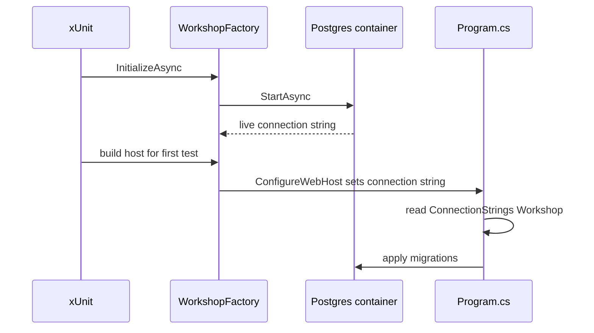
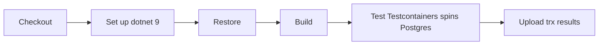

# Lecture 3 — The Integration Baseline: `WebApplicationFactory<Program>`, Testcontainers, and Green in CI

## Why this lecture exists

We have a contract, a service, a migration, and one vertical slice that works under `grpcurl`. "Works on my machine, poked by hand" is not the milestone. The milestone is an **integration baseline**: a small, automated suite that boots the *real* `Workshop.Api` in-process against a *real* PostgreSQL container, drives the enroll slice through the *real* generated gRPC client, asserts on the result, and runs **green on a GitHub Actions runner**. This lecture builds that suite and the CI that runs it. When it is green, the architecture is de-risked: the contract compiles into a working client, the service implements it, EF Core migrates a real database, and the round trip holds — all proven by a checkmark someone other than you can see.

This is the same `WebApplicationFactory<T>` + Testcontainers technique from Week 12, but the capstone elevates it to the **default substrate**. No SQLite-in-memory (it hides Npgsql-specific behavior — `timestamptz`, the unique-index violation shape, case folding). No shared dev database (it makes tests order-dependent and flaky). Every integration test gets a fresh, real PostgreSQL 16 container. The references are the ASP.NET Core integration-test docs at <https://learn.microsoft.com/en-us/aspnet/core/test/integration-tests> and Testcontainers for .NET at <https://dotnet.testcontainers.org/>.

## Unit test vs integration test — what the milestone requires

A **unit test** calls a method and asserts on its return; it touches no database, no socket, no container. It is fast and it proves a function's logic. An **integration test**, in the sense the capstone means, boots the entire application — `Program.cs` and all — inside the test process, points it at an ephemeral PostgreSQL container, and drives it through the real client. It is slower (a container start, a host boot, a migration apply) and it proves that the *parts compose*: the contract, the service, EF Core, the migration, and the wire all agree.

The build milestone requires the **integration** kind, because the risk this week is not "does `ToContract` map correctly" (a unit test's job) — it is "do the contract, the service, and a real database actually line up end to end." You will write unit tests too, over time; the *baseline* that gates Milestone 1 is integration. Citation: <https://learn.microsoft.com/en-us/aspnet/core/test/integration-tests>.

## The Testcontainers fixture

The fixture owns the lifecycle of the PostgreSQL container and the `WebApplicationFactory`. It starts a container, overrides the host's connection string to point at it, applies migrations, and exposes a configured `WorkshopClient`.

```csharp
namespace Workshop.IntegrationTests;

using Grpc.Net.Client;
using Microsoft.AspNetCore.Mvc.Testing;
using Microsoft.Extensions.DependencyInjection;
using Microsoft.Extensions.Hosting;
using Testcontainers.PostgreSql;
using Workshop.Api.Data;
using Workshop.Contracts.V1;

public sealed class WorkshopFactory : WebApplicationFactory<Program>, IAsyncLifetime
{
    private readonly PostgreSqlContainer _postgres = new PostgreSqlBuilder()
        .WithImage("postgres:16")
        .WithDatabase("workshop")
        .WithUsername("workshop")
        .WithPassword("devpass")
        .Build();

    public async Task InitializeAsync() => await _postgres.StartAsync();

    public new async Task DisposeAsync() => await _postgres.DisposeAsync();

    protected override void ConfigureWebHost(IWebHostBuilder builder)
    {
        // Point the host at the throwaway container instead of the dev DB.
        builder.UseSetting("ConnectionStrings:Workshop", _postgres.GetConnectionString());
        builder.UseEnvironment("Development");   // so migrations apply on startup
    }

    // A gRPC client that talks to the in-memory TestServer, no real socket.
    public Workshop.WorkshopClient CreateGrpcClient()
    {
        var handler = Server.CreateHandler();          // routes into the TestServer pipeline
        var channel = GrpcChannel.ForAddress(Server.BaseAddress, new GrpcChannelOptions
        {
            HttpHandler = handler,
        });
        return new Workshop.WorkshopClient(channel);
    }

    public async Task SeedLessonAsync(Guid lessonId, string title)
    {
        using var scope = Services.CreateScope();
        var db = scope.ServiceProvider.GetRequiredService<WorkshopDbContext>();
        db.Lessons.Add(new Lesson
        {
            Id = lessonId,
            Title = title,
            Summary = "seed",
            InstructorId = Guid.NewGuid(),
            Status = LessonStatus.Published,
            CreatedAt = DateTimeOffset.UtcNow,
        });
        await db.SaveChangesAsync();
    }
}
```

Three load-bearing details. `IAsyncLifetime`'s `InitializeAsync`/`DisposeAsync` start and stop the container around the test class, so each class gets a clean database. `ConfigureWebHost` overrides the connection string *after* the host's own configuration loads, so the production wiring is untouched and only the test redirects it. And `CreateGrpcClient` builds a `GrpcChannel` over `Server.CreateHandler()` — the in-memory `TestServer`'s `HttpMessageHandler` — so the gRPC call flows through the real ASP.NET Core pipeline (routing, the gRPC middleware, the service) with no TCP socket. Citation: the `WebApplicationFactory` customization docs at <https://learn.microsoft.com/en-us/aspnet/core/test/integration-tests#customize-webapplicationfactory> and the Testcontainers PostgreSQL module at <https://dotnet.testcontainers.org/modules/postgres/>.

> One subtlety the gRPC-over-`TestServer` setup requires: the in-memory test server speaks HTTP/2 for gRPC, and you must tell the channel not to attempt TLS or HTTP/2 upgrade negotiation it cannot do in-memory. The `GrpcChannelOptions.HttpHandler = Server.CreateHandler()` path is the supported one; see <https://learn.microsoft.com/en-us/aspnet/core/grpc/test-services> for the canonical recipe.

It is worth being explicit about the order of operations inside `ConfigureWebHost`, because getting it wrong is the most common reason a freshly-written factory throws on the first test. The override runs *as part of building the host*, which is after the container has started (because `InitializeAsync` ran first and `xUnit` guarantees it completes before any test resolves the fixture) but *before* `Program.cs` reads `ConnectionStrings:Workshop`. So the sequence is: (1) `InitializeAsync` starts the PostgreSQL container and `GetConnectionString()` now returns a live `Host=127.0.0.1;Port=<random>;...`; (2) the first test asks for the factory, which builds the host; (3) `ConfigureWebHost` calls `UseSetting` to slot the live connection string in at the highest configuration precedence; (4) `Program.cs` runs, reads that connection string, registers the pooled context against it, and applies migrations on startup. If you call `_postgres.GetConnectionString()` outside `ConfigureWebHost` — say in the constructor, before `InitializeAsync` — you capture an empty or pre-start value and every query fails to connect. Read the value lazily, inside the override, where the container is guaranteed up.


*The container must be live before ConfigureWebHost reads its connection string, which must run before Program.cs starts the host.*

## A second container: Testcontainers for Keycloak

PostgreSQL is the container the milestone requires; Keycloak is the one Week 14 will need, and wiring it now means the harden week adds *assertions*, not *infrastructure*. Auth this week is a stub — the service reads an `x-learner-id` header rather than validating a token — but the factory can already own a Keycloak container so that the moment real OIDC lands, the test substrate is ready. Testcontainers ships a generic-container builder for any image; Keycloak is a `ContainerBuilder` with a wait strategy on its readiness endpoint:

```csharp
using DotNet.Testcontainers.Builders;
using DotNet.Testcontainers.Containers;

public sealed class KeycloakContainer
{
    private readonly IContainer _container = new ContainerBuilder()
        .WithImage("quay.io/keycloak/keycloak:25.0")
        .WithPortBinding(8080, assignRandomHostPort: true)
        .WithEnvironment("KEYCLOAK_ADMIN", "admin")
        .WithEnvironment("KEYCLOAK_ADMIN_PASSWORD", "admin")
        .WithEnvironment("KC_HEALTH_ENABLED", "true")
        .WithCommand("start-dev")
        // Keycloak is slow to boot; wait for its health endpoint, not just the port.
        .WithWaitStrategy(Wait.ForUnixContainer()
            .UntilHttpRequestIsSucceeded(r => r.ForPort(9000).ForPath("/health/ready")))
        .Build();

    public Task StartAsync() => _container.StartAsync();
    public Task DisposeAsync() => _container.DisposeAsync().AsTask();

    // The issuer URL the JWT bearer middleware will validate against in Week 14.
    public string Authority =>
        $"http://localhost:{_container.GetMappedPublicPort(8080)}/realms/workshop";
}
```

Two details transfer the whole way to Week 14. First, **the wait strategy must target readiness, not the open port.** Keycloak opens its port seconds before it is ready to serve realm metadata; a test that fires the instant the port is open gets a connection-refused or a half-initialized realm. `UntilHttpRequestIsSucceeded(... /health/ready)` waits for the application to declare itself ready, which is the difference between a flaky suite and a green one. Second, **the issuer URL is computed from the mapped port**, exactly as the PostgreSQL connection string is — Testcontainers assigns a random host port, so nothing is hard-coded, and parallel test classes never collide. When Week 14 turns auth real, the factory adds this container to its `InitializeAsync`, points the JWT bearer middleware at `Authority` via `UseSetting`, and mints tokens against the running Keycloak. This week the container is dormant in the harness; the point is that adding it later is an `Add*` line, not a redesign. Citations: the Testcontainers generic builder at <https://dotnet.testcontainers.org/> and the wait-strategy reference at <https://dotnet.testcontainers.org/api/wait_strategies/>.

For the milestone you do **not** need Keycloak running — the enroll slice authenticates via the `x-learner-id` header stub, and adding a slow container to every test run for a feature you have not built yet is the kind of premature cost the scope discipline warns against. The takeaway is the *pattern*: a fixture composes as many real containers as the system under test needs, each with its own readiness wait, each addressed by a Testcontainers-assigned port. PostgreSQL now; Keycloak next week; the shape is identical.

## The baseline test: the enroll round trip

One test proves the whole architecture. It seeds a lesson, constructs the real generated client, calls `EnrollAsync`, and asserts the enrollment came back wired to that lesson — through a real database.

```csharp
namespace Workshop.IntegrationTests;

using FluentAssertions;
using Grpc.Core;
using Workshop.Contracts.V1;
using Xunit;

public sealed class EnrollSliceTests(WorkshopFactory factory) : IClassFixture<WorkshopFactory>
{
    [Fact]
    public async Task Enroll_in_an_existing_lesson_creates_an_enrollment()
    {
        // Arrange — seed a lesson directly in the real database.
        var lessonId = Guid.NewGuid();
        await factory.SeedLessonAsync(lessonId, "Vertical Slices 101");
        var client = factory.CreateGrpcClient();

        // Act — call the generated client through the in-memory server.
        var enrollment = await client.EnrollAsync(
            new EnrollRequest { LessonId = lessonId.ToString() },
            headers: new Metadata { { "x-learner-id", "00000000-0000-0000-0000-000000000007" } });

        // Assert — the round trip holds against a real Postgres.
        enrollment.LessonId.Should().Be(lessonId.ToString());
        enrollment.LearnerId.Should().Be("00000000-0000-0000-0000-000000000007");
        Guid.Parse(enrollment.Id).Should().NotBe(Guid.Empty);
        enrollment.EnrolledAt.ToDateTimeOffset().Should().BeCloseTo(DateTimeOffset.UtcNow, TimeSpan.FromMinutes(1));
    }

    [Fact]
    public async Task Enroll_in_a_missing_lesson_returns_NotFound()
    {
        var client = factory.CreateGrpcClient();

        var act = async () => await client.EnrollAsync(new EnrollRequest { LessonId = Guid.NewGuid().ToString() });

        var ex = await Assert.ThrowsAsync<RpcException>(act);
        ex.StatusCode.Should().Be(StatusCode.NotFound);
    }

    [Fact]
    public async Task Enroll_is_idempotent_for_the_same_learner_and_lesson()
    {
        var lessonId = Guid.NewGuid();
        await factory.SeedLessonAsync(lessonId, "Idempotency");
        var client = factory.CreateGrpcClient();
        var headers = new Metadata { { "x-learner-id", "00000000-0000-0000-0000-000000000008" } };

        var first = await client.EnrollAsync(new EnrollRequest { LessonId = lessonId.ToString() }, headers);
        var second = await client.EnrollAsync(new EnrollRequest { LessonId = lessonId.ToString() }, headers);

        second.Id.Should().Be(first.Id);   // same enrollment, not a unique-violation error
    }
}
```

Three tests, one slice, every failure mode the slice can produce: the happy path, the invariant violation, and the idempotency branch. This is the *baseline* — narrow on purpose. As the system grows (Week 14), each new RPC gets its own happy/error/edge trio in the same shape. Citation for `RpcException` status assertions: the gRPC core status codes at <https://learn.microsoft.com/en-us/aspnet/core/grpc/error-handling> and xUnit shared-context fixtures at <https://xunit.net/docs/shared-context>.

The test project's `.csproj` references the contract for the *client* side, the API for `Program` and the seeding context, and the test packages:

```xml
<ItemGroup>
  <PackageReference Include="Microsoft.AspNetCore.Mvc.Testing" Version="9.0.0" />
  <PackageReference Include="Testcontainers.PostgreSql" Version="3.10.0" />
  <PackageReference Include="FluentAssertions" Version="6.12.0" />
  <PackageReference Include="xunit" Version="2.9.2" />
  <PackageReference Include="xunit.runner.visualstudio" Version="2.8.2" />
  <PackageReference Include="Microsoft.NET.Test.Sdk" Version="17.11.1" />
  <ProjectReference Include="..\..\src\Workshop.Api\Workshop.Api.csproj" />
  <ProjectReference Include="..\..\src\Workshop.Contracts\Workshop.Contracts.csproj" />
</ItemGroup>
```

## The same shape, a second time: a create-then-read round trip

The three enroll tests are the gating baseline, but the *value* of the shape is that the next slice is a copy with the nouns changed. Here is the create-then-list round trip — it constructs a lesson through the client, then reads it back through a second call, proving the write and the read agree across two RPCs and one database. You write this once for `Enroll` and then mechanically for every RPC after; the muscle memory is the point.

```csharp
public sealed class LessonSliceTests(WorkshopFactory factory) : IClassFixture<WorkshopFactory>
{
    [Fact]
    public async Task Create_then_list_returns_the_created_lesson()
    {
        // Arrange — a real client over the in-memory server.
        var client = factory.CreateGrpcClient();
        var instructor = new Metadata { { "x-instructor-id", "00000000-0000-0000-0000-000000000003" } };

        // Act 1 — create a lesson through the contract.
        var created = await client.CreateLessonAsync(
            new CreateLessonRequest { Title = "Vertical Slices 201", Summary = "deeper" },
            instructor);

        // Act 2 — list lessons and find it.
        var list = await client.ListLessonsAsync(new ListLessonsRequest { PageSize = 50 });

        // Assert — the write is visible to the read, through a real Postgres.
        Guid.Parse(created.Id).Should().NotBe(Guid.Empty);
        created.Status.Should().Be(LessonStatus.Draft);          // new lessons start DRAFT
        list.Lessons.Should().ContainSingle(l => l.Id == created.Id)
            .Which.Title.Should().Be("Vertical Slices 201");
    }

    [Fact]
    public async Task Create_with_a_blank_title_returns_InvalidArgument()
    {
        var client = factory.CreateGrpcClient();

        var act = async () => await client.CreateLessonAsync(new CreateLessonRequest { Title = "" });

        var ex = await Assert.ThrowsAsync<RpcException>(act);
        ex.StatusCode.Should().Be(StatusCode.InvalidArgument);   // validation rejects the empty title
    }
}
```

Read the structure, not the specifics. `Create_then_list_returns_the_created_lesson` is a *happy path that spans two RPCs* — it proves the create persisted in a way the list query can see, which catches a whole class of bug a single-RPC test misses (a write that lands in the wrong table, a list query that filters out drafts, a mapping that drops the title). `Create_with_a_blank_title_returns_InvalidArgument` is the *invariant* test, the validation twin of `Enroll`'s `NotFound`. There is no idempotency case here because creating two lessons with the same title is legal — so the trio for this slice is happy/invariant/(read-back) rather than happy/invariant/idempotent. Choosing the right third case per slice is the judgment the baseline trains. Citation for the status-code assertions: <https://learn.microsoft.com/en-us/aspnet/core/grpc/error-handling>.

Notice too that both tests share the one `WorkshopFactory` via `IClassFixture<WorkshopFactory>`, so they pay the container start and host boot *once* for the class, not once per test — the cost model the local-run section below quantifies.

## Running it locally

With Docker running:

```bash
dotnet test tests/Workshop.IntegrationTests
```

```
  Determining projects to restore...
  Restored ...
  Workshop.Contracts -> .../Workshop.Contracts.dll
  Workshop.Api -> .../Workshop.Api.dll
  Workshop.IntegrationTests -> .../Workshop.IntegrationTests.dll
[xUnit.net] Discovering: Workshop.IntegrationTests
[xUnit.net] Starting:    Workshop.IntegrationTests
  Pulling postgres:16 (first run only) ...
  Passed Workshop.IntegrationTests.EnrollSliceTests.Enroll_in_an_existing_lesson_creates_an_enrollment [842 ms]
  Passed Workshop.IntegrationTests.EnrollSliceTests.Enroll_in_a_missing_lesson_returns_NotFound [61 ms]
  Passed Workshop.IntegrationTests.EnrollSliceTests.Enroll_is_idempotent_for_the_same_learner_and_lesson [88 ms]

Passed!  - Failed: 0, Passed: 3, Skipped: 0, Total: 3, Duration: ~6 s (incl. container start)
```

The bulk of the time is the container start and the host boot, paid once per test class. The test bodies themselves are milliseconds. That ratio is the price of fidelity, and it is worth it.

## Green in CI: the GitHub Actions workflow

The deliverable is green *in CI*, not on your laptop. GitHub's `ubuntu-latest` runner has Docker pre-installed and the daemon running, so Testcontainers works out of the box — no `services:` block needed, because Testcontainers starts the container itself from inside the test. The workflow lives at `.github/workflows/ci.yml`:

```yaml
name: CI

on:
  push:
    branches: [ main ]
  pull_request:

jobs:
  build-and-test:
    runs-on: ubuntu-latest
    steps:
      - uses: actions/checkout@v4

      - name: Set up .NET 9
        uses: actions/setup-dotnet@v4
        with:
          dotnet-version: '9.0.x'

      - name: Restore
        run: dotnet restore

      - name: Build
        run: dotnet build --no-restore --configuration Release

      - name: Test (integration baseline — Testcontainers spins Postgres itself)
        run: dotnet test --no-build --configuration Release --logger "trx;LogFileName=results.trx"

      - name: Upload test results
        if: always()
        uses: actions/upload-artifact@v4
        with:
          name: test-results
          path: '**/results.trx'
```

This is the canonical .NET CI shape from <https://docs.github.com/en/actions/use-cases-and-examples/building-and-testing/building-and-testing-net>. Read the steps top to bottom and notice that each one is a single, named, independently-failable command — when CI goes red, the Actions tab tells you *which* step failed, and that is half the diagnosis. `Restore` failing means a NuGet feed or version problem; `Build` failing means a compile error (a renamed `.proto` field, perhaps — Challenge 1); `Test` failing means the round trip broke or Docker was unreachable; the artifact upload runs `if: always()` so you get the `.trx` even on a red test step, which is how you read the failure without re-running.


*Each CI step is independently failable, so a red run points straight at which stage broke.*

### Caching the NuGet restore and the Docker layer

The workflow above is correct but cold-starts everything on every run: it re-downloads every NuGet package and re-pulls `postgres:16` each time. On a busy repo that is a minute of waste per run. Two caches remove most of it. The NuGet cache keys on the lock file so it invalidates only when dependencies change:

```yaml
      - name: Set up .NET 9
        uses: actions/setup-dotnet@v4
        with:
          dotnet-version: '9.0.x'
          cache: true                                   # caches ~/.nuget/packages
          cache-dependency-path: '**/packages.lock.json'
```

`setup-dotnet`'s built-in `cache: true` is the modern one-liner; it requires `RestorePackagesWithLockFile=true` in your projects so a `packages.lock.json` exists to key on. (The older, explicit form is `actions/cache@v4` over `~/.nuget/packages` keyed on a hash of the lock files — same effect, more YAML.) The image-pull cost is harder to cache on GitHub-hosted runners because each run gets a fresh VM with an empty Docker layer store; the pragmatic answers are to accept the ~10-20s `postgres:16` pull (it is one-time per run, not per test) or, on a self-hosted runner that persists between runs, let the layer cache do it for free. Do **not** try to start PostgreSQL with a `services:` block to avoid the pull — that defeats the point, because then the test is not the one Testcontainers starts and the local and CI paths diverge. Citation: <https://github.com/actions/setup-dotnet> and <https://github.com/actions/cache>.

Three notes on the gotchas you will actually hit (and that Challenge 2 makes you diagnose):

```
+--------------------------------------------------------------+
|  Why a green LOCAL run can be a RED ci run                    |
+--------------------------------------------------------------+
| 1. The runner is Linux; your laptop may be macOS/Windows.    |
|    A path or a line-ending or a case-sensitive table name    |
|    that worked locally fails on Linux. (snake_case helps.)   |
| 2. Testcontainers needs the Docker socket. ubuntu-latest has |
|    it; a self-hosted runner may not. Symptom: "Cannot connect|
|    to the Docker daemon."                                     |
| 3. The first run PULLS postgres:16 (~10-20s). Set a generous |
|    test timeout or the suite times out on a cold runner.     |
+--------------------------------------------------------------+
```

When the workflow goes green, the Actions tab shows a checkmark on the commit. *That* is Milestone 1's pass condition — a green checkmark a reviewer can see, proving the contract, the service, the migration, and the client all compose against a real database on a machine that is not yours.

## What "green in CI" actually proves

It is worth saying plainly what the checkmark is and is not evidence for, because "the tests pass" is a weaker claim than learners assume and a stronger one than they realize, in different directions.

"Green in CI" proves the **deployment shape**: that on a clean checkout, on a machine with none of your local state, with the SDK pinned to a version someone else can read, the contract generated, the service compiled, EF Core applied a real migration to a real PostgreSQL, and the generated client drove a real round trip that returned the right answer. Every one of those is a thing that can be true on your laptop and false in CI — a generated file you forgot was gitignored and never regenerated cleanly, an SDK feature only your machine had, a migration that only applied because your dev database already had the table. The checkmark retires all of those at once. It is the difference between "I believe it works" and "anyone can verify it works without trusting me," and on a team the second is the only one that counts.

What it does **not** prove: that the system is *correct* beyond the three cases the baseline asserts, that it performs under load, or that the un-exercised RPCs (`SubmitExercise`, `ReviewSubmission`) work at all — they are `Unimplemented` and untested by design. The baseline is narrow on purpose; it de-risks the *architecture*, not the *feature set*. The breadth comes in Weeks 14-15, each new RPC adding its own happy/error/edge trio in the same shape. Confusing "the baseline is green" with "the system is done" is the trap; the baseline's job is to prove the foundation holds weight, and three tests that genuinely exercise the full stack do that better than fifty that mock the database away.

There is also a discipline the checkmark enforces socially: a red CI run **blocks the merge**. Configure the branch protection rule (Settings → Branches → require status checks) so `build-and-test` must pass before a PR can merge to `main`. Now the contract-first bet has teeth — the day someone renames a `.proto` field and forgets to update a consumer, the build step goes red, the merge is blocked, and the broken change never reaches `main`. That is Challenge 1's lesson made automatic. Citation: <https://docs.github.com/en/actions/use-cases-and-examples/building-and-testing/building-and-testing-net>.

## What we built

- A `WorkshopFactory` that owns a throwaway PostgreSQL 16 container, redirects the real host's connection string to it, applies migrations, and hands out a generated `WorkshopClient` wired to the in-memory `TestServer`.
- A three-test enroll baseline — happy path, `NotFound`, idempotency — that drives the slice through the real client against a real database, the narrow-on-purpose baseline that gates the milestone.
- A GitHub Actions workflow that restores, builds, and tests on `ubuntu-latest`, where Docker is present so Testcontainers runs unmodified — turning "works locally" into a green checkmark anyone can see.

The slogan: **the baseline is green in CI or it is not done — Testcontainers makes a real database the default, not a luxury.**
