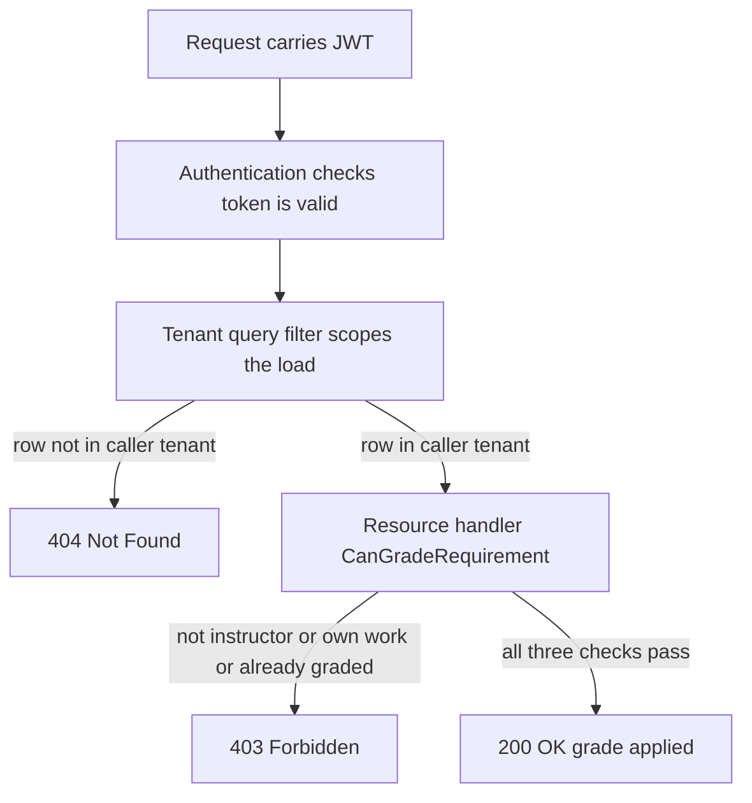
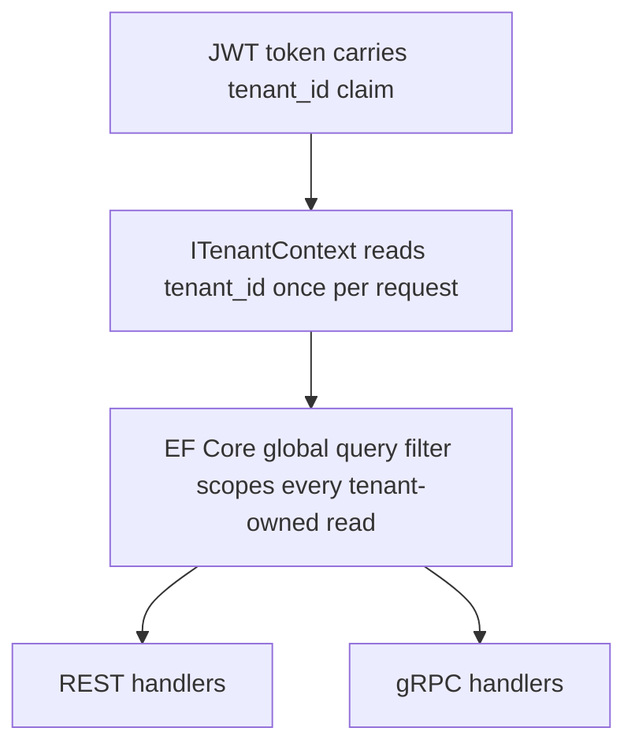

# Lecture 1 — Threat Modeling the API Boundary and the OWASP API Security Top 10 in .NET

## Why this lecture exists

In Week 13 you built the Polyglot Workshop. The contract (`Workshop.Contracts`, `workshop.v1`) compiled; the service (`Workshop.Api`) booted; the EF Core data layer migrated against PostgreSQL; the first client connected; the Testcontainers baseline went green. The build milestone proved the system *exists*. This week proves it *holds up* — that a learner from one tenant cannot read another tenant's submissions, that an unauthenticated caller cannot reach a privileged path, that the failure modes are visible in the logs instead of in a breach report.

Hardening is not "add a security library." Hardening is **editing**. Most of the vulnerabilities in the OWASP API Security Top 10 are not missing features — they are missing *checks* on code that already works. The endpoint that lists submissions works perfectly; it just forgot to filter by the caller's tenant. The handler that fetches a review by id works perfectly; it just trusted the id in the URL instead of checking who owns it. This lecture walks the boundary of `Workshop.Api` the way an attacker walks it, names each weakness in the OWASP catalogue, and shows the .NET code that closes it. The slogan for the week — **"hardening is editing; we delete more than we add"** — starts here: most fixes in this lecture *remove* a trust assumption, they do not add a subsystem.

The authoritative catalogue is the **OWASP API Security Top 10 (2023)** at <https://owasp.org/API-Security/editions/2023/en/0x11-t10/>. We will treat it as a checklist against the capstone's real endpoints.

## The boundary, drawn

Before you can threat-model a system you have to draw its trust boundary — the line where data you control meets data an attacker controls. For the Polyglot Workshop the picture is:

```
   UNTRUSTED                      |  TRUSTED (your process)
                                  |
 Workshop.Mobile (MAUI) ---+      |
 Workshop.Admin  (Blazor) -+----> | [ Keycloak OIDC ] --(JWT: sub, tenant_id, role)-->
 attacker w/ stolen token -+      |        |
 attacker w/ no token -----+      |        v
                                  |  +--------------------------+
                                  |  | Workshop.Api             |
                                  |  |  REST + gRPC (workshop.v1)|
                                  |  |  Authn -> Authz -> Handler|
                                  |  |       |          |        |
                                  |  |   EF Core      Dapper     |
                                  |  |  (Lessons,    (analytics) |
                                  |  |   Enrollments,            |
                                  |  |   Submissions, Reviews)   |
                                  |  +--------------------------+
                                  |        |            |
                                  |   PostgreSQL   outbound calls
                                  |               (Polly-wrapped)
```

Every arrow that crosses the vertical line is an attack surface. The token Keycloak issues carries claims you must *re-validate intent against* on every request — not just "is this token valid" (authentication) but "is this caller allowed to touch *this* row" (authorization). The Top 10 is, mostly, a taxonomy of the ways that second question gets skipped. The OIDC validation foundation comes from the JWT bearer chapter at <https://learn.microsoft.com/en-us/aspnet/core/security/authentication/jwt-authn>.

## API1:2023 — Broken Object Level Authorization (the one that matters most)

BOLA — broken object-level authorization — is the most common and most damaging API vulnerability, and it is the first thing we close in the capstone. The shape is always the same: an endpoint takes an object id, loads the object, and returns it *without checking that the caller is allowed to see that specific object*. Reference: <https://owasp.org/API-Security/editions/2023/en/0xa1-broken-object-level-authorization/>.

Here is the vulnerable handler in `Workshop.Api` as it stood at the end of Week 13. It compiles, it passes the happy-path test, and it leaks every tenant's data:

```csharp
// VULNERABLE — do not ship. Loads a submission by id with no ownership check.
app.MapGet("/api/submissions/{id:guid}", async (Guid id, WorkshopDbContext db) =>
{
    var submission = await db.Submissions.FindAsync(id);
    return submission is null ? Results.NotFound() : Results.Ok(submission.ToDto());
}).RequireAuthorization();
```

`RequireAuthorization()` is doing *authentication* — it proves the caller has a valid token. It does nothing about *authorization* for this object. A learner in tenant A who guesses (or enumerates, since GUIDs leak in URLs and logs) a submission id from tenant B gets tenant B's submission. The fix is to scope the query by the caller's tenant claim, so a row that is not theirs is simply not found:

```csharp
app.MapGet("/api/submissions/{id:guid}", async (
    Guid id,
    WorkshopDbContext db,
    ITenantContext tenant,            // resolves tenant_id from the validated JWT
    CancellationToken ct) =>
{
    var submission = await db.Submissions
        .Where(s => s.Id == id && s.TenantId == tenant.TenantId)   // the load-bearing line
        .FirstOrDefaultAsync(ct);

    return submission is null ? Results.NotFound() : Results.Ok(submission.ToDto());
}).RequireAuthorization();
```

Note what the fix *is*: a `Where` clause. We did not add a permissions engine. We deleted the assumption that "found by id" equals "allowed to see." That is the editing thesis in miniature. The `ITenantContext` reads the `tenant_id` claim that Keycloak put in the token; it is registered scoped and populated from `HttpContext.User` once, so no handler re-parses claims.

### Defense in depth: the EF Core global query filter

Per-handler `Where` clauses are correct but fragile — the next person to add an endpoint will forget one. The structural fix is a **global query filter** that EF Core applies to *every* query against a tenant-owned entity. You set it once in `OnModelCreating`:

```csharp
protected override void OnModelCreating(ModelBuilder modelBuilder)
{
    // _tenantProvider is injected into the DbContext; it reads the current request's tenant.
    modelBuilder.Entity<Submission>()
        .HasQueryFilter(s => s.TenantId == _tenantProvider.TenantId);
    modelBuilder.Entity<Enrollment>()
        .HasQueryFilter(e => e.TenantId == _tenantProvider.TenantId);
    modelBuilder.Entity<Review>()
        .HasQueryFilter(r => r.TenantId == _tenantProvider.TenantId);
}
```

Now `db.Submissions.FindAsync(id)` is *automatically* tenant-scoped; the leak is closed at the data layer, not at each call site. This is the editing thesis again — one filter deletes a whole class of forgettable per-handler checks. The query-filter reference is <https://learn.microsoft.com/en-us/ef/core/querying/filters>. Two caveats the docs spell out and you must internalize: filters are ignored by `IgnoreQueryFilters()` (audit code and the outbox drainer need that escape hatch, deliberately), and a filter that reads a captured service makes the `DbContext` non-poolable unless you use the supported `IDbContextFactory` + per-request tenant pattern. We address pooling under load in Lecture 2's MediatR pipeline.

### The multi-tenant pitfalls the filter docs warn about

A global query filter is one line of code that hides three sharp edges. Internalize all three before you ship it.

**Pitfall one — the captured-service trap.** The filter closes over `_tenantProvider`, which must be *the current request's* tenant. If you register `WorkshopDbContext` with `AddDbContextPool` and capture a singleton tenant accessor, EF Core reuses a pooled context whose filter still points at the *previous* request's tenant — a leak strictly worse than the BOLA you started with, because it is intermittent and load-dependent. The supported shape is a *scoped* tenant accessor read through the request's `IServiceProvider`, with `AddDbContext` (not the pool) when the filter depends on per-request state, or the documented pool-friendly pattern where the tenant is set on the context after it is rented:

```csharp
// Scoped accessor — one per request, populated from HttpContext.User once.
public sealed class TenantProvider : ITenantProvider
{
    public Guid TenantId { get; }
    public TenantProvider(IHttpContextAccessor accessor)
    {
        var claim = accessor.HttpContext?.User.FindFirst("tenant_id")?.Value
                    ?? throw new InvalidOperationException("No tenant_id claim on request.");
        TenantId = Guid.Parse(claim);
    }
}

// DbContext takes the scoped provider; the filter reads TenantId at query-translation time.
builder.Services.AddScoped<ITenantProvider, TenantProvider>();
builder.Services.AddDbContext<WorkshopDbContext>((sp, opt) =>
    opt.UseNpgsql(cs).AddInterceptors(/* ... */));
```

**Pitfall two — the unfiltered side of a relationship.** A filter on `Submission` does *not* automatically filter a navigation loaded through a non-filtered entity. If `Exercise` has no tenant filter (because exercises are shared across a cohort), then `db.Exercises.Include(e => e.Submissions)` still returns only the current tenant's submissions — EF Core applies the `Submission` filter to the included collection — but `db.Exercises.Find(id)` returns the exercise to *anyone*, which may itself be a leak depending on your model. Decide, per entity, whether it is tenant-owned or shared, and write the filter (or deliberately omit it) on each. Silence is not a decision.

**Pitfall three — `required navigation` + filter = silent row disappearance.** If a filtered principal (a `Submission`) is referenced by a required navigation from a child, and the principal is filtered out, EF Core 9 logs a warning and the child can vanish from results. The docs call this out; the capstone keeps tenant-owned principals and their dependents on the *same* filter predicate so a row never half-disappears. Reference again: <https://learn.microsoft.com/en-us/ef/core/querying/filters>, and the EF Core security guidance at <https://learn.microsoft.com/en-us/ef/core/miscellaneous/security>.

### Resource-based authorization for the cases a filter cannot express

The global query filter answers "can this caller *see* this row." It cannot answer "can this caller *grade* this submission" — that depends on the caller's role *and* the row's state (you cannot grade your own submission; you cannot re-grade a finalized one). When the authorization decision needs the resource in hand, ASP.NET Core's **resource-based authorization** is the right tool: an `AuthorizationHandler<TRequirement, TResource>` that runs *after* the row is loaded.

```csharp
public sealed class CanGradeRequirement : IAuthorizationRequirement;

public sealed class CanGradeHandler : AuthorizationHandler<CanGradeRequirement, Submission>
{
    protected override Task HandleRequirementAsync(
        AuthorizationHandlerContext context,
        CanGradeRequirement requirement,
        Submission submission)
    {
        var isInstructor = context.User.IsInRole("instructor");
        var notOwnWork   = context.User.GetSubjectId() != submission.LearnerId;
        var notFinalized = submission.Grade is null;

        if (isInstructor && notOwnWork && notFinalized)
            context.Succeed(requirement);   // all three must hold; otherwise the requirement stays unmet

        return Task.CompletedTask;
    }
}
```

The handler is invoked from the endpoint with `IAuthorizationService.AuthorizeAsync(User, submission, new CanGradeRequirement())` *after* the tenant-filtered load — so a cross-tenant id is already a `404` (the filter), and a same-tenant-but-not-allowed grade is a `403` (the handler). The two mechanisms compose: the filter is the blunt "you cannot see other tenants" instrument, the resource handler is the precise "you cannot perform this operation on this specific row" instrument. Reference: <https://learn.microsoft.com/en-us/aspnet/core/security/authorization/resourcebased>.


*How the tenant filter and the resource-based handler compose into 404, 403, or success.*

## API2:2023 — Broken Authentication

Authentication is the question "is this token real?" In the capstone the answer comes from Keycloak via OIDC, validated by the JWT bearer handler. The failure modes the catalogue (<https://owasp.org/API-Security/editions/2023/en/0xa2-broken-authentication/>) calls out, mapped to .NET:

```csharp
builder.Services.AddAuthentication(JwtBearerDefaults.AuthenticationScheme)
    .AddJwtBearer(options =>
    {
        options.Authority = builder.Configuration["Oidc:Authority"];   // Keycloak realm URL
        options.Audience  = builder.Configuration["Oidc:Audience"];    // "workshop-api"
        options.TokenValidationParameters = new TokenValidationParameters
        {
            ValidateIssuer           = true,   // <-- skipping this accepts any issuer's token
            ValidateAudience         = true,   // <-- skipping this accepts tokens minted for other apps
            ValidateLifetime         = true,   // <-- skipping this accepts expired tokens forever
            ValidateIssuerSigningKey = true,   // <-- skipping this accepts unsigned/forged tokens
            ClockSkew                = TimeSpan.FromSeconds(30)  // not five minutes; tighten the default
        };
    });
```

Every `Validate*` set to `false` is a CVE waiting to happen. The default `ClockSkew` is five minutes, which means an "expired" token lives five extra minutes; for a high-value capstone we tighten it to thirty seconds. The metadata (signing keys) is fetched from Keycloak's discovery document and rotated automatically — do not hardcode keys. Reference: <https://learn.microsoft.com/en-us/aspnet/core/security/authentication/configure-jwt-bearer-authentication>.

## API3:2023 — Broken Object Property Level Authorization

API3 is two failures: **mass assignment** (the client sends properties it should not be allowed to set) and **excessive data exposure** (the response returns properties the client should not see). Reference: <https://owasp.org/API-Security/editions/2023/en/0xa3-broken-object-property-level-authorization/>.

The capstone's `Submission` entity has a `Grade`, a `TenantId`, and an `IsFlagged` field. If the create endpoint binds straight to the entity, a learner can `POST` themselves an A+:

```csharp
// VULNERABLE — binds the request body straight to the entity. Learner sets Grade and TenantId.
app.MapPost("/api/submissions", async (Submission body, WorkshopDbContext db) => { ... });
```

The fix is a **request DTO that contains only the fields the client may set**, mapped explicitly to the entity. The server owns `Grade`, `TenantId`, `IsFlagged`, `CreatedAt`:

```csharp
public sealed record CreateSubmissionRequest(Guid ExerciseId, string Content);  // no Grade, no TenantId

app.MapPost("/api/submissions", async (
    CreateSubmissionRequest req, WorkshopDbContext db, ITenantContext tenant, ClaimsPrincipal user) =>
{
    var submission = new Submission
    {
        Id         = Guid.CreateVersion7(),       // C# 13 / .NET 9 sortable GUID
        ExerciseId = req.ExerciseId,
        Content    = req.Content,
        LearnerId  = user.GetSubjectId(),          // from the token, never from the body
        TenantId   = tenant.TenantId,              // from the token, never from the body
        Grade      = null,                         // server-owned: set only by a grading path
        CreatedAt  = DateTimeOffset.UtcNow
    };
    db.Submissions.Add(submission);
    await db.SaveChangesAsync();
    return Results.Created($"/api/submissions/{submission.Id}", submission.ToDto());
});
```

The response goes through `ToDto()`, which is the symmetric guard against excessive exposure — the DTO has no `TenantId`, no internal flags. This is the seam where AutoMapper *might* earn its keep (Lecture 2), and the seam where it usually does not. Note `Guid.CreateVersion7()`, new in .NET 9, which gives time-ordered GUIDs that index better than `NewGuid()` — see <https://learn.microsoft.com/en-us/dotnet/api/system.guid.createversion7>.

Two failure modes lurk here that the DTO alone does not close. First, **the binder is greedy**: if you *do* bind to the entity and try to "fix it" by ignoring extra fields, you are one refactor away from a leak — the only safe shape is a request type that *cannot express* the server-owned fields, so `Grade` is unreachable from the wire by construction, not by convention. Second, **excessive exposure hides in serialization defaults**: if `ToDto()` returns the entity directly and you rely on `[JsonIgnore]` to hide `TenantId`, a new developer who adds a property forgets the attribute and ships the leak. The record-DTO approach inverts the default — a field is exposed only if you *named it* in the DTO constructor. The audit question for API3 is therefore mechanical: *can a reviewer enumerate every field that leaves the process by reading one type?* With a hand-written `record SubmissionDto(...)`, yes; with a reflection-mapped entity, no.

The symmetric guard for the *response* side reads the same way. The hand-written projection is the inventory of what escapes:

```csharp
// What leaves the process is exactly these five fields. Reviewer reads one line, knows everything.
public static SubmissionDto ToDto(this Submission s) => new(
    Id:          s.Id,
    ExerciseId:  s.ExerciseId,
    Content:     s.Content,
    StatusLabel: s.Grade is null ? "Pending" : "Graded",
    SubmittedAt: s.CreatedAt);
    // deliberately absent: TenantId, LearnerId, IsFlagged, Grade (raw), the EF shadow columns
```

## API4 and API5 — Resource Consumption and Function-Level Authorization

**API4 (Unrestricted Resource Consumption)** — a `GET /api/submissions` with no paging will happily try to materialize a tenant's entire history. The fix is mandatory paging plus ASP.NET Core 9 **rate limiting**:

```csharp
builder.Services.AddRateLimiter(options =>
{
    options.AddFixedWindowLimiter("per-tenant", o =>
    {
        o.Window = TimeSpan.FromSeconds(10);
        o.PermitLimit = 100;
        o.QueueLimit = 0;
    });
});
// ...
app.MapGet("/api/submissions", Handler).RequireRateLimiting("per-tenant");
```

Reference: <https://owasp.org/API-Security/editions/2023/en/0xa4-unrestricted-resource-consumption/> and the rate-limiting middleware at <https://learn.microsoft.com/en-us/aspnet/core/performance/rate-limit>.

**API5 (Broken Function Level Authorization)** — often written **BFLA** — is BOLA's sibling at the *operation* level: a learner can call an instructor-only function. Where BOLA is "wrong *object*," BFLA is "wrong *verb*." In the capstone, `POST /api/exercises/{id}/grade` must require the `instructor` role. Authentication alone does not stop a learner from calling it — you need a policy:

```csharp
builder.Services.AddAuthorizationBuilder()
    .AddPolicy("InstructorOnly", p => p.RequireRole("instructor"))
    .AddPolicy("RequireTenant", p => p.RequireClaim("tenant_id"));

app.MapPost("/api/exercises/{id:guid}/grade", GradeHandler)
   .RequireAuthorization("InstructorOnly");
```

The BFLA trap is *implicit* exposure: a route that exists but carries no policy is reachable by anyone with a valid token. The audit is a sweep — every mutating endpoint and every gRPC method must name the policy it requires, and "the default scheme authenticated the caller" is not a policy. The capstone enforces this with a fallback policy so an *unannotated* endpoint denies by default rather than allows:

```csharp
builder.Services.AddAuthorizationBuilder()
    .SetFallbackPolicy(new AuthorizationPolicyBuilder()   // deny-by-default for any endpoint with no explicit policy
        .RequireAuthenticatedUser()
        .RequireClaim("tenant_id")
        .Build());
```

With a fallback policy in place, forgetting `RequireAuthorization` on a new endpoint fails *closed* (401/403) instead of *open* — the editing thesis again: we delete the assumption that "no annotation" means "public." Reference: <https://owasp.org/API-Security/editions/2023/en/0xa5-broken-function-level-authorization/> and the policy-based authorization chapter at <https://learn.microsoft.com/en-us/aspnet/core/security/authorization/policies>.

## Tenant-aware authorization as a first-class requirement

The capstone is multi-tenant. "Tenant" here means an organization — a school, a bootcamp cohort — and the iron rule is **no row crosses a tenant line, ever, on any protocol**. We enforce it in three layers, each one a deletion of trust:

1. **The token** carries `tenant_id`; the JWT handler validates it (you trust Keycloak's signature, nothing more).
2. **`ITenantContext`** reads `tenant_id` from `HttpContext.User` once per request and is the single source of truth handlers read.
3. **The EF Core global query filter** scopes every tenant-owned read by `ITenantContext.TenantId`, so the leak is structurally impossible even when a handler forgets.


*Three layers of tenant isolation, shared by both protocols.*

The gRPC surface gets the same treatment for free, because gRPC and REST share the authentication middleware (Week 12's lesson): a gRPC `GetSubmission` call carries the same bearer token in the `authorization` metadata, the same `tenant_id` claim lands on `ServerCallContext.GetHttpContext().User`, and the same `ITenantContext` resolves it. One authorization model, two protocols. Reference: <https://learn.microsoft.com/en-us/aspnet/core/grpc/authn-and-authz>.

## API6 and API7 — sensitive flows and SSRF

The middle of the catalogue is two entries the capstone touches more lightly but must still answer for in the threat model.

**API6 (Unrestricted Access to Sensitive Business Flows)** is the abuse of a legitimate function at machine speed — not a broken check, but a missing *rate-of-flow* control. In the capstone the sensitive flow is submission creation: a script that posts ten thousand submissions to a graded exercise distorts the analytics and can starve the grading queue. The mitigation is the same per-tenant limiter from API4 *plus* a per-flow constraint — a learner may have at most one un-graded submission per exercise, enforced with a unique index:

```csharp
modelBuilder.Entity<Submission>()
    .HasIndex(s => new { s.TenantId, s.LearnerId, s.ExerciseId })
    .IsUnique()
    .HasFilter("grade IS NULL");   // partial unique index: one pending submission per learner per exercise
```

The unique index turns the eleventh duplicate `POST` into a `DbUpdateException` the handler maps to `409 Conflict`, not a successful flood. Reference: <https://owasp.org/API-Security/editions/2023/en/0xa6-unrestricted-access-to-sensitive-business-flows/>.

**API7 (Server-Side Request Forgery)** is the risk that *your* server makes an outbound request to an attacker-controlled address. The capstone's notification webhook URL is configuration, not user input, so SSRF surface is small — but the moment a tenant can configure their own webhook (a plausible Milestone 3 feature), the input must be validated against an allow-list and resolved to a non-private IP before the `HttpClient` call. The Polly-wrapped `NotificationClient` (Lecture 2) is the chokepoint where that validation belongs. Reference: <https://owasp.org/API-Security/editions/2023/en/0xa7-server-side-request-forgery/>.

## API8, API9, API10 — the operational tail

The remaining catalogue entries are about how the system is *operated*, which is why they bridge into Lecture 3 (observability) and Milestone 2:

- **API8 (Security Misconfiguration)** — verbose error pages, missing security headers, CORS set to `*`. In production we use `Results.Problem` (RFC 9457) so we never leak a stack trace, and we set CORS to the known client origins only:

  ```csharp
  builder.Services.AddCors(o => o.AddPolicy("clients", p => p
      .WithOrigins("https://admin.workshop.example", "https://app.workshop.example")  // never AllowAnyOrigin()
      .AllowAnyHeader().AllowAnyMethod()));

  app.UseExceptionHandler();   // maps unhandled exceptions to RFC 9457 ProblemDetails — no stack trace on the wire
  app.UseHsts();               // Strict-Transport-Security in production
  ```

  The default `developer exception page` is a stack-trace leak; it is registered only under `app.Environment.IsDevelopment()`. The capstone's edge handler also maps `ValidationException` (from the MediatR `ValidationBehavior`, Lecture 2) to a `400` ProblemDetails so a validation failure is a clean RFC 9457 body, not an unhandled 500.
- **API9 (Improper Inventory Management)** — the `/dev/mint-token` shortcut from Week 13 must be compiled out of production. An endpoint you forgot exists is an endpoint nobody is watching. Reference: <https://owasp.org/API-Security/editions/2023/en/0xa9-improper-inventory-management/>.
- **API10 (Unsafe Consumption of APIs)** — *your* service calls outbound services (a grading webhook, a notification service). A slow or hostile downstream can take you down. This is where Polly's retry, timeout, and circuit-breaker (Lecture 2 and Milestone 2) live, and why "the call that always worked in dev" needs a resilience pipeline before production.

## The threat model as a written artifact

A threat model is not a vibe; it is a document. For the capstone we use a lightweight STRIDE-per-element pass over the boundary diagram. STRIDE is six categories — **S**poofing, **T**ampering, **R**epudiation, **I**nformation disclosure, **D**enial of service, **E**levation of privilege — and the discipline is to ask all six of *every* element that crosses the trust boundary, even when the answer is "not applicable, because." A blank cell is an unanswered question, not a safe one.

For each crossing arrow, ask the six STRIDE questions and write the one-line answer. Here is the worked pass for the learner read path:

```
Element: GET /api/submissions/{id}   (REST, learner-facing)
  Spoofing       -> JWT bearer, ValidateIssuerSigningKey=true (Keycloak)        [API2]
  Tampering      -> TLS in transit; server owns Grade/TenantId, not the body    [API3]
  Repudiation    -> Serilog request log carries sub + tenant_id + trace id      [Lecture 3]
  Info disclosure-> EF global query filter scopes by tenant_id; DTO hides internals [API1/API3]
  Denial of svc  -> per-tenant fixed-window rate limiter; mandatory paging      [API4]
  Elevation      -> n/a (read path); grade path has InstructorOnly policy       [API5]
```

The point of a *per-element* pass is that different elements have different sharp edges. Two more worked rows make the discipline concrete:

```
Element: POST /api/exercises/{id}/grade   (REST, instructor-only mutation)
  Spoofing       -> JWT bearer; ClockSkew tightened to 30s                      [API2]
  Tampering      -> request DTO carries only the score; row state checked       [API3]
  Repudiation    -> grade write logged with instructor sub + submission id; audited
  Info disclosure-> ToDto() omits other learners' fields on the response        [API3]
  Denial of svc  -> rate-limited; grading is bounded work, no fan-out
  Elevation      -> InstructorOnly policy + resource handler (not own work,
                    not already graded) — the BFLA + state check together       [API5]

Element: workshop.v1 SubmissionService/GetSubmission   (gRPC, learner-facing)
  Spoofing       -> same JWT bearer via authorization metadata (shared middleware)
  Tampering      -> Protobuf wire contract; id is the only client-supplied field
  Repudiation    -> same Serilog request log; gRPC rides the HTTP pipeline      [Wk12]
  Info disclosure-> SAME global query filter (shared DbContext) -> NOT_FOUND     [API1]
  Denial of svc  -> rate limiter applies; gRPC max-message-size capped
  Elevation      -> RequireAuthorization on the service; fallback policy denies by default
```

Notice the gRPC row reuses every REST mitigation because the two protocols share the authentication middleware and the `DbContext` — *that* is the payoff of Week 12's "one auth model, two protocols," restated as a security property. This table is a deliverable in Milestone 2 (`THREAT-MODEL.md`). Microsoft's threat-modeling guidance and the STRIDE breakdown are at <https://learn.microsoft.com/en-us/azure/security/develop/threat-modeling-tool-threats>. The point of writing it down is that the table *names the test you must write*: every row's mitigation is a line of code, and every line of code is an integration test that proves the unauthorized case is rejected. The Repudiation cells, in particular, are the contract that Lecture 3's observability fulfills — you cannot prove who did what after the fact unless the request log carries `sub`, `tenant_id`, and the trace id.

## What we built

- A drawn trust boundary for the Polyglot Workshop that names every arrow crossing into `Workshop.Api`.
- The BOLA fix as a `Where` clause and, structurally, an EF Core **global query filter** — the deletion of "found by id equals allowed."
- A hardened JWT bearer registration with every `Validate*` on and a tightened `ClockSkew`.
- Request DTOs that close mass assignment and `ToDto()` projections that close excessive exposure (API3).
- Per-tenant rate limiting (API4) and an `InstructorOnly` policy (API5).
- A three-layer tenant-isolation model — token, `ITenantContext`, query filter — that holds on both REST and gRPC.
- A STRIDE-per-element threat table that turns each mitigation into a test you owe Milestone 2.

The slogan: **a privileged path without a test that proves the unauthorized case is rejected is not hardened — it is hoping.**
