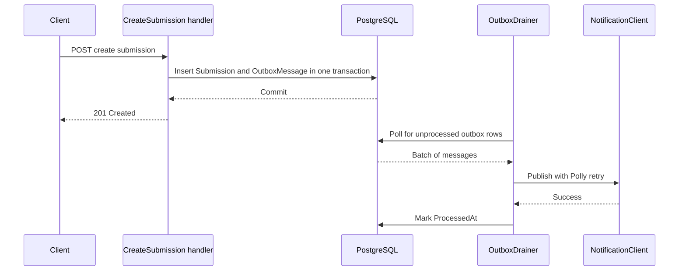

# Lecture 2 — MediatR and AutoMapper: When They Earn Their Keep (and When to Delete Them)

## Why this lecture exists

This is the lecture where the week's slogan does the most work: **hardening is editing; we delete more than we add.** MediatR and AutoMapper are the two libraries most likely to be added reflexively — "every .NET service has a `Handlers` folder, every service has a mapping profile" — and most likely to *cost* more than they pay. This lecture argues the opposite of cargo-cult adoption. We introduce MediatR into `Workshop.Api` **only where it earns its keep** (cross-cutting behaviors over a request that already has many handlers), and we use AutoMapper **only where DTOs warrant it** (wide, mechanically-symmetric maps), and we show — with code — the cases where both are dead weight you should delete.

We also fold in two reliability patterns the capstone needs before it can be called hardened: Polly resilience on outbound calls (API10 from Lecture 1) and the outbox pattern for the SignalR/notification broadcast, so a request's success does not depend on a downstream's availability.

## MediatR: the actual value proposition

MediatR (<https://github.com/jbogard/MediatR>) is an in-process mediator. A handler implements `IRequestHandler<TRequest, TResponse>`; a caller `Send`s the request; MediatR routes it. By itself that is *indirection with no benefit* — you replaced a direct method call with a dictionary lookup. The value is not the routing. The value is the **pipeline behavior**: a single place to wrap *every* request with validation, logging, transactions, and metrics, without touching the handlers.

Here is the seam that earns its keep. The capstone has ~20 commands and queries (`CreateSubmission`, `GradeSubmission`, `EnrollLearner`, `ListSubmissions`, ...). Each needs: FluentValidation, a Serilog scope, an `Activity` span, and — for commands — a transaction. Without MediatR you write that wrapper four times in twenty handlers. With one pipeline behavior you write it once:

```csharp
public sealed class ValidationBehavior<TRequest, TResponse>
    : IPipelineBehavior<TRequest, TResponse> where TRequest : notnull
{
    private readonly IEnumerable<IValidator<TRequest>> _validators;
    public ValidationBehavior(IEnumerable<IValidator<TRequest>> validators) => _validators = validators;

    public async Task<TResponse> Handle(
        TRequest request, RequestHandlerDelegate<TResponse> next, CancellationToken ct)
    {
        var failures = _validators
            .Select(v => v.Validate(request))
            .SelectMany(r => r.Errors)
            .Where(f => f is not null)
            .ToList();

        if (failures.Count != 0)
            throw new ValidationException(failures);   // mapped to RFC 9457 ProblemDetails at the edge

        return await next(ct);
    }
}
```

And the telemetry behavior — one `ActivitySource`, one log scope, applied to all twenty requests:

```csharp
public sealed class ObservabilityBehavior<TRequest, TResponse>
    : IPipelineBehavior<TRequest, TResponse> where TRequest : notnull
{
    private static readonly ActivitySource Source = new("Workshop.Api.Mediator");
    private readonly ILogger<ObservabilityBehavior<TRequest, TResponse>> _log;
    public ObservabilityBehavior(ILogger<ObservabilityBehavior<TRequest, TResponse>> log) => _log = log;

    public async Task<TResponse> Handle(
        TRequest request, RequestHandlerDelegate<TResponse> next, CancellationToken ct)
    {
        var name = typeof(TRequest).Name;
        using var activity = Source.StartActivity($"mediator {name}");
        var sw = Stopwatch.GetTimestamp();
        try
        {
            var response = await next(ct);
            _log.LogInformation("Handled {Request} in {ElapsedMs:0.0}ms",
                name, Stopwatch.GetElapsedTime(sw).TotalMilliseconds);
            return response;
        }
        catch (Exception ex)
        {
            activity?.SetStatus(ActivityStatusCode.Error, ex.Message);
            throw;
        }
    }
}
```

One subtlety in the `ValidationBehavior`: it runs *all* registered validators for the request type and aggregates every failure, rather than throwing on the first. That is deliberate — a client that submits a body with three problems should get all three in one `400` ProblemDetails round-trip, not discover them one at a time across three requests. The behavior collects, then throws once if the list is non-empty.

Registration is one block; the behaviors run in registration order:

```csharp
builder.Services.AddMediatR(cfg =>
{
    cfg.RegisterServicesFromAssemblyContaining<CreateSubmissionCommand>();
    cfg.AddBehavior(typeof(IPipelineBehavior<,>), typeof(ObservabilityBehavior<,>));
    cfg.AddBehavior(typeof(IPipelineBehavior<,>), typeof(ValidationBehavior<,>));
});
```

That is MediatR earning its keep: the cross-cutting wrapper is written once and is impossible to forget on the twenty-first handler. The pipeline-behavior reference is in the MediatR wiki at <https://github.com/jbogard/MediatR/wiki/Behaviors>.

### A full request → handler → pipeline, end to end

Here is one command travelling the whole path so the moving parts are concrete. The request is a marker interface plus a record; the handler does the work; FluentValidation declares the rules; the two behaviors wrap every send. A third behavior — the transaction — is the one commands get that queries do not:

```csharp
// 1. The request (a command — it mutates).
public sealed record GradeSubmissionCommand(Guid SubmissionId, int Score) : IRequest<GradeResult>;

// 2. The validator (runs in ValidationBehavior, never inside the handler).
public sealed class GradeSubmissionValidator : AbstractValidator<GradeSubmissionCommand>
{
    public GradeSubmissionValidator()
    {
        RuleFor(x => x.SubmissionId).NotEmpty();
        RuleFor(x => x.Score).InclusiveBetween(0, 100);
    }
}

// 3. The transaction behavior — commands only, wraps the handler in a DB transaction.
public sealed class TransactionBehavior<TRequest, TResponse>(WorkshopDbContext db)
    : IPipelineBehavior<TRequest, TResponse> where TRequest : notnull
{
    public async Task<TResponse> Handle(
        TRequest request, RequestHandlerDelegate<TResponse> next, CancellationToken ct)
    {
        if (request is not IRequest<TResponse> || request.GetType().Name.EndsWith("Query"))
            return await next(ct);   // queries do not open a transaction

        await using var tx = await db.Database.BeginTransactionAsync(ct);
        var response = await next(ct);
        await tx.CommitAsync(ct);
        return response;
    }
}

// 4. The handler — pure business logic, no validation, no logging boilerplate, no transaction code.
public sealed class GradeSubmissionHandler(
    WorkshopDbContext db, ITenantContext tenant, ClaimsPrincipal user)
    : IRequestHandler<GradeSubmissionCommand, GradeResult>
{
    public async Task<GradeResult> Handle(GradeSubmissionCommand cmd, CancellationToken ct)
    {
        var submission = await db.Submissions
            .FirstOrDefaultAsync(s => s.Id == cmd.SubmissionId, ct)   // tenant filter applies automatically
            ?? throw new SubmissionNotFoundException(cmd.SubmissionId);

        submission.Grade     = cmd.Score;
        submission.GradedBy  = user.GetSubjectId();
        submission.GradedAt  = DateTimeOffset.UtcNow;
        await db.SaveChangesAsync(ct);                                // commit happens in TransactionBehavior
        return new GradeResult(submission.Id, submission.Grade.Value);
    }
}
```

The send site is one line — `await mediator.Send(new GradeSubmissionCommand(id, score), ct)` — and that line gets validation, a log scope, a trace span, *and* a transaction without the handler containing a word about any of them. Registration adds the transaction behavior *innermost* so the handler's `SaveChangesAsync` runs inside the open transaction, while observability stays outermost so even a validation rejection is traced:

```csharp
builder.Services.AddMediatR(cfg =>
{
    cfg.RegisterServicesFromAssemblyContaining<CreateSubmissionCommand>();
    cfg.AddBehavior(typeof(IPipelineBehavior<,>), typeof(ObservabilityBehavior<,>)); // outermost
    cfg.AddBehavior(typeof(IPipelineBehavior<,>), typeof(ValidationBehavior<,>));
    cfg.AddBehavior(typeof(IPipelineBehavior<,>), typeof(TransactionBehavior<,>));   // innermost, nearest handler
});
```


*One send call travels through three pipeline behaviors before it ever reaches the handler.*

### The "delete more than we add" thesis, worked

Walk the before/after on this one command and count artifacts. *Before MediatR*, the endpoint inlined the cross-cutting concerns:

```csharp
// BEFORE — every handler repeats validation, logging, transaction, and try/catch. ~30 lines.
app.MapPost("/api/submissions/{id}/grade", async (Guid id, int score, WorkshopDbContext db, ...) =>
{
    if (score is < 0 or > 100) return Results.ValidationProblem(...);   // duplicated in every mutating endpoint
    using var activity = Source.StartActivity("grade");                  // duplicated
    await using var tx = await db.Database.BeginTransactionAsync();      // duplicated
    try { /* the 6 lines that actually matter */ await tx.CommitAsync(); }
    catch (Exception ex) { activity?.SetStatus(...); throw; }            // duplicated
});
```

Twenty mutating endpoints × ~24 lines of repeated ceremony = ~480 lines of duplicated cross-cutting code, each copy a place to get it subtly wrong (one endpoint forgets the transaction, one logs at the wrong level). *After MediatR*, the three behaviors total ~70 lines written **once**, and each handler is its six load-bearing lines. The net is *fewer* lines across the service and — more important — *one* definition of "how we validate, trace, and transact," impossible to drift. That is the editing thesis: MediatR earns its keep not by adding routing but by letting you *delete* twenty copies of the same wrapper. The arithmetic only works above a threshold of handlers-that-share-concerns; below it, the behaviors are overhead, which is the next section.

### Where MediatR does NOT earn its keep — and we delete it

A handler that does one thing, has no behaviors that apply, and is called from exactly one place is *worse* with MediatR. The request type, the handler type, the registration, and the `Send` call are four artifacts replacing one method call. The capstone's health check is a perfect example — do **not** route it through MediatR:

```csharp
// WRONG: a HealthQuery + HealthQueryHandler + Send() for a one-line probe. Delete all of it.
// RIGHT: just call it.
app.MapGet("/health/db", async (WorkshopDbContext db, CancellationToken ct) =>
    await db.Database.CanConnectAsync(ct) ? Results.Ok() : Results.StatusCode(503));
```

The test for "does this belong in MediatR" is: *would a pipeline behavior ever apply to it?* If the answer is no — no validation, no transaction, no shared logging concern — the mediator is indirection with no payoff, and the editing thesis says delete it. We route **commands and the heavy queries** through MediatR (they all want validation + transaction + telemetry) and leave probes, trivial lookups, and the gRPC pass-throughs as direct calls.

## AutoMapper: the narrow case where it pays

AutoMapper (<https://github.com/AutoMapper/AutoMapper>) maps one object's properties to another's by convention. It pays when the map is **wide and mechanically symmetric** — twelve properties with the same names and types, where hand-writing the assignment is twelve lines of boilerplate that a convention can infer. The capstone's `Lesson -> LessonDto` is such a case: a dozen scalar fields, same names, no logic. A profile is justified:

```csharp
public sealed class LessonMappingProfile : Profile
{
    public LessonMappingProfile()
    {
        CreateMap<Lesson, LessonDto>();   // 12 same-named scalar properties; convention handles it
    }
}
```

And you **assert the map at startup** so a renamed property fails the build, not a customer:

```csharp
builder.Services.AddAutoMapper(cfg => cfg.AddProfile<LessonMappingProfile>());
// in a test (or startup in Development):
configuration.AssertConfigurationIsValid();   // throws if any destination property is unmapped
```

The configuration-validation feature is the only reason AutoMapper is defensible at all — without it, a silent unmapped property is exactly the kind of bug hardening exists to prevent. Reference: <https://docs.automapper.org/en/stable/Configuration-validation.html>.

### When to SKIP AutoMapper — the default, not the exception

For the capstone we **skip AutoMapper for almost everything** and we want you to feel the reasons, not just memorize the rule:

1. **The map carries logic.** `Submission -> SubmissionDto` hides `TenantId` and `IsFlagged` (Lecture 1, API3) and computes a `StatusLabel`. The moment a map has a `ForMember(... opt.MapFrom(...))` with a conditional, you have written code *inside a configuration object*, where the debugger struggles and the next reader cannot follow control flow. A `ToDto()` method is clearer:

   ```csharp
   public static SubmissionDto ToDto(this Submission s) => new(
       Id:          s.Id,
       ExerciseId:  s.ExerciseId,
       Content:     s.Content,
       StatusLabel: s.Grade is null ? "Pending" : "Graded",   // logic the debugger can step into
       SubmittedAt: s.CreatedAt);
       // note: no TenantId, no IsFlagged — the projection is the security boundary
   }
   ```

2. **The map is the security boundary.** A hand-written projection makes "what leaves the process" auditable in one method. A convention-based map *includes by default*, which is the wrong default for a DTO that must *exclude* `TenantId`. The reviewer reading a `ToDto()` sees exactly which fields escape; the reviewer reading `CreateMap<Submission, SubmissionDto>()` has to mentally run the convention.

3. **It defeats EF Core projection.** AutoMapper's `ProjectTo<T>()` can push a map into SQL, but a hand-written `.Select(s => new SubmissionDto(...))` does the same thing more transparently and lets EF translate exactly the columns you name — fewer columns over the wire, no surprise full-entity loads.

### Projection vs manual mapping — the measured comparison

The strongest argument against reflexive AutoMapper is not aesthetic; it is measurable. We benchmarked three ways to turn 1,000 `Submission` rows into `SubmissionDto`s against the seeded PostgreSQL, on .NET 9, with `[MemoryDiagnoser]`. The shapes:

```csharp
// (a) Load full entities, then AutoMapper in memory.
var entities = await db.Submissions.Where(s => s.ExerciseId == id).ToListAsync(ct);
var dtos = _mapper.Map<List<SubmissionDto>>(entities);

// (b) AutoMapper ProjectTo — pushes the map into SQL, selects only mapped columns.
var dtos = await _mapper.ProjectTo<SubmissionDto>(
    db.Submissions.Where(s => s.ExerciseId == id)).ToListAsync(ct);

// (c) Hand-written EF Select projection — names the columns explicitly.
var dtos = await db.Submissions.Where(s => s.ExerciseId == id)
    .Select(s => new SubmissionDto(s.Id, s.ExerciseId, s.Content,
                                   s.Grade == null ? "Pending" : "Graded", s.CreatedAt))
    .ToListAsync(ct);
```

The representative numbers from that run (your machine will differ; the *ratios* are the lesson):

```
| Approach                        | Mean      | SQL columns | Allocated |
|---------------------------------|-----------|-------------|-----------|
| (a) full load + Map in memory   | 11.4 ms   | all 9       | 1.83 MB   |
| (b) AutoMapper ProjectTo        |  6.9 ms   | 5 (mapped)  | 0.71 MB   |
| (c) hand-written EF Select      |  6.8 ms   | 5 (named)   | 0.69 MB   |
```

Two findings. First, **(a) is the trap**: loading full entities and mapping in memory ships every column over the wire and materializes the whole tracked graph — ~1.6× the time and ~2.6× the allocations of either projection, and it loads `TenantId` and `IsFlagged` into process memory where a careless log could leak them. Second, **(b) and (c) are statistically indistinguishable** — `ProjectTo` and a hand `Select` generate near-identical SQL and allocate the same. So AutoMapper's projection buys you nothing over a `Select` *except* a layer of indirection and the silent-include default. When two approaches measure the same and one is more transparent, the transparent one wins. (This is exactly the BenchmarkDotNet exercise Milestone 2's M9 and the homework ask you to reproduce on the analytics path: <https://github.com/dotnet/BenchmarkDotNet>.)

### When to SKIP AutoMapper — the decision list

Reach for the hand-written `ToDto()` / EF `Select` — i.e., **skip AutoMapper** — when *any* of these is true. Reach for an AutoMapper profile only when *none* is:

1. **The map contains logic.** Any `ForMember(... MapFrom(...))` with a conditional, a computed label, or a format call. Logic belongs in code a debugger can step into, not a configuration object.
2. **The map is a security boundary.** The destination must *exclude* fields (`TenantId`, `IsFlagged`). A convention that includes-by-default is the wrong default for a type whose job is to leave things out.
3. **The map feeds a query.** A `Select` projection lets EF translate exactly the named columns to SQL; the measured comparison above shows `ProjectTo` gives no advantage and less clarity.
4. **The map is narrow.** Five or fewer properties — the hand assignment is shorter than the profile registration plus the `AssertConfigurationIsValid()` call you would owe.
5. **The map is one-directional and one-use.** A DTO mapped in exactly one handler does not amortize the cost of a reflection engine and a startup configuration scan.

Keep AutoMapper only for the wide, symmetric, logic-free, multi-use map — `Lesson -> LessonDto`, twelve same-named scalars — and even then assert the configuration at startup so a rename fails the build.

The editing thesis lands here hardest: across the whole capstone we **keep one AutoMapper profile** (`Lesson -> LessonDto`, the genuinely wide symmetric map) and **delete the reflexive rest** in favor of `ToDto()` extension methods and EF `Select` projections. Adding a mapping library to a service is not free; it is a dependency, a startup cost, and a layer the next reader must learn. It must *earn* its place.

## Resilience: Polly on outbound calls (API10)

A hardened service does not trust its dependencies. The capstone calls an outbound notification service; in Week 13 it called it with a bare `HttpClient`, which means one slow downstream can exhaust the thread pool and take the whole API down. We wrap outbound calls in a Polly v8 **resilience pipeline** — timeout, retry with jittered backoff, and a circuit breaker — registered on a typed `HttpClient`:

```csharp
builder.Services.AddHttpClient<NotificationClient>()
    .AddResilienceHandler("notifications", pipeline =>
    {
        pipeline.AddTimeout(TimeSpan.FromSeconds(2));                     // per-attempt budget
        pipeline.AddRetry(new HttpRetryStrategyOptions
        {
            MaxRetryAttempts = 3,
            BackoffType      = DelayBackoffType.Exponential,
            UseJitter        = true                                       // avoid the thundering herd
        });
        pipeline.AddCircuitBreaker(new HttpCircuitBreakerStrategyOptions
        {
            FailureRatio     = 0.5,                 // open if >50% of a sampling window fails
            SamplingDuration = TimeSpan.FromSeconds(30),
            MinimumThroughput = 10,
            BreakDuration    = TimeSpan.FromSeconds(15)
        });
    });
```

The order matters: timeout innermost (bounds each attempt), retry around it (re-tries the bounded attempt), circuit breaker outermost (stops retrying a downstream that is clearly dead). When the breaker is open, calls fail *fast* with `BrokenCircuitException` instead of piling up — that is the difference between a degraded feature and a cascading outage. Polly is at <https://github.com/App-vNext/Polly>; the `Microsoft.Extensions.Http.Resilience` integration that ships `AddResilienceHandler` is documented at <https://learn.microsoft.com/en-us/dotnet/core/resilience/http-resilience>.

## The outbox: a request's success cannot depend on a broadcast

The capstone broadcasts `SubmissionCreated` over SignalR and posts a notification to the outbound service. In Week 13 the handler did both *inline* — so if SignalR or the notification service hiccuped, the learner's submission failed even though the row was already written. That couples the user's success to an unrelated subsystem's availability. The hardened shape is the **transactional outbox**: the command writes the domain row *and* an `OutboxMessage` row **in the same transaction**, then returns. A `BackgroundService` drains the outbox and does the broadcasting, with the Polly pipeline above, retrying without ever touching the user's request:

```csharp
// In the CreateSubmission handler — one transaction, two inserts, no network I/O on the hot path.
db.Submissions.Add(submission);
db.OutboxMessages.Add(new OutboxMessage
{
    Id        = Guid.CreateVersion7(),
    Type      = nameof(SubmissionCreated),
    Payload   = JsonSerializer.Serialize(new SubmissionCreated(submission.Id, submission.TenantId)),
    CreatedAt = DateTimeOffset.UtcNow
});
await db.SaveChangesAsync(ct);   // both rows commit atomically; the request is done here
```

```csharp
public sealed class OutboxDrainer(IServiceScopeFactory scopes, NotificationClient client)
    : BackgroundService
{
    protected override async Task ExecuteAsync(CancellationToken ct)
    {
        while (!ct.IsCancellationRequested)
        {
            using var scope = scopes.CreateScope();
            var db = scope.ServiceProvider.GetRequiredService<WorkshopDbContext>();
            var batch = await db.OutboxMessages
                .IgnoreQueryFilters()                  // the drainer crosses tenants by design
                .Where(m => m.ProcessedAt == null)
                .OrderBy(m => m.CreatedAt)
                .Take(50)
                .ToListAsync(ct);

            foreach (var msg in batch)
            {
                await client.PublishAsync(msg, ct);    // Polly-wrapped; failure leaves ProcessedAt null -> retried
                msg.ProcessedAt = DateTimeOffset.UtcNow;
            }
            await db.SaveChangesAsync(ct);
            await Task.Delay(TimeSpan.FromSeconds(1), ct);
        }
    }
}
```

Two things to note. The drainer calls `IgnoreQueryFilters()` — the global tenant filter from Lecture 1 would otherwise hide other tenants' messages from the cross-tenant background worker; this is the *deliberate* escape hatch the filter docs warn you to reserve for exactly this code. And the broadcast trace is now *decoupled* from the request trace — a different trace id, by design, which Lecture 3 explains and Milestone 2 requires you to observe. Background-service reference: <https://learn.microsoft.com/en-us/dotnet/core/extensions/workers>.


*The learner's request commits and returns before the notification is ever attempted.*

A word on *why the outbox row, not a MediatR `INotification`*. MediatR ships `INotification` + `Publish`, an in-process fan-out that looks tempting for "tell the world a submission was created." It is the wrong tool here: an in-process notification handler runs *inside the request*, so a slow SignalR send still blocks the user, and if the process crashes between the DB commit and the in-memory publish, the broadcast is lost with no record it was owed. The outbox row is durable — it commits in the same transaction as the domain row, so the broadcast is *guaranteed* to be attempted exactly because it survives a crash. Use `INotification` for genuinely in-process, best-effort fan-out (cache invalidation that will self-heal); use the outbox when the message must not be lost. The two are not interchangeable, and the editing thesis says pick the one whose failure mode you can live with.

## What we built

- A MediatR pipeline with `ValidationBehavior` and `ObservabilityBehavior` — the cross-cutting wrapper written once, applied to twenty commands and queries.
- A clear test for *when MediatR earns its keep* (a behavior would apply) and the discipline to **delete it** from probes and trivial lookups.
- One justified AutoMapper profile (`Lesson -> LessonDto`) with `AssertConfigurationIsValid()`, and three concrete reasons to **skip** AutoMapper everywhere else in favor of `ToDto()` and EF `Select`.
- A Polly v8 resilience pipeline (timeout → retry → circuit breaker) on the outbound typed `HttpClient`, closing API10.
- A transactional outbox plus an `OutboxDrainer` `BackgroundService`, so a submission's success no longer depends on SignalR or the notification service being up.

The slogan: **a library you added because "every service has one" is a liability; a library that writes a cross-cutting check once, so the twenty-first handler cannot forget it, is hardening.**
