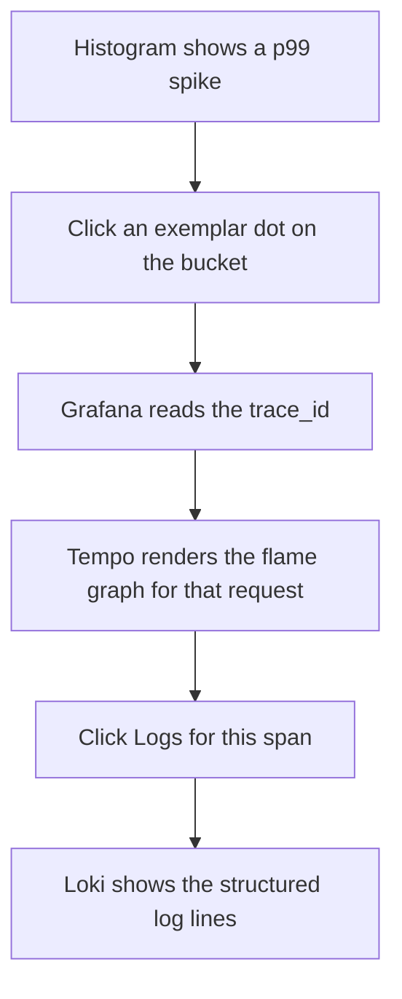

# Lecture 3 — Observability: Logs, Metrics, Traces, and the Exemplar That Links Them

## Why this lecture exists

Week 12 gave you a single trace ID across three protocols, exported to the console and to Jaeger. That was enough to *read* a trace. It was not enough to *operate* a service. Operating a service means: a dashboard shows a latency spike at 3:14am, and within one click you are looking at the exact trace that caused it. That click is what an **exemplar** buys you — the missing link between the metric (the spike) and the trace (the cause). This lecture stands up the local **Grafana + Loki + Tempo + Prometheus** stack via docker-compose, wires `Workshop.Api` to push logs to Loki, traces to Tempo, and metrics to Prometheus, and connects the three with exemplars and the shared trace id so you can debug the capstone *from the dashboard alone*.

The harden contract for observability is blunt: **you must be able to debug a production incident in the Polyglot Workshop from logs, metrics, and traces alone — never by attaching a debugger.** If you cannot answer "which request was slow and why" from the stack, the service is not observable, and "it works on my machine" is not an operations strategy.

## The three pillars, and why three

Logs, metrics, and traces answer three different questions and you need all three:

```
   METRICS  -> "is something wrong, and roughly where?"   (cheap, aggregated, alertable)
      |  exemplar: this bucket spike came from THIS trace
      v
   TRACES   -> "what was the path of the one slow request?" (per-request, causal, sampled)
      |  shared trace_id
      v
   LOGS     -> "what exactly happened inside one span?"     (detailed, expensive, queryable)
```

Metrics tell you *that* the p99 of `submission.grade` jumped. A trace tells you *which* request was slow and that it spent 800ms in a Dapper analytics query. Logs tell you *why* — the structured log line on that span shows the query ran without the `tenant_id` index because someone shipped a migration that dropped it. You cannot get from "p99 jumped" to "missing index" with metrics alone; the exemplar and the trace id are the bridges. The conceptual reference is the OpenTelemetry overview at <https://opentelemetry.io/docs/concepts/observability-primer/>.

## The local stack: Grafana + Loki + Tempo + Prometheus

The capstone ships a `docker-compose.observability.yml`. The data flow:

```
  Workshop.Api  --OTLP (gRPC 4317)-->  otel-collector
                                          |  |  |
                       logs --------------+  |  +-------- traces
                       metrics --------------+
                          |                 |             |
                          v                 v             v
                       (Loki via         (Prometheus    (Tempo
                        OTLP exporter)     remote-write   OTLP)
                          |                 / scrape)      |
                          +--------+--------+--------------+
                                   v
                                Grafana   <-- you, debugging from one pane of glass
                                 (Loki + Tempo + Prometheus datasources;
                                  exemplars + trace-to-logs correlation wired)
```

The collector receives one OTLP stream and fans it out to the three backends. Grafana reads all three as datasources, and — the part that makes it *one* tool instead of three — its Tempo datasource is configured with **trace-to-logs** (jump from a trace span to the Loki logs that share its trace id) and its Prometheus datasource has **exemplars** enabled (jump from a histogram bucket to the trace). Grafana's docs for these correlations: trace-to-logs at <https://grafana.com/docs/grafana/latest/datasources/tempo/configure-tempo-data-source/> and exemplars at <https://grafana.com/docs/grafana/latest/fundamentals/exemplars/>.

The compose file, abbreviated to the load-bearing services:

```yaml
services:
  otel-collector:
    image: otel/opentelemetry-collector-contrib:0.103.0
    command: ["--config=/etc/otel/config.yaml"]
    volumes: ["./otel/config.yaml:/etc/otel/config.yaml"]
    ports: ["4317:4317"]            # OTLP gRPC in
  tempo:
    image: grafana/tempo:2.5.0
    command: ["-config.file=/etc/tempo.yaml"]
    volumes: ["./tempo/tempo.yaml:/etc/tempo.yaml"]
  loki:
    image: grafana/loki:3.0.0
    command: ["-config.file=/etc/loki/local-config.yaml"]
  prometheus:
    image: prom/prometheus:v2.53.0
    command: ["--config.file=/etc/prometheus/prometheus.yml", "--enable-feature=exemplar-storage"]
    volumes: ["./prometheus/prometheus.yml:/etc/prometheus/prometheus.yml"]
  grafana:
    image: grafana/grafana:11.1.0
    ports: ["3000:3000"]
    volumes: ["./grafana/provisioning:/etc/grafana/provisioning"]
```

The Prometheus `--enable-feature=exemplar-storage` flag is mandatory — without it Prometheus accepts exemplars on the wire and silently drops them, and your "click the spike, see the trace" workflow quietly fails. Tempo install docs: <https://grafana.com/docs/tempo/latest/>; Loki: <https://grafana.com/docs/loki/latest/>.

### The collector config — one receiver, three pipelines

The collector is the fan-out point: it accepts one OTLP stream and routes each signal to its backend. The `otel/config.yaml` is three pipelines sharing one receiver:

```yaml
receivers:
  otlp:
    protocols:
      grpc:
        endpoint: 0.0.0.0:4317     # the app's single OTLP target

exporters:
  otlp/tempo:                       # traces -> Tempo (OTLP)
    endpoint: tempo:4317
    tls: { insecure: true }
  prometheusremotewrite:            # metrics -> Prometheus remote-write (carries exemplars)
    endpoint: http://prometheus:9090/api/v1/write
    send_exemplars: true            # <-- without this the collector drops exemplars before Prometheus sees them
  otlphttp/loki:                    # logs -> Loki (OTLP-native ingest, Loki 3.x)
    endpoint: http://loki:3100/otlp

processors:
  batch: {}                         # batch each signal to cut per-export overhead

service:
  pipelines:
    traces:  { receivers: [otlp], processors: [batch], exporters: [otlp/tempo] }
    metrics: { receivers: [otlp], processors: [batch], exporters: [prometheusremotewrite] }
    logs:    { receivers: [otlp], processors: [batch], exporters: [otlphttp/loki] }
```

The `send_exemplars: true` on the remote-write exporter is the second mandatory exemplar switch — the app emits the exemplar, the collector must be told to forward it, and Prometheus must be told to store it. Miss any one of the three and the dots vanish silently. Collector reference: <https://opentelemetry.io/docs/collector/>.

### Wiring the correlations in Grafana provisioning

The "one pane of glass" is not magic — it is two datasource settings checked into `grafana/provisioning/datasources/`. The Tempo datasource gets a `tracesToLogsV2` block (the "Logs for this span" button → Loki) and the Prometheus datasource gets `exemplarTraceIdDestinations` (the exemplar dot → Tempo):

```yaml
datasources:
  - name: Tempo
    type: tempo
    uid: tempo
    jsonData:
      tracesToLogsV2:
        datasourceUid: loki
        filterByTraceID: true        # query Loki for {…} | trace_id="<this span's id>"
  - name: Prometheus
    type: prometheus
    uid: prometheus
    jsonData:
      exemplarTraceIdDestinations:
        - name: trace_id             # the label the exemplar carries
          datasourceUid: tempo       # clicking a dot opens this datasource
  - name: Loki
    type: loki
    uid: loki
```

Checked into the repo, this is reproducible and reviewable — not hand-clicked in the UI and lost on the next container restart.

## Wiring the .NET 9 app: one OTLP exporter for all three signals

The app registers OpenTelemetry once, points everything at the collector over OTLP, and routes Serilog to Loki. The .NET OTel SDK is at <https://github.com/open-telemetry/opentelemetry-dotnet>.

```csharp
builder.Services.AddOpenTelemetry()
    .ConfigureResource(r => r.AddService("workshop-api", serviceVersion: "14.0"))
    .WithTracing(t => t
        .AddAspNetCoreInstrumentation()
        .AddGrpcClientInstrumentation()
        .AddHttpClientInstrumentation()
        .AddNpgsql()                              // EF Core / Dapper PostgreSQL spans
        .AddSource("Workshop.Api.Mediator")        // the MediatR behavior's ActivitySource (Lecture 2)
        .AddSource("Workshop.Api.Analytics")       // the Dapper hot-path source (below)
        .AddOtlpExporter())                        // -> collector :4317 -> Tempo
    .WithMetrics(m => m
        .AddAspNetCoreInstrumentation()
        .AddRuntimeInstrumentation()
        .AddMeter("Workshop.Api.Metrics")
        .AddOtlpExporter());                       // -> collector -> Prometheus
```

Serilog writes to console (dev) and to Loki via the OTLP sink, enriched with the trace id so a log line and its span share a key:

```csharp
builder.Host.UseSerilog((ctx, _, cfg) => cfg
    .ReadFrom.Configuration(ctx.Configuration)
    .Enrich.FromLogContext()
    .Enrich.WithSpan()                             // adds TraceId/SpanId from Activity.Current
    .WriteTo.Console(new CompactJsonFormatter())
    .WriteTo.OpenTelemetry(o =>                     // Serilog.Sinks.OpenTelemetry -> collector -> Loki
    {
        o.Endpoint = ctx.Configuration["Otel:Endpoint"]!;   // http://otel-collector:4317
        o.ResourceAttributes = new Dictionary<string, object> { ["service.name"] = "workshop-api" };
    }));
```

`Enrich.WithSpan()` (from `Serilog.Enrichers.Span`) reads `Activity.Current` so every Loki log line carries the same `TraceId` the Tempo span does — that shared key is what makes Grafana's trace-to-logs button work. Serilog is at <https://github.com/serilog/serilog>; the OTLP sink at <https://github.com/serilog/serilog-sinks-opentelemetry>.

## Custom metrics with the .NET `Meter` API

Framework instrumentation gives you HTTP and DB metrics for free. The capstone adds three domain metrics through `System.Diagnostics.Metrics.Meter` — the modern, OTel-native counterpart to the old performance counters:

```csharp
public sealed class WorkshopMetrics
{
    public static readonly Meter Meter = new("Workshop.Api.Metrics", "14.0");
    public readonly Counter<long> SubmissionsCreated =
        Meter.CreateCounter<long>("workshop.submissions.created");
    public readonly Histogram<double> AnalyticsQueryDuration =
        Meter.CreateHistogram<double>("workshop.analytics.query.duration", unit: "ms");
}
```

The `Histogram` is the one that will carry exemplars. Note the `Meter` is a `static readonly` field with a name (`Workshop.Api.Metrics`) and a version (`14.0`); the name is exactly what `.AddMeter("Workshop.Api.Metrics")` subscribes to in the OTel registration above. A common first bug is creating the `Meter` with one name and subscribing with another — the instruments emit, but no exporter is listening, so the metric silently never appears in Prometheus. Match the strings. Metrics-instrumentation reference: <https://learn.microsoft.com/en-us/dotnet/core/diagnostics/metrics-instrumentation>.

## The exemplar: linking a metric spike to the trace that caused it

This is the lecture's centerpiece. An **exemplar** is a sample attached to a metric data point that records the `trace_id` and `span_id` of *one* of the requests that contributed to that data point. When you record the histogram value *inside an active span*, the OTel SDK attaches the current trace context as an exemplar automatically — you write no extra code, you only have to *be inside a span when you record*:

```csharp
public sealed class AnalyticsQuery(NpgsqlDataSource ds, WorkshopMetrics metrics, ITenantContext tenant)
{
    private static readonly ActivitySource Source = new("Workshop.Api.Analytics");

    public async Task<ProgressSummary> GetProgressAsync(CancellationToken ct)
    {
        using var activity = Source.StartActivity("analytics.progress");   // <-- the active span
        var sw = Stopwatch.GetTimestamp();

        await using var conn = await ds.OpenConnectionAsync(ct);
        var rows = await conn.QueryAsync<ProgressRow>(
            ProgressSql, new { TenantId = tenant.TenantId });               // Dapper hot path

        var elapsedMs = Stopwatch.GetElapsedTime(sw).TotalMilliseconds;
        metrics.AnalyticsQueryDuration.Record(elapsedMs);   // recorded inside the span -> exemplar attached
        activity?.SetTag("workshop.row_count", rows.Count());
        return Summarize(rows);
    }
}
```

Now the operator workflow that justifies the whole stack:

1. In Grafana, the `workshop.analytics.query.duration` histogram shows a p99 spike at 3:14am.
2. The spike's bucket has **exemplar dots**. Click one.
3. Grafana reads the exemplar's `trace_id`, jumps to the **Tempo** datasource, and renders *that exact slow request* as a flame graph.
4. The flame graph shows 800ms in the Dapper `analytics.progress` span. Click the span's **"Logs for this span"** button.
5. Grafana queries **Loki** for `{service_name="workshop-api"} | trace_id="..."` and shows the structured log lines — including the EF Core query plan warning you logged when the index was missing.


*Three clicks from a metric spike to the exact log line that explains it.*

Metric → trace → log, three clicks, no debugger. That is observability. The exemplar concept is specified at <https://opentelemetry.io/docs/specs/otel/metrics/data-model/#exemplars> and OTel .NET exemplar support is documented at <https://github.com/open-telemetry/opentelemetry-dotnet/blob/main/docs/metrics/README.md#exemplars>.

## The queries behind the panels

A dashboard is just saved queries; you should be able to write them by hand. The .NET `Histogram<double>` exports to Prometheus as three series — `_bucket`, `_sum`, `_count` — and the p99 is a quantile over the bucket series. The panel that shows the analytics latency spike is this PromQL:

```promql
# p99 of analytics query duration over a 5m window, by protocol
histogram_quantile(0.99,
  sum by (le, protocol) (
    rate(workshop_analytics_query_duration_milliseconds_bucket[5m])
  ))
```

The `_bucket` suffix and the `le` ("less-than-or-equal") label are how Prometheus stores a histogram; `histogram_quantile` reconstructs the percentile from the bucket counts. The error-rate panel is a ratio of two counters:

```promql
# 5xx fraction of requests, by protocol
sum by (protocol) (rate(http_server_request_duration_seconds_count{http_response_status_code=~"5.."}[5m]))
  /
sum by (protocol) (rate(http_server_request_duration_seconds_count[5m]))
```

And the Loki side — the "logs for this span" jump — is the LogQL that Grafana's trace-to-logs button generates for you, but you should recognize it:

```logql
{service_name="workshop-api"} | json | trace_id="4bf92f3577b34da6a3ce929d0e0e4736"
```

`| json` parses the Serilog compact-JSON line into queryable fields; the `trace_id` filter is exactly the key `Enrich.WithSpan()` put on every line. Without the enricher this query matches nothing — which is the most common reason "logs for this span" comes back empty. PromQL reference: <https://grafana.com/docs/grafana/latest/datasources/prometheus/query-editor/>; LogQL: <https://grafana.com/docs/loki/latest/query/>.

## Polly under the tracer — seeing resilience in the telemetry

Lecture 2's Polly pipeline is invisible until you instrument it, and a hardened service makes its resilience *observable*. The `Microsoft.Extensions.Http.Resilience` pipeline emits both metrics and trace events automatically when OpenTelemetry is wired — each retry is a child span of the outbound call, and the circuit-breaker state is a metric. Add the resilience meter to the metrics pipeline:

```csharp
.WithMetrics(m => m
    .AddMeter("Polly")                          // circuit-breaker state, retry counts, timeout events
    .AddMeter("Workshop.Api.Metrics")
    .AddOtlpExporter());
```

Now the dashboard can carry a **circuit-breaker state** stat panel and the retries show up in Tempo. The payoff is the incident below: when the notification downstream dies, you do not guess — you *see* the breaker flip to open and the publish spans turn red.

## Sampling, cardinality, and the cost discipline

Observability is not free, and a hardened service is one whose telemetry will not bankrupt it. Three rules:

1. **Sample traces, keep all metrics.** Metrics are cheap (pre-aggregated); record every request. Traces are expensive (per-request); use a parent-based sampler (`TraceIdRatioBased` at, say, 10% in production, 100% in dev). The wiring is one line on the tracing builder, driven by config so dev and prod differ without a code change:

   ```csharp
   .WithTracing(t => t
       .SetSampler(new ParentBasedSampler(
           new TraceIdRatioBasedSampler(builder.Configuration.GetValue<double>("Otel:SampleRatio")))) // 1.0 dev, 0.1 prod
       .AddAspNetCoreInstrumentation()
       /* ... */)
   ```

   `ParentBased` means a child span honors its parent's sample decision — so a sampled trace stays whole across REST→gRPC hops rather than dropping half its spans. Exemplars still work under sampling: every metric data point keeps a *sample* trace id even when most traces are dropped, because the exemplar is attached at record time independent of the sampler. Sampling reference: <https://opentelemetry.io/docs/concepts/sampling/>.
2. **Watch metric cardinality.** A tag like `tenant_id` on a high-traffic counter multiplies the time series by the tenant count and can blow up Prometheus memory — every distinct tag-value combination is a separate stored series. Tag with bounded values (`status_class`, `protocol`), not unbounded ones (`submission_id`, raw `tenant_id` if you have thousands). The capstone tags the analytics histogram with `protocol` (rest/grpc) only:

   ```csharp
   // GOOD: 2 series (rest, grpc). The cardinality is bounded by design.
   metrics.AnalyticsQueryDuration.Record(elapsedMs,
       new KeyValuePair<string, object?>("protocol", isGrpc ? "grpc" : "rest"));

   // BAD: one series per tenant per submission — unbounded, will OOM Prometheus under load.
   // metrics.AnalyticsQueryDuration.Record(elapsedMs,
   //     new("tenant_id", tenant.TenantId), new("submission_id", id));
   ```

   The rule of thumb: a tag is safe if you can name every value it will ever take. `protocol` has two values forever; `tenant_id` grows without bound. When you genuinely need per-tenant latency, that is what the *trace* (and the exemplar) is for — one slow tenant's request is a trace you can open, not a metric dimension you pay for on every record.
3. **Log levels are a budget.** `LogDebug` inside the hot Dapper path, gated below `Information` in production, costs only the level comparison — the message template is never rendered and no JSON is serialized when the level is below the threshold. Do not `LogInformation` per row. The high-value `Information` line on the analytics path is the *exceptional* one — the query-plan warning that fires only when a sequential scan is detected:

   ```csharp
   if (elapsedMs > 200)   // only log the slow ones; the fast 99.9% cost nothing
       _log.LogInformation("Slow analytics query {ElapsedMs:0}ms for {RowCount} rows", elapsedMs, rows.Count());
   ```

   That single conditional line is what the incident walkthrough below finds in Loki. One log line per *slow* request is affordable and diagnostic; one per *row* is neither.

## The dashboard you owe Milestone 2

The deliverable is a provisioned Grafana dashboard (`grafana/provisioning/dashboards/workshop.json`) with at least:

- A **request-rate** and **error-rate** panel (from ASP.NET Core metrics), split by `protocol`.
- A **latency histogram** panel for `workshop.analytics.query.duration` **with exemplars enabled** — the panel you click to reach a trace.
- A **logs** panel (Loki) filtered by `service_name="workshop-api"`, with the `trace_id` field rendered as a link into Tempo.
- A **circuit-breaker state** stat panel reading the Polly metrics (Lecture 2) so you can see the breaker open in real time.

Provisioned via config, checked into the repo, so the dashboard is reproducible and reviewable — not hand-clicked and lost. Provisioning docs: <https://grafana.com/docs/grafana/latest/administration/provisioning/>.

## Reading the three pillars together — one incident, start to finish

Here is the workflow the whole stack exists for, walked as a single 3:14am incident on the Polyglot Workshop. Read it as the *integration* of everything above — no one pillar solves it; the joins between them do.

```
  3:14 — PagerDuty: "workshop-api analytics p99 > 500ms for 5m"
   |
   1. METRICS (Prometheus panel)  ── "is it real, and where?"
   |    histogram_quantile(0.99, ...) shows p99 = 840ms, normally 6ms.
   |    error-rate panel: flat (no 5xx) — so it is SLOW, not FAILING.
   |    split by protocol: both rest and grpc affected -> shared cause, not a client bug.
   |
   2. EXEMPLAR  ── the join from "slow" to "which request"
   |    The 99th-percentile bucket has exemplar dots. Click one on the 840ms bucket.
   |    Grafana reads trace_id, opens the Tempo datasource on THAT request.
   |
   3. TRACES (Tempo flame graph)  ── "what was the path?"
   |    POST is fine (4ms). The analytics.progress span is 820ms — a single Dapper query.
   |    db.statement tag: SELECT ... FROM submissions WHERE tenant_id=$1 ...
   |    workshop.row_count tag: 200,000 — one heavy tenant.
   |
   4. LOGS (Loki, "logs for this span")  ── "WHY?"
        {service_name="workshop-api"} | json | trace_id="..."
        finds: "Seq Scan on submissions (cost=0..) — index ix_submissions_tenant_exercise MISSING"
        a query-plan warning the analytics path logs at Information when a scan is detected.
        Root cause: last week's migration dropped the composite index.
```

Four steps, no debugger, no SSH to a box, no "can you reproduce it." Metrics told you *that* and *roughly where*; the exemplar was the bridge to the *one* slow request; the trace told you *which span and how long*; the logs told you *why*. Pull any one pillar and the chain breaks: without the exemplar you are grepping logs blind; without the trace you know it is slow but not which query; without the structured log line's `trace_id` the "logs for span" jump returns nothing. The fix — re-add the index (Challenge 2's Step 5) — collapses the tail, and the same dashboard *confirms* the fix because the p99 returns to 6ms in front of your eyes. That confirmation loop is the second half of observability people forget: you do not just diagnose from the stack, you *verify the fix* from it too.

## What we built

- A local `docker-compose.observability.yml` running Grafana, Loki, Tempo, Prometheus, and an OTel collector that fans one OTLP stream out to all three backends.
- A single `AddOpenTelemetry()` registration in `Workshop.Api` exporting traces, metrics, and logs over OTLP, with Serilog enriched by `WithSpan()` so logs carry the trace id.
- Three custom domain metrics via the `Meter` API, including the analytics-latency histogram.
- An **exemplar** wired by recording the histogram *inside an active span*, enabling the metric → trace → log click-through in Grafana.
- Sampling, cardinality, and log-level discipline so the telemetry is affordable.
- A provisioned, checked-in Grafana dashboard — the artifact Milestone 2 grades.

The slogan: **a service you can only debug by attaching a debugger is a service you cannot operate at 3:14am — the exemplar is the line from the spike to the cause, and you owe it before you ship.**
