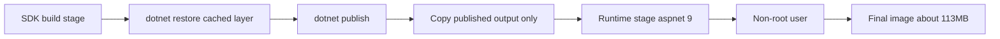
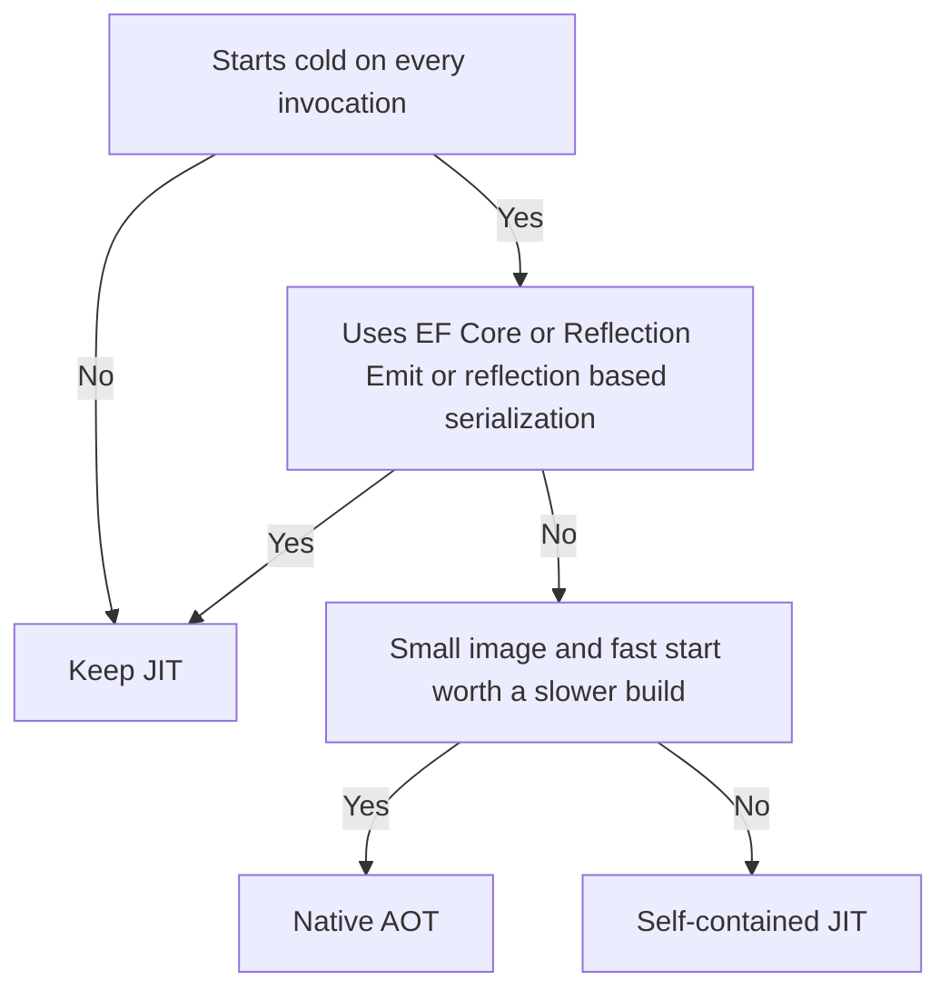

# Lecture 1 — Multi-Stage Dockerfiles for ASP.NET Core, Image Hardening, and a Native AOT Companion

## Why this lecture exists

Week 14 ended with a hardened service: `Workshop.Api` with auth covered by integration tests, MediatR where it earned its keep, and observability flowing. It ran on your laptop with `dotnet run` and in CI with `dotnet test`. Neither of those is a deployment. To put the Polyglot Workshop on a public URL, the first thing we need is a **container image** — a single, reproducible artifact that carries the published application and exactly enough operating system to run it, and nothing else.

This lecture has three jobs. First, write the multi-stage Dockerfile that turns the `Workshop.Api` project into a small, hardened runtime image — separating the build environment (the .NET SDK, full of compilers and tooling) from the runtime environment (just enough to run a published ASP.NET Core app). Second, harden and shrink that image: layer caching, a chiseled base, a non-root user, a `.dockerignore`, and the measurement that proves the shrink. Third, build the **Native AOT** companion — the analytics-export CLI that ships alongside the API — and state precisely what AOT gives you, what it costs you, and what it forbids, so you can decide for yourself which of the capstone's binaries should be AOT and which should not.

By the end, `docker build` produces an image you can `docker run` locally, hit at `http://localhost:8080/healthz`, and measure with `docker images`. That image is the artifact the Week 15 pipeline will publish and deploy.

## What "deploy is a feature" actually means here

The slogan we lead the week with — *deploy is a feature, the pipeline is part of the product* — has a concrete consequence for this lecture. The Dockerfile is **source code**. It is reviewed, it is versioned, it has a correct and an incorrect form, and it has performance characteristics (build time, image size, cold start) you measure rather than guess at. We are not "writing some Docker config." We are authoring the build artifact that defines what runs in production.

The reference for the whole topic is Microsoft's "Containerize a .NET app" guide at <https://learn.microsoft.com/en-us/dotnet/core/docker/build-container>, and the catalogue of official .NET images is at <https://github.com/dotnet/dotnet-docker>. Open both; this lecture is the guided tour, those are the manuals.

## The naive single-stage image, and why it is wrong

The first Dockerfile most people write looks like this:

```dockerfile
# DON'T do this — single stage, ships the SDK to production.
FROM mcr.microsoft.com/dotnet/sdk:9.0
WORKDIR /app
COPY . .
RUN dotnet publish src/Workshop.Api/Workshop.Api.csproj -c Release -o /app/publish
ENTRYPOINT ["dotnet", "/app/publish/Workshop.Api.dll"]
```

It works. It is also wrong in three ways. The final image is built `FROM` the SDK, so it ships the C# compiler, MSBuild, the NuGet client, and the full SDK toolchain — none of which run in production, all of which are attack surface. It copies the entire build context (`COPY . .`) including `bin/`, `obj/`, `.git`, and your source, into the image. And because the single `COPY . .` invalidates the layer cache on any file change, every build re-restores every package. The resulting image is roughly **800 MB**. The runtime needs about a tenth of that.

## The multi-stage Dockerfile for `Workshop.Api`

A multi-stage build uses one stage to *build* and a second, lean stage to *run*, copying only the published output across the stage boundary. The build tooling stays in the discarded build stage; the final image is `FROM` the runtime base.

```dockerfile
# syntax=docker/dockerfile:1

# ---- build stage: the full SDK, discarded after publish ----
FROM mcr.microsoft.com/dotnet/sdk:9.0 AS build
WORKDIR /src

# Copy only the project files first and restore. This layer is cached
# and only re-runs when a .csproj or the lock file changes — not on
# every source edit. This is the single biggest build-time win.
COPY ["src/Workshop.Api/Workshop.Api.csproj", "src/Workshop.Api/"]
COPY ["src/Workshop.Contracts/Workshop.Contracts.csproj", "src/Workshop.Contracts/"]
COPY ["Directory.Packages.props", "Directory.Build.props", "./"]
RUN dotnet restore "src/Workshop.Api/Workshop.Api.csproj"

# Now copy the rest of the source and publish.
COPY . .
RUN dotnet publish "src/Workshop.Api/Workshop.Api.csproj" \
    -c Release \
    -o /app/publish \
    /p:UseAppHost=false

# ---- runtime stage: only the ASP.NET Core runtime ----
FROM mcr.microsoft.com/dotnet/aspnet:9.0 AS final
WORKDIR /app

# Run as a non-root user. The aspnet:9.0 image ships an 'app' user (UID 1654);
# use it so a container escape does not land an attacker as root.
USER $APP_UID

COPY --from=build /app/publish .

# Kestrel listens on 8080 by default in the .NET 8+ images (non-root can't
# bind 80). Document it; the platform maps external 443 -> internal 8080.
EXPOSE 8080
ENV ASPNETCORE_HTTP_PORTS=8080

ENTRYPOINT ["dotnet", "Workshop.Api.dll"]
```

Read the order. The `COPY` of just the `.csproj` files followed by `dotnet restore`, *before* the `COPY . .` of the source, is the layer-cache trick: Docker caches each `RUN` and `COPY` as a layer keyed on its inputs, and a layer is reused if its inputs are unchanged. Because the restore layer depends only on the project files, editing a `.cs` file does not invalidate it — the build skips straight to `publish` and reuses the restored packages. On a project with dozens of NuGet dependencies, that is the difference between a 10-second and a 90-second build. Citation: <https://docs.docker.com/build/cache/>.

The `USER $APP_UID` line matters more than it looks. The .NET 8+ images ship a non-root `app` user and expose its UID as the `APP_UID` build arg; switching to it means a process that breaks out of the application does not break out as root. This is the cheapest hardening win available and the one most images skip. Citation: <https://learn.microsoft.com/en-us/dotnet/core/docker/container-security>.

`/p:UseAppHost=false` skips generating the platform-specific native launcher; in a container we invoke `dotnet Workshop.Api.dll` directly, so the apphost is dead weight.


*Only the published output crosses from the discarded SDK build stage into the lean runtime stage.*

## The `.dockerignore`

Without a `.dockerignore`, the `COPY . .` ships `bin/`, `obj/`, `.git/`, the test outputs, and any local secrets into the build context — slow to transfer and a leak risk. The fix is one file at the repo root:

```
# .dockerignore
**/bin/
**/obj/
**/.vs/
**/.vscode/
.git/
.github/
**/*.user
**/appsettings.*.Local.json
**/TestResults/
README.md
RUNBOOK.md
```

Excluding `bin/` and `obj/` is not optional: a stale `obj/` copied into the build stage can poison the restore with paths from your host. Citation: <https://docs.docker.com/build/concepts/context/#dockerignore-files>.

## Building and running it locally

```bash
# From the PolyglotWorkshop repo root.
docker build -t workshop-api:local -f src/Workshop.Api/Dockerfile .

# Run it, mapping host 8080 to container 8080.
docker run --rm -p 8080:8080 \
  -e ConnectionStrings__Workshop="Host=host.docker.internal;Port=5432;Database=workshop;Username=workshop;Password=devpass" \
  -e ASPNETCORE_ENVIRONMENT=Development \
  workshop-api:local

# In another shell — the liveness probe should answer.
curl -s http://localhost:8080/healthz
# Healthy
```

Then measure:

```bash
docker images workshop-api:local --format "{{.Repository}}:{{.Tag}} {{.Size}}"
# workshop-api:local 226MB
```

The single-stage image was ~800 MB; the multi-stage `aspnet:9.0` image is ~220–230 MB. We can do better.

## Shrinking further: the chiseled runtime

The `aspnet:9.0` image is based on Ubuntu and carries a shell, a package manager, and assorted userland. A production runtime needs none of that. The **chiseled** images (`-noble-chiseled`) are distroless-style: no shell, no package manager, no `apt`, just the runtime and its dependencies, running as non-root by default. Swap the runtime base:

```dockerfile
# ---- runtime stage: chiseled, ~110 MB, no shell ----
FROM mcr.microsoft.com/dotnet/aspnet:9.0-noble-chiseled AS final
WORKDIR /app
COPY --from=build /app/publish .
EXPOSE 8080
ENV ASPNETCORE_HTTP_PORTS=8080
ENTRYPOINT ["dotnet", "Workshop.Api.dll"]
```

```bash
docker images workshop-api:chiseled --format "{{.Size}}"
# 113MB
```

The tradeoff: no shell means `docker exec -it ... bash` does not work — you cannot shell into a chiseled container to poke around. That is a feature in production (smaller attack surface, nothing to live off the land with) and a mild inconvenience in debugging (you observe via logs and traces, which you built in Week 14, not by shelling in). For the capstone API, chiseled is the right default. Citation: <https://learn.microsoft.com/en-us/dotnet/core/docker/container-images#chiseled-ubuntu-images> and the image catalogue at <https://github.com/dotnet/dotnet-docker/blob/main/documentation/ubuntu-chiseled.md>.

Image-size summary for `Workshop.Api`:

```
+--------------------------------+----------+-------------------------------+
| Image                          | Size     | Notes                         |
+--------------------------------+----------+-------------------------------+
| single-stage (FROM sdk:9.0)    | ~800 MB  | ships the whole SDK — wrong   |
| multi-stage (aspnet:9.0)       | ~226 MB  | correct baseline              |
| multi-stage (aspnet chiseled)  | ~113 MB  | distroless, non-root, no shell|
+--------------------------------+----------+-------------------------------+
```

## Native AOT — what it is

Ahead-of-Time compilation publishes a .NET application as a **self-contained native executable** with no JIT compiler and no managed runtime loaded at startup. The IL is compiled to machine code at *publish* time rather than at *first run*. The result is a single native binary that starts in milliseconds, has a small memory footprint, and runs on the slim `runtime-deps` base image (which carries only the native dependencies — `libc`, ICU, OpenSSL — not the managed runtime).

The reference is <https://learn.microsoft.com/en-us/dotnet/core/deploying/native-aot/>.

For the Polyglot Workshop, the API host is **not** a good AOT candidate — EF Core, the gRPC server, and the OIDC stack all lean on reflection and runtime code generation that AOT either forbids or makes painful. But the capstone ships a small companion: `Workshop.AnalyticsExport`, a CLI that reads the analytics aggregates (the Dapper queries from Week 13's analytics surface), serializes them to CSV/JSON, and exits. It runs on a schedule or by hand, starts cold every time, does no reflection-heavy work, and benefits enormously from a sub-100ms start. That is the AOT binary.

## Publishing the AOT companion

The project file opts in and uses the source-generated JSON serializer (reflection-based `System.Text.Json` is not AOT-safe):

```xml
<!-- Workshop.AnalyticsExport.csproj -->
<Project Sdk="Microsoft.NET.Sdk">
  <PropertyGroup>
    <OutputType>Exe</OutputType>
    <TargetFramework>net9.0</TargetFramework>
    <LangVersion>13.0</LangVersion>
    <Nullable>enable</Nullable>
    <PublishAot>true</PublishAot>
    <InvariantGlobalization>true</InvariantGlobalization>
    <StripSymbols>true</StripSymbols>
  </PropertyGroup>
</Project>
```

```csharp
// AnalyticsJsonContext.cs — source-generated serialization, AOT-safe.
using System.Text.Json.Serialization;

[JsonSerializable(typeof(LessonCompletionRow[]))]
[JsonSerializable(typeof(EnrollmentSummary))]
internal partial class AnalyticsJsonContext : JsonSerializerContext;
```

The publish command names a runtime identifier (AOT cross-compiles to a target; you publish for the platform you will run on — Linux x64 for the container):

```bash
dotnet publish src/Workshop.AnalyticsExport/Workshop.AnalyticsExport.csproj \
  -c Release -r linux-x64 -o /app/publish
```

And the Dockerfile runs it on `runtime-deps` — no managed runtime in the image at all:

```dockerfile
# syntax=docker/dockerfile:1
FROM mcr.microsoft.com/dotnet/sdk:9.0 AS build
WORKDIR /src
# AOT needs the native toolchain (clang, zlib) in the build image.
RUN apt-get update && apt-get install -y --no-install-recommends clang zlib1g-dev
COPY . .
RUN dotnet publish "src/Workshop.AnalyticsExport/Workshop.AnalyticsExport.csproj" \
    -c Release -r linux-x64 -o /app/publish

# runtime-deps: native deps only, NO managed runtime. Tiny.
FROM mcr.microsoft.com/dotnet/runtime-deps:9.0-noble-chiseled AS final
WORKDIR /app
COPY --from=build /app/publish/Workshop.AnalyticsExport .
ENTRYPOINT ["./Workshop.AnalyticsExport"]
```

Measure cold start and size against a normal (JIT, framework-dependent) build of the same tool:

```
+----------------------------+-----------+--------------+
| Build                      | Image     | Cold start   |
+----------------------------+-----------+--------------+
| framework-dependent (JIT)  | ~226 MB   | ~480 ms      |
| self-contained (JIT)       | ~95 MB    | ~310 ms      |
| Native AOT                 | ~28 MB    | ~35 ms       |
+----------------------------+-----------+--------------+
```

The numbers are illustrative of the shape, not a benchmark promise — measure your own. The shape is the lesson: AOT trades a slower, more constrained build for a dramatically smaller image and a near-instant start.

## What AOT gives, costs, and forbids

**Gives.** Sub-100ms cold start (no JIT warm-up, no runtime load). A small self-contained binary on `runtime-deps`. Lower steady-state memory. Predictable startup latency — valuable for scale-to-zero workloads (the Container Apps free tier scales to zero, so every cold request pays the start cost; AOT makes that cheap).

**Costs.** Longer publish times and a native toolchain (clang, the platform linker) in the build image. Cross-compilation is constrained — you publish for one runtime identifier; you cannot publish a Linux-x64 AOT binary from an arm64 host without an emulator or matching toolchain. Trimming is mandatory (AOT implies `PublishTrimmed`), so code reached only via reflection can be trimmed away and fail at runtime unless you keep it with trimming attributes.

**Forbids (or makes very hard).** Unbounded reflection (`Type.GetType(string)` on a trimmed type, dynamic `Activator.CreateInstance` of arbitrary types). Runtime IL generation (`System.Reflection.Emit`, dynamic proxies — which is why EF Core, MediatR's reflection scanning, and Castle-based mocking libraries are unfriendly to AOT). The reflection-based `System.Text.Json` (use the source-generated `JsonSerializerContext` instead). Loading assemblies at runtime (`Assembly.LoadFrom`). The compiler will warn at publish time with `IL2xxx`/`IL3xxx` trim and AOT analysis warnings — treat them as errors. Citation: <https://learn.microsoft.com/en-us/dotnet/core/deploying/native-aot/#limitations>.

The decision rule for the capstone: **AOT the leaf tools (the analytics CLI), keep the API host on the JIT runtime.** The API's startup latency is amortized over a long-lived process; the CLI's is paid on every invocation. AOT where the cold start is the cost.


*Which capstone binaries earn Native AOT versus staying on the JIT runtime.*

```
   AOT decision tree
   -----------------
   Does it start cold on every invocation?        --no--> keep JIT
        | yes
   Does it use EF Core / Reflection.Emit /
   reflection-based serialization?                 --yes--> keep JIT (or refactor)
        | no
   Is a small image / fast start worth a
   slower, constrained build?                      --yes--> Native AOT
                                                   --no---> self-contained JIT
```

## Running the full stack locally with docker-compose

The pipeline deploys `Workshop.Api` to a managed Postgres and a Keycloak container. Before you trust the cloud deploy, prove the image composes with its dependencies locally. A `docker-compose.yml` at the repo root brings up the API, PostgreSQL, and Keycloak together so the same image you will ship runs against the same dependency shape it will meet in production:

```yaml
# docker-compose.yml — the local full stack.
services:
  postgres:
    image: postgres:16
    environment:
      POSTGRES_DB: workshop
      POSTGRES_USER: workshop
      POSTGRES_PASSWORD: devpass
    ports: [ "5432:5432" ]
    healthcheck:
      test: ["CMD-SHELL", "pg_isready -U workshop"]
      interval: 5s
      timeout: 3s
      retries: 10

  keycloak:
    image: quay.io/keycloak/keycloak:25.0
    command: ["start-dev", "--import-realm"]
    environment:
      KC_BOOTSTRAP_ADMIN_USERNAME: admin
      KC_BOOTSTRAP_ADMIN_PASSWORD: admin
    volumes:
      - ./infra/keycloak/workshop-realm.json:/opt/keycloak/data/import/workshop-realm.json:ro
    ports: [ "8081:8080" ]

  workshop-api:
    build:
      context: .
      dockerfile: src/Workshop.Api/Dockerfile
    depends_on:
      postgres:
        condition: service_healthy
      keycloak:
        condition: service_started
    environment:
      ASPNETCORE_ENVIRONMENT: Development
      ASPNETCORE_HTTP_PORTS: "8080"
      ConnectionStrings__Workshop: "Host=postgres;Port=5432;Database=workshop;Username=workshop;Password=devpass"
      Oidc__Authority: "http://keycloak:8080/realms/workshop"
    ports: [ "8080:8080" ]
```

`docker compose up --build` brings the lot online; the `depends_on ... condition: service_healthy` makes the API wait for Postgres's healthcheck to pass before it starts, so the readiness probe finds a reachable database on first poll. `curl http://localhost:8080/readyz` returns 200 once the stack settles. This compose file is the local mirror of the cloud topology — the same image, the same dependencies, one `up` away. Citation: <https://docs.docker.com/compose/> and the Compose healthcheck/`depends_on` reference at <https://docs.docker.com/reference/compose-file/services/#depends_on>.

## Tags, registries, and which image production runs

A built image is identified by a tag. The instinct is to tag everything `:latest`, and `:latest` is exactly the wrong tag for production, because it is mutable: the `:latest` in your registry today is not the `:latest` from last week, so "which image is in production?" has no stable answer and "roll back to the image before this one" has no target. The discipline is **immutable tags keyed on the commit SHA** — `workshop-api:9f3c2a1...` is exactly one build forever. The pipeline (Lecture 2) tags by SHA and deploys the SHA; `:latest` is a convenience pointer for humans pulling locally, never the thing production references.

The registry is where built images live so the cloud can pull them. Three common choices, all interchangeable with the pipeline:

```
+---------------------------+-------------------------------+--------------------------+
| Registry                  | Auth in CI                    | When                     |
+---------------------------+-------------------------------+--------------------------+
| GitHub Container Registry | the run's GITHUB_TOKEN        | default; nothing to set  |
| (ghcr.io)                 | (ephemeral, scoped to run)    | up, free for public      |
| Azure Container Registry  | the OIDC identity (Lecture 2) | when already on Azure;   |
| (myacr.azurecr.io)        |                               | private, region-local    |
| Docker Hub                | a stored access token         | public sharing; rate     |
|                           |                               | limits on free pulls     |
+---------------------------+-------------------------------+--------------------------+
```

We lead with `ghcr.io` because it needs no extra credential — the workflow's automatic `GITHUB_TOKEN` can push to it with `packages: write`. Citation: the GitHub Packages docs at <https://docs.github.com/en/packages/working-with-a-github-packages-registry/working-with-the-container-registry> and the ACR docs at <https://learn.microsoft.com/en-us/azure/container-registry/>.

## What we built

By the end of Lecture 1, the repo has:

- A multi-stage Dockerfile for `Workshop.Api` that restores from cached layers, builds in the SDK stage, and ships only the published output on a chiseled non-root runtime — ~113 MB instead of ~800 MB.
- A `.dockerignore` that keeps `bin/`, `obj/`, `.git/`, and local secrets out of the build context.
- A locally runnable image: `docker run -p 8080:8080 workshop-api:chiseled` answers `/healthz`.
- A Native AOT companion (`Workshop.AnalyticsExport`) published on `runtime-deps`, ~28 MB, ~35ms cold start, with source-generated JSON.
- A clear rule for which capstone binaries are AOT and which are not, grounded in what AOT gives, costs, and forbids.

The slogan: the image is the artifact, and the artifact is source code. Build it small, run it as non-root, and measure the size — the pipeline in Lecture 2 publishes whatever you hand it, so hand it something you would be willing to run in production.
