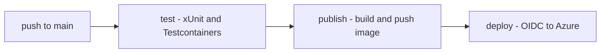
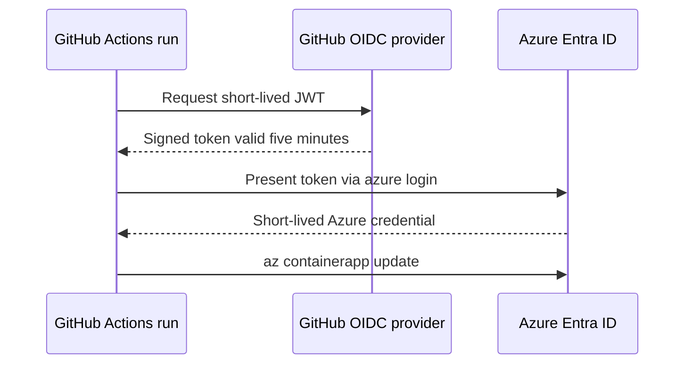

# Lecture 2 — GitHub Actions: Build, Test in CI, Publish the Image, and Deploy with OIDC and No Long-Lived Secret

## Why this lecture exists

Lecture 1 produced an image. An image on your laptop is still not a deployment. This lecture builds the **pipeline** — the GitHub Actions workflow that, on every push to `main`, checks out the repo, restores and builds, runs `Workshop.IntegrationTests` against ephemeral containers in the runner, publishes the hardened image to a registry, and deploys it to Azure Container Apps. The deploy contract for the week — *one push to `main` reaches a live URL with the tests green* — is exactly this workflow.

The lecture has three jobs. First, the **build-and-test** job: how Actions runs `dotnet test` with Testcontainers in CI, and why the runner already has a Docker daemon. Second, **publish**: building the image with `docker/build-push-action` and pushing it to a registry, gated on the tests passing. Third — the part that separates a toy pipeline from a real one — **deploy with GitHub OIDC**, so the workflow authenticates to Azure with a short-lived federated token and stores no long-lived cloud credential anywhere.

By the end you will have a `.github/workflows/deploy.yml` that goes green from `git push` to a live HTTPS URL, with nothing in the repo's secrets but the three non-secret identifiers OIDC needs.

The references: GitHub's "build and test .NET" guide at <https://docs.github.com/en/actions/use-cases-and-examples/building-and-testing/building-and-testing-net>, the OIDC hardening guide at <https://docs.github.com/en/actions/deployment/security-hardening-your-deployments/about-security-hardening-with-openid-connect>, and the Container Apps deploy action at <https://github.com/Azure/container-apps-deploy-action>.

## The shape of the workflow

A GitHub Actions workflow is a YAML file under `.github/workflows/`. It has triggers (`on:`), and a set of `jobs:`, each running on a runner, each a sequence of `steps:`. Jobs run in parallel unless `needs:` declares a dependency. Our pipeline is a three-job graph:

```
   push to main
        |
        v
   +---------+      +-----------+      +-----------+
   |  test   | ---> |  publish  | ---> |  deploy   |
   | (xUnit, |      | (build &  |      | (OIDC ->  |
   | Testcon)|      | push img) |      |  Azure)   |
   +---------+      +-----------+      +-----------+
   needs: -         needs: test       needs: publish
```

`publish` does not start until `test` is green; `deploy` does not start until `publish` has pushed an image. A red test stops the line — that is the whole point. Citation: <https://docs.github.com/en/actions/using-workflows/workflow-syntax-for-github-actions>.


*Each job waits on the previous via needs; a red test stops the line before an image is ever built.*

## Job 1 — build and test, with Testcontainers in the runner

The integration tests built in Weeks 12–14 use Testcontainers for .NET, which spins ephemeral PostgreSQL and Keycloak containers on demand. That works in CI because the GitHub-hosted `ubuntu-latest` runner ships a running Docker daemon — Testcontainers talks to it exactly as it does on your laptop. No `services:` block is needed; Testcontainers manages the container lifecycle from inside the test process.

```yaml
name: deploy

on:
  push:
    branches: [ main ]
  workflow_dispatch:

permissions:
  contents: read

env:
  REGISTRY: ghcr.io
  IMAGE_NAME: ${{ github.repository }}/workshop-api
  DOTNET_VERSION: "9.0.x"

jobs:
  test:
    runs-on: ubuntu-latest
    steps:
      - uses: actions/checkout@v4

      - name: Set up .NET
        uses: actions/setup-dotnet@v4
        with:
          dotnet-version: ${{ env.DOTNET_VERSION }}

      - name: Restore
        run: dotnet restore PolyglotWorkshop.sln

      - name: Build
        run: dotnet build PolyglotWorkshop.sln -c Release --no-restore

      - name: Test (integration, against Testcontainers)
        run: >
          dotnet test tests/Workshop.IntegrationTests/Workshop.IntegrationTests.csproj
          -c Release --no-build
          --logger "trx;LogFileName=test-results.trx"
          --collect:"XPlat Code Coverage"
        # Testcontainers reaches the runner's Docker daemon directly;
        # it pulls postgres:16 and keycloak and tears them down after.

      - name: Upload test results
        if: always()
        uses: actions/upload-artifact@v4
        with:
          name: test-results
          path: "**/test-results.trx"
```

The `--no-restore` and `--no-build` flags avoid redoing work each step already did — restore once, build once, test against the build output. The `if: always()` on the upload step means a failed test run still publishes its `.trx` so you can read what broke. Citation: <https://github.com/testcontainers/testcontainers-dotnet#supported-environments> on Testcontainers in CI.

## Job 2 — build and push the image

With tests green, build the multi-stage image from Lecture 1 and push it to a registry. We use **GitHub Container Registry** (`ghcr.io`) because it needs no extra credential — the workflow's automatic `GITHUB_TOKEN` can push to it — but Azure Container Registry (ACR) or Docker Hub work identically with `docker/login-action`.

```yaml
  publish:
    runs-on: ubuntu-latest
    needs: test
    permissions:
      contents: read
      packages: write          # push to ghcr.io
    outputs:
      image: ${{ steps.meta.outputs.tags }}
    steps:
      - uses: actions/checkout@v4

      - name: Log in to the registry
        uses: docker/login-action@v3
        with:
          registry: ${{ env.REGISTRY }}
          username: ${{ github.actor }}
          password: ${{ secrets.GITHUB_TOKEN }}   # ephemeral, scoped to this run

      - name: Compute tags
        id: meta
        uses: docker/metadata-action@v5
        with:
          images: ${{ env.REGISTRY }}/${{ env.IMAGE_NAME }}
          tags: |
            type=sha,prefix=,format=long
            type=raw,value=latest,enable={{is_default_branch}}

      - name: Set up Buildx
        uses: docker/setup-buildx-action@v3

      - name: Build and push
        uses: docker/build-push-action@v6
        with:
          context: .
          file: src/Workshop.Api/Dockerfile
          push: true
          tags: ${{ steps.meta.outputs.tags }}
          cache-from: type=gha
          cache-to: type=gha,mode=max
```

Two details earn their keep. **Tag by commit SHA**, not just `latest`: `latest` is mutable and ambiguous ("which build is in production right now?"), while the immutable `:<sha>` tag is exactly the image you can roll back to. The deploy job deploys the SHA tag. **`cache-from`/`cache-to: type=gha`** persists the Docker layer cache between runs in the Actions cache, so the restore layer from Lecture 1 is reused across builds — the same layer-caching win, now in CI. Citation: <https://github.com/docker/build-push-action> and <https://docs.docker.com/build/cache/backends/gha/>.

## The credential problem, stated plainly

The deploy job has to authenticate to Azure. The naive way is to create a service principal, generate a client secret, and paste it into a repo secret named `AZURE_CREDENTIALS`. This is a standing liability:

- The secret does not expire on its own. It is valid until someone remembers to rotate it, which is never.
- It grants whoever has it your subscription access. A leaked workflow log, a compromised fork's PR run, a mis-scoped secret — any of these hands it over.
- It is one more thing in the rotation runbook, and rotating it means editing the repo secret, which means someone with admin on the repo, which is more blast radius.

The whole category of "long-lived credential in CI" is one of the most common ways cloud accounts get compromised. The modern answer removes the credential entirely.

## OIDC federation — no stored secret

GitHub Actions can act as an **OpenID Connect identity provider**. On a workflow run, GitHub mints a short-lived JWT describing the run — its repository, branch, environment, workflow — signed by GitHub's well-known issuer. Azure is configured to **trust** that issuer for a specific subject (e.g. "the `main` branch of `org/PolyglotWorkshop`") and, when presented with such a token, issues a credential that lives only for the length of the job. Nothing is stored. Nothing expires-and-leaks. Nothing to rotate.


*No stored secret — GitHub mints a short-lived token that Azure exchanges for a scoped, job-length credential.*

```
   +---------+   1. mint OIDC JWT      +-----------------+
   | GitHub  |------------------------>|  GitHub OIDC    |
   | Actions |   (sub=repo:org/Poly... |  provider       |
   |  run    |    ...:ref:refs/heads/  +--------+--------+
   +----+----+         main)                    | 2. token (5 min)
        |                                        v
        | 3. azure/login presents token   +-----------------+
        +-------------------------------->|  Microsoft      |
        | 4. short-lived Azure token       |  Entra ID       |
        |<--------------------------------|  (federated     |
        |                                  |   credential)   |
        v                                  +-----------------+
   az containerapp update ...
```

The one-time setup creates a federated credential on a managed identity (or app registration) in Azure, scoped to the exact subject:

```bash
# One-time, run by an admin against the Azure subscription.
az identity create --name workshop-deployer \
  --resource-group rg-workshop --location eastus

# Federate it to GitHub for the main branch of this repo only.
az identity federated-credential create \
  --name github-main \
  --identity-name workshop-deployer \
  --resource-group rg-workshop \
  --issuer "https://token.actions.githubusercontent.com" \
  --subject "repo:your-org/PolyglotWorkshop:ref:refs/heads/main" \
  --audiences "api://AzureADTokenExchange"

# Grant the identity rights to deploy to the container app.
az role assignment create \
  --assignee <identity-client-id> \
  --role Contributor \
  --scope /subscriptions/<sub>/resourceGroups/rg-workshop
```

The `--subject` is the security boundary: it federates *only* the `main` branch of *this* repo. A pull request from a fork, or a push to a feature branch, mints a token with a different `sub` that Azure does not trust — so a malicious PR cannot deploy. Scope it tighter than you think you need; widen only with reason. Citation: <https://learn.microsoft.com/en-us/entra/workload-id/workload-identity-federation> and GitHub's "configuring OIDC in Azure" at <https://docs.github.com/en/actions/deployment/security-hardening-your-deployments/configuring-openid-connect-in-azure>.

In the repo, the three non-secret identifiers go in the repo's variables or secrets (they are not credentials — the client ID and tenant ID are not sensitive, but secrets is a fine place for them):

- `AZURE_CLIENT_ID` — the managed identity's client ID.
- `AZURE_TENANT_ID` — the Entra tenant.
- `AZURE_SUBSCRIPTION_ID` — the subscription.

## Job 3 — deploy

```yaml
  deploy:
    runs-on: ubuntu-latest
    needs: publish
    environment: production         # gate with required reviewers (see below)
    permissions:
      id-token: write               # REQUIRED for OIDC — mints the GitHub JWT
      contents: read
    steps:
      - name: Azure login (OIDC, no stored secret)
        uses: azure/login@v2
        with:
          client-id: ${{ secrets.AZURE_CLIENT_ID }}
          tenant-id: ${{ secrets.AZURE_TENANT_ID }}
          subscription-id: ${{ secrets.AZURE_SUBSCRIPTION_ID }}

      - name: Run the gated EF Core migration
        run: |
          az containerapp job start \
            --name workshop-migrate \
            --resource-group rg-workshop
          # The migrate job runs `efbundle` against the prod DB and exits 0/1.
          # Lecture 3 covers why migration is a gated step, not a startup hook.

      - name: Deploy the new revision
        uses: azure/container-apps-deploy-action@v2
        with:
          resourceGroup: rg-workshop
          containerAppName: workshop-api
          imageToDeploy: ${{ env.REGISTRY }}/${{ env.IMAGE_NAME }}:${{ github.sha }}
          # The new revision must pass its readiness probe before it
          # takes traffic; the platform enforces that (Lecture 3).
```

The single most common OIDC failure is forgetting `permissions: id-token: write` on the deploy job. Without it, GitHub will not mint the OIDC JWT, and `azure/login` fails with "unable to get ACTIONS_ID_TOKEN_REQUEST_URL." It is a job-level permission, not a workflow-level one; set it on the job that logs in. Citation: <https://github.com/Azure/login#login-with-openid-connect-oidc-recommended>.

## Environments and required reviewers — the gate before production

Auto-deploying every green push to production is fine for a learning project and reckless for a team. GitHub **Environments** add a gate: declaring `environment: production` on the deploy job lets a repo admin configure *required reviewers* (a human approves before the deploy step runs), *wait timers*, and *branch restrictions* (only `main` may deploy to `production`). For the capstone, configuring a one-reviewer gate on `production` and noting it in the runbook is a real-world-correct touch. Citation: <https://docs.github.com/en/actions/deployment/targeting-different-environments/using-environments-for-deployment>.

## The one-time Azure provisioning the deploy assumes

The deploy job updates a container app that must already exist. The one-time provisioning — run by hand before the first pipeline deploy — creates the environment, the database, and the app. It is worth reading even though it is not in the workflow, because the runbook (Lecture 3) refers to these resources by name:

```bash
RG=rg-workshop
LOC=eastus

# Resource group + Container Apps environment (with a Log Analytics workspace).
az group create -n $RG -l $LOC
az containerapp env create -n workshop-env -g $RG -l $LOC

# Managed PostgreSQL on the free/burstable tier.
az postgres flexible-server create -n workshop-pg -g $RG -l $LOC \
  --tier Burstable --sku-name Standard_B1ms --storage-size 32 \
  --admin-user workshop --admin-password "<generated>" \
  --database-name workshop --public-access 0.0.0.0

# The container app, first revision from the published image, public ingress.
az containerapp create -n workshop-api -g $RG --environment workshop-env \
  --image ghcr.io/your-org/PolyglotWorkshop/workshop-api:bootstrap \
  --target-port 8080 --ingress external \
  --min-replicas 0 --max-replicas 3 \
  --secrets oidc-client-secret=<from-keycloak> \
            db-conn="Host=workshop-pg.postgres.database.azure.com;..." \
  --env-vars ConnectionStrings__Workshop=secretref:db-conn \
             Oidc__ClientSecret=secretref:oidc-client-secret

# Allow both old and new revisions to coexist (required for zero-downtime).
az containerapp revision set-mode -n workshop-api -g $RG --mode multiple
```

`--min-replicas 0` is scale-to-zero — the free-tier money-saver; an idle app costs nothing and pays a cold start on the next request (which is why Lecture 1's fast-starting binaries matter). Secrets go in the container app's secret store and are referenced from env vars with `secretref:`, never inlined. Citation: <https://learn.microsoft.com/en-us/azure/container-apps/get-started> and the secrets doc at <https://learn.microsoft.com/en-us/azure/container-apps/manage-secrets>.

After this exists once, the pipeline's `deploy` job only ever *updates* it with a new image and lets the revision machinery handle the rollout.

## Reading the OIDC token — what Azure actually trusts

It is worth seeing what the OIDC JWT carries, because the `--subject` you federated must match it exactly. The token GitHub mints for a run has claims like:

```json
{
  "iss": "https://token.actions.githubusercontent.com",
  "sub": "repo:your-org/PolyglotWorkshop:ref:refs/heads/main",
  "aud": "api://AzureADTokenExchange",
  "repository": "your-org/PolyglotWorkshop",
  "ref": "refs/heads/main",
  "workflow": "deploy",
  "exp": 1718712345
}
```

Azure's federated credential matches on `iss` + `sub` + `aud`. If the workflow runs on a tag, `sub` becomes `repo:your-org/PolyglotWorkshop:ref:refs/tags/v1.0.0` and the `main`-scoped credential does not match — the login is rejected. You can scope to a branch, a tag pattern, a pull request, or a GitHub Environment (`repo:...:environment:production`); the environment form is the most common production scope because it composes with the required-reviewer gate. The token expires in minutes, so even if it leaked it is near-useless. Citation: GitHub's "about security hardening with OIDC" example-subjects table at <https://docs.github.com/en/actions/deployment/security-hardening-your-deployments/about-security-hardening-with-openid-connect>.

## Secondary target — Fly.io in the same pipeline

Azure Container Apps is the primary target; Fly.io is the documented secondary, useful if you do not have an Azure account. The deploy job is even simpler — `flyctl` reads `fly.toml` from the repo and deploys the same image:

```yaml
  deploy-fly:
    runs-on: ubuntu-latest
    needs: publish
    steps:
      - uses: actions/checkout@v4
      - uses: superfly/flyctl-actions/setup-flyctl@master
      - run: flyctl deploy --image ${{ env.REGISTRY }}/${{ env.IMAGE_NAME }}:${{ github.sha }} --remote-only
        env:
          FLY_API_TOKEN: ${{ secrets.FLY_API_TOKEN }}
```

Fly.io uses a deploy token (`FLY_API_TOKEN`) rather than OIDC; scope it to the one app with `fly tokens create deploy` so a leak cannot reach the rest of your account. Citation: <https://fly.io/docs/launch/deploy/> and <https://fly.io/docs/security/tokens/>.

## Reading a failed run

When the pipeline goes red, read it top down. A `test` failure is a code or test problem — pull the `.trx` artifact. A `publish` failure is usually a Dockerfile path or a registry-permission problem (`packages: write` missing). A `deploy` failure is almost always one of: `id-token: write` missing (OIDC), the federated subject not matching the branch (`sub` mismatch — the error names the presented subject; compare it to what `az identity federated-credential` configured), the migration job exiting non-zero (Lecture 3), or the new revision failing its readiness probe (also Lecture 3). The log lines name the layer; do not guess.

## What we built

By the end of Lecture 2, the repo has:

- A `.github/workflows/deploy.yml` with a `test → publish → deploy` job graph triggered on push to `main`.
- A `test` job running `Workshop.IntegrationTests` against Testcontainers on the runner's Docker daemon, uploading results even on failure.
- A `publish` job building the Lecture 1 image and pushing an immutable `:<sha>` tag (plus `latest`) to `ghcr.io`, with the layer cache persisted across runs.
- A `deploy` job that authenticates to Azure with GitHub OIDC — **no long-lived credential stored anywhere** — runs the gated migration, and rolls out the new revision, gated by a `production` environment with required reviewers.
- A Fly.io secondary deploy job for accounts without Azure.

The slogan: the pipeline is part of the product, and the credential it does not store is the credential that cannot leak. One push to `main`, tests green, image published, revision live — that is the deploy contract, and it is now code in the repo.
