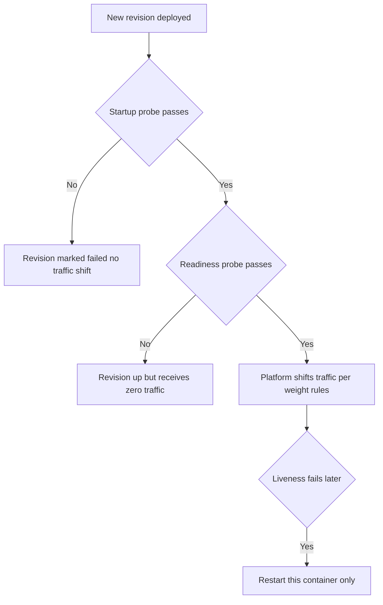
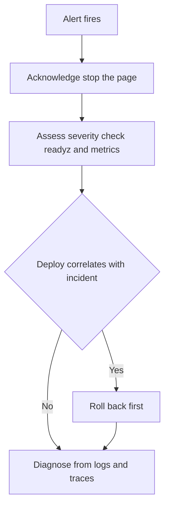

# Lecture 3 — Health Probes, Migration-on-Deploy, Rollback, the Runbook, On-Call Basics, and the Live Demo

## Why this lecture exists

Lecture 1 built the image and Lecture 2 built the pipeline that ships it. This lecture is about everything that happens *after* the deploy step succeeds — and everything you wish you had written down *before* the deploy step failed at 3am. It covers the operational surface of the Polyglot Workshop: how the platform decides a new revision is healthy enough to take traffic, how the database migration runs without racing or breaking rollback, how you roll a bad deploy back in one command, and how you write the `RUNBOOK.md` that the C9 SYLLABUS grades as part of the capstone.

The lecture has five jobs. First, **health and readiness probes** — the difference, and why a readiness probe is what keeps a broken revision off the wire. Second, **migration-on-deploy** done as a gated step with the expand-then-contract discipline. Third, **rollback** as a revision traffic reweight. Fourth, the **`RUNBOOK.md`** — its five required sections, written so someone who did not build the system can follow them. Fifth, **on-call basics and the live-demo choreography** for the defense.

This is the last lecture of C9. The reference for the operational framing is the Google SRE workbook's playbook chapter at <https://sre.google/workbook/playbooks/>.

## Health vs readiness — two different questions

The platform asks two different questions of a container, and conflating them is a classic outage:

- **Liveness** ("is the process alive?") — if this fails, the platform *restarts* the container. A liveness probe should be cheap and check nothing but "the process is responding." If you make liveness depend on the database, a transient DB blip restarts every container in a thundering herd that makes the blip worse.
- **Readiness** ("is this instance ready to receive traffic?") — if this fails, the platform *withholds traffic* from the instance but does not restart it. Readiness *should* depend on the things the instance needs to serve a request: the database is reachable, Keycloak's discovery document loaded, migrations applied. A new revision that fails readiness simply never takes traffic — which is exactly the gate that protects you from a broken deploy.


*A new revision must clear startup then readiness before it ever receives live traffic.*

ASP.NET Core's health-checks framework models both with tagged checks:

```csharp
// Program.cs (Workshop.Api) — carried forward and tagged for deploy.
builder.Services.AddHealthChecks()
    .AddCheck("self", () => HealthCheckResult.Healthy(), tags: ["live"])
    .AddNpgSql(
        builder.Configuration.GetConnectionString("Workshop")!,
        name: "postgres", tags: ["ready"])
    .AddUrlGroup(
        new Uri($"{keycloakAuthority}/.well-known/openid-configuration"),
        name: "keycloak", tags: ["ready"]);

var app = builder.Build();

// Liveness: only the "live" checks — never touches the DB.
app.MapHealthChecks("/healthz", new HealthCheckOptions
{
    Predicate = check => check.Tags.Contains("live")
});

// Readiness: the "ready" checks — DB + Keycloak reachable.
app.MapHealthChecks("/readyz", new HealthCheckOptions
{
    Predicate = check => check.Tags.Contains("ready")
});
```

Citation: <https://learn.microsoft.com/en-us/aspnet/core/host-and-deploy/health-checks>.

On Azure Container Apps you wire the probes into the revision spec so the platform polls them:

```yaml
# container app probes (excerpt of the app spec / az containerapp YAML)
probes:
  - type: Liveness
    httpGet: { path: /healthz, port: 8080 }
    periodSeconds: 10
    failureThreshold: 3
  - type: Readiness
    httpGet: { path: /readyz, port: 8080 }
    periodSeconds: 5
    failureThreshold: 3
    initialDelaySeconds: 5
  - type: Startup
    httpGet: { path: /healthz, port: 8080 }
    failureThreshold: 30
    periodSeconds: 2
```

The **startup probe** gives a slow-starting app time to come up before liveness begins — important on the free tier, where a scale-from-zero cold start can take a few seconds. Citation: <https://learn.microsoft.com/en-us/azure/container-apps/health-probes>.

```
   new revision deployed
        |
        v
   startup probe passes? --no--> revision marked failed, NO traffic shift
        | yes
   readiness probe passes? --no--> revision is up but receives 0% traffic
        | yes
   platform shifts traffic to the new revision per the weight rules
        |
   liveness fails later? --yes--> restart THIS container (no traffic loss
                                   if other replicas are ready)
```

The lesson: a deploy that compiles, builds, and pushes can still be a *non-event* for your users if its readiness probe never passes — the old revision keeps serving. That is the safety net. Build it before you need it.

## Migration on deploy — a gated step, not a startup hook

It is tempting to call `db.Database.MigrateAsync()` in `Program.cs` so migrations apply automatically on boot. Do not, in production. Two failure modes:

1. **The race.** Container Apps may start two replicas of the new revision at once (or one new while one old still runs). Two processes applying the same migration race; EF Core's migration history table mitigates simple cases but destructive or long-running migrations can deadlock or half-apply.
2. **The coupling.** If migration is part of startup and a migration fails, the app fails to start, the readiness probe never passes, and you cannot even get a shell-less chiseled container to tell you why. The migration failure and the app failure are now the same event.

The disciplined pattern runs the migration as a **separate, gated step before the new revision takes traffic** — the migration job in the Lecture 2 deploy workflow. Build a self-contained migration bundle and run it as a one-shot Container Apps Job:

```bash
# At build time (in the publish job or locally): produce a portable bundle.
dotnet ef migrations bundle \
  --project src/Workshop.Api/Workshop.Api.csproj \
  --output efbundle --self-contained -r linux-x64

# The migrate job runs it against the prod connection string and exits.
./efbundle --connection "$WORKSHOP_PROD_CONNECTION"
```

`dotnet ef migrations bundle` produces `efbundle`, a single executable that applies pending migrations and exits with a status code — perfect for a CI gate. If it exits non-zero, the deploy job's `needs:` chain stops and the new revision never deploys. Citation: <https://learn.microsoft.com/en-us/ef/core/managing-schemas/migrations/applying#bundles> and the migrations-in-production guidance at <https://learn.microsoft.com/en-us/ef/core/managing-schemas/migrations/applying>.

### Expand, then contract

The migration has to be safe to run *while the old revision is still serving traffic*, because for a window during the rollout both revisions are live. That forbids destructive changes mid-deploy. The pattern is **expand-then-contract**, across two deploys:

- **Deploy N (expand).** Add the new column as nullable; write to both old and new; backfill. The old code ignores the new column; the new code uses it. Both revisions are happy.
- **Deploy N+1 (contract).** Once every replica runs the new code, make the column non-null / drop the old column. Now it is safe — nothing reads the old shape.

A rename is two columns and a backfill, never an `ALTER COLUMN RENAME` in one deploy. The reward is that a rollback from revision N to revision N−1 still finds a schema N−1 can read. Citation: <https://learn.microsoft.com/en-us/ef/core/managing-schemas/migrations/#evolving-the-schema> and the "BlueGreen / expand-contract" literature linked from the SRE workbook.

## Rollback — a one-command traffic reweight

Azure Container Apps models every deploy as a **revision**. With multiple-revision mode enabled, both the old and new revisions exist simultaneously and traffic is split by weight. A rollback is therefore not a rebuild or a redeploy — it is reassigning 100% of traffic back to the last-known-good revision, which is already running:

```bash
# List revisions, newest first.
az containerapp revision list -n workshop-api -g rg-workshop \
  -o table --query "[].{name:name, created:properties.createdTime, active:properties.active}"

# Roll back: send all traffic to the previous good revision.
az containerapp ingress traffic set -n workshop-api -g rg-workshop \
  --revision-weight workshop-api--rev-0007=100

# (Optional) blue/green canary: 90/10 before committing.
az containerapp ingress traffic set -n workshop-api -g rg-workshop \
  --revision-weight workshop-api--rev-0007=90 workshop-api--rev-0008=10
```

Because the previous revision was never torn down, the rollback is instant — no image pull, no cold start, no migration. This is why we keep migrations expand-only: the rolled-back revision finds a schema it understands. The same model on Fly.io is `flyctl releases` plus `flyctl deploy --image <previous-sha>` or the rollback command; the operational shape is identical. Citation: <https://learn.microsoft.com/en-us/azure/container-apps/revisions-manage> and <https://learn.microsoft.com/en-us/azure/container-apps/blue-green-deployment>.

Challenge-02 proves, with a load generator, that a rollout and rollback drop zero requests when probes and traffic weights are set correctly.

## Where the logs and traces live

The Week 14 observability stack — Serilog structured logs and OpenTelemetry traces/metrics — does not change when you deploy; only the *sink* changes. On Container Apps:

```bash
# Live tail of the running container's stdout (Serilog compact JSON).
az containerapp logs show -n workshop-api -g rg-workshop --follow --tail 100

# Query the Log Analytics workspace the environment writes to.
az monitor log-analytics query \
  --workspace <workspace-id> \
  --analytics-query "ContainerAppConsoleLogs_CL | where Log_s contains 'Error' | take 50"
```

Traces flow over OTLP to whatever backend the environment runs (the free-tier choice is an Azure Monitor / Application Insights OTLP endpoint, or a self-hosted Jaeger/Tempo container in the environment). The runbook records the exact query and the exact URL — "where do the logs live" is a question you answer once, in writing, not by remembering at 3am. Citation: <https://learn.microsoft.com/en-us/azure/container-apps/log-monitoring>.

## Secret rotation — the OIDC client secret

Lecture 2's *deploy* credential is OIDC-federated, so there is no secret to rotate there — that is the point. But the application still holds one real secret: the **OIDC client secret** that `Workshop.Api` uses as a confidential client against Keycloak (the back-channel token exchange). That one is stored as a Container Apps secret and rotated on a schedule. The runbook records the procedure:

```bash
# 1. In Keycloak, regenerate the client secret for the workshop-api client.
#    (Admin console -> Clients -> workshop-api -> Credentials -> Regenerate.)

# 2. Update the Container Apps secret with the new value.
az containerapp secret set -n workshop-api -g rg-workshop \
  --secrets oidc-client-secret=<new-secret>

# 3. Restart the revision so it picks up the new secret reference.
az containerapp revision restart -n workshop-api -g rg-workshop \
  --revision <current-revision>
```

Rotate before expiry, not after an incident. Keycloak keeps the old secret valid briefly if configured for rotation, so the window is overlapping — exactly so the rotation does not cause an outage. Citation: <https://learn.microsoft.com/en-us/azure/container-apps/manage-secrets>.

## What to do if the database fills up

The free-tier PostgreSQL has a fixed storage allowance, and the analytics tables grow. The runbook's database-full section is a short decision tree:

```
   disk > 85%?
     |
     +-- check the biggest tables:
     |     SELECT relname, pg_size_pretty(pg_total_relation_size(relid))
     |     FROM pg_catalog.pg_statio_user_tables ORDER BY pg_total_relation_size(relid) DESC LIMIT 10;
     |
     +-- is it the outbox / event log? --yes--> the drain worker is stuck;
     |                                           restart it, confirm it catches up.
     +-- is it analytics history?      --yes--> run the retention job:
     |                                           DELETE FROM submission_events WHERE created_at < now() - interval '90 days';
     |                                           then VACUUM (FULL) the table off-hours.
     +-- genuinely out of room?        --yes--> scale up storage:
                                                 az postgres flexible-server update -g rg-workshop
                                                   -n workshop-pg --storage-size 64
```

The point is not the exact SQL — it is that the answer exists *before* the disk fills, written down, runnable by whoever is on call. Citation: <https://learn.microsoft.com/en-us/azure/postgresql/flexible-server/concepts-storage> and the PostgreSQL `VACUUM` docs at <https://www.postgresql.org/docs/current/sql-vacuum.html>.

## The `RUNBOOK.md` — five required sections

The capstone's `RUNBOOK.md` lives at the repo root and has exactly five sections, each answerable by someone who did not build the system:

```
# RUNBOOK — Polyglot Workshop

## 1. Deploy
- Trigger: push to `main` runs .github/workflows/deploy.yml.
- Manual: `gh workflow run deploy` or the Actions "Run workflow" button.
- The pipeline: test -> publish (:<sha>) -> migrate (gated) -> deploy revision.
- Verify: `curl https://<fqdn>/readyz` returns 200; the new revision shows
  100% traffic in `az containerapp revision list`.

## 2. Roll back
- `az containerapp ingress traffic set -n workshop-api -g rg-workshop \
     --revision-weight <last-good-revision>=100`
- Migrations are expand-only, so the previous revision's schema still works.
- Confirm with `/readyz` and the error-rate metric.

## 3. Where the logs live
- Live tail: `az containerapp logs show -n workshop-api -g rg-workshop --follow`
- Search: Log Analytics workspace <id>, table ContainerAppConsoleLogs_CL.
- Traces: OTLP -> <backend URL>; search by TraceId from any log line.

## 4. Rotate the OIDC client secret
- Regenerate in Keycloak (Clients -> workshop-api -> Credentials).
- `az containerapp secret set ... --secrets oidc-client-secret=<new>`
- Restart the revision. Verify a fresh sign-in succeeds end to end.

## 5. If the database fills up
- Find the big tables (pg_total_relation_size query).
- Outbox stuck -> restart the drain worker.
- Analytics history -> run the 90-day retention DELETE, then VACUUM off-hours.
- Out of room -> scale storage with `az postgres flexible-server update`.
```

This is the deliverable. A runbook that requires the author in the room is not a runbook. Citation: <https://sre.google/workbook/playbooks/>.

## On-call basics — the first five minutes

When an alert fires, you do four things in order, and the runbook makes each one a copy-paste:

1. **Acknowledge.** Stop the alert from re-paging; tell the channel you have it.
2. **Assess severity.** Is the site down (sev1) or degraded (sev2)? `curl /readyz`; check the error-rate and latency metrics.
3. **Mitigate before you diagnose.** If a deploy correlates with the incident, *roll back first* (Section 2 of the runbook), then investigate the rolled-back revision at leisure. Restoring service beats understanding it. This is the single most important on-call instinct.
4. **Diagnose from logs and traces** (Section 3), not by SSH-ing into a box — the chiseled container has no shell, and you built observability in Week 14 precisely so you would not need one.


*Restoring service beats understanding it — mitigate before you diagnose.*

The reference is the SRE workbook's incident-response chapter at <https://sre.google/workbook/incident-response/>.

## The live-demo choreography

The capstone defense (`mini-project/README.md`) includes a live demo of the deployed system. Choreograph it so nothing is improvised:

```
   1. Show the green pipeline.  Open the Actions run for the latest main commit:
      test green, image published :<sha>, revision deployed. "One push, live URL."
   2. Hit the API.  curl https://<api-fqdn>/readyz -> 200. Show a real gRPC/REST
      call returning workshop data (a lesson list for a signed-in instructor).
   3. Open the Blazor admin at its public URL.  Sign in via Keycloak (OIDC),
      show the moderation queue and an analytics chart pulling live data.
   4. Sideload the MAUI app.  The Workshop.Mobile APK is already installed on the
      Android device; open it, sign in via OIDC, show it consuming the SAME
      gRPC contract — enroll in a lesson, see it reflected in the admin.
   5. Roll back, live.  Reweight traffic to the previous revision and show /readyz
      still 200 throughout — zero downtime. Reweight back.
   6. Walk the RUNBOOK.  One sentence per section. "Here is how the next person
      operates this without me."
```

Have the API URL, the admin URL, the device, and the terminal staged before you start. The demo is part of the grade; the runbook and the contract are most of it. Citation: the C9 SYLLABUS capstone framing.

## Cost on the free tier — and why it matters operationally

"Free tier" is not "free of consequences." Knowing the cost shape is an operational skill, and the runbook's deploy section should note it. On Azure Container Apps the free grant covers a monthly allowance of vCPU-seconds and GiB-seconds plus a number of requests; an idle app scaled to zero (`--min-replicas 0`) consumes none of it. The managed PostgreSQL Burstable `B1ms` has its own free-trial allowance for new accounts and then bills hourly; storage bills by the GiB provisioned, which is why the database-full section scales storage *deliberately* rather than reflexively. Keycloak runs as a container in the same environment, so it consumes the same vCPU/GiB grant.

```
   What the free tier buys you, and what blows it
   -----------------------------------------------
   scale-to-zero idle app          ->  ~$0 (no replicas running)
   a cold request after idle       ->  one cold start, then billed while warm
   min-replicas 1 (always warm)    ->  burns the grant 24/7 — avoid for a demo
   a load test left running        ->  burns the request + compute grant fast
   over-provisioned DB storage     ->  billed by the GiB even when empty
```

The operational lesson: keep `--min-replicas 0` for the capstone, do not leave a load generator running (challenge-02 runs for two minutes, not two days), and provision the smallest DB storage that holds the demo data. The runbook records the current tier and the scale-up command so the next operator knows the cost lever exists. Citation: the Container Apps pricing page at <https://azure.microsoft.com/en-us/pricing/details/container-apps/> and the Postgres Flexible Server pricing at <https://azure.microsoft.com/en-us/pricing/details/postgresql/flexible-server/>.

## Severity levels — naming the incident

On-call needs a shared vocabulary for "how bad is this," because the response differs. A minimal three-level scheme the runbook can adopt:

- **Sev1 — down.** The public URL returns 5xx or times out; no user can sign in or use the system. Page immediately; mitigate first (roll back if a deploy correlates), diagnose second.
- **Sev2 — degraded.** The system serves most requests but a feature is broken or latency is elevated (e.g. analytics charts fail but lessons load). Respond promptly during hours; roll back if a deploy caused it.
- **Sev3 — minor.** A cosmetic or non-blocking issue (a stale cache, a slow background job catching up). File it; fix in the next deploy.

The severity determines the urgency, and the urgency determines whether you mitigate-then-diagnose (sev1/sev2) or simply file it (sev3). Mis-classifying a sev1 as a sev3 is how an outage becomes a long outage. Citation: the SRE workbook's incident-management chapter at <https://sre.google/workbook/incident-response/>.

## What we built

By the end of Lecture 3, the deployed Polyglot Workshop has:

- Tagged liveness (`/healthz`, no DB) and readiness (`/readyz`, DB + Keycloak) checks, wired into the Container Apps probe spec, so a broken revision never takes traffic.
- A gated, bundled EF Core migration that runs before the new revision deploys, with expand-then-contract discipline so rollback is always safe.
- A one-command revision-reweight rollback, proven downtime-free in challenge-02.
- A documented path to the logs and traces, an OIDC-client-secret rotation procedure, and a database-full decision tree.
- A five-section `RUNBOOK.md` at the repo root that the next operator can actually follow.
- A staged live-demo choreography for the defense.

The slogan: the runbook is the feature your future self thanks you for, and rollback is the feature you build before you need it. Deploy is a feature; operating is the rest of the job. C9 ends here — go operate something.
